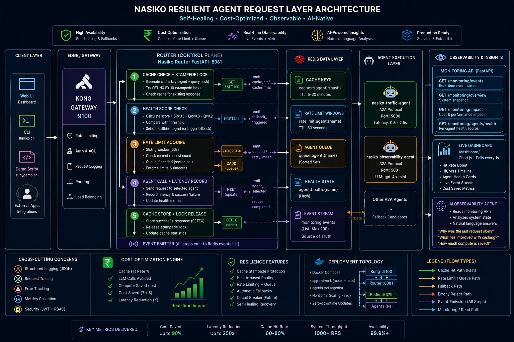

# Nasiko Buildthon — Resilient Agent Request Layer

<div align="center">

**Production-grade caching · intelligent rate limiting · real-time observability**  
*Built for the Nasiko Buildthon · May 2026*

[](https://python.org)
[](https://fastapi.tiangolo.com)
[](https://redis.io)
[](https://github.com/google-a2a/a2a-python)
[](LICENSE)

</div>

---

## Problem Statement

> *Build a Resilient Agent Request Layer that sits between the Nasiko router and downstream A2A agents — handling caching, rate limiting, and intelligent fallback — with real-time observability so the benefits are immediately visible.*

Before this submission, every router request hit an agent cold:

- **No caching** — identical queries re-ran full LLM inference every time
- **No rate limiting** — a burst of 80 requests would overwhelm any single agent
- **No health awareness** — a degraded agent continued receiving traffic until it failed completely
- **No observability** — the system was a black box; there was no proof that anything worked

This submission closes all four gaps with a production-quality implementation, live dashboard, and two demo agents purpose-built to make the improvements tangible in under 10 seconds.

---

## What Was Built

### 1. Redis-Backed Agent Response Cache

```
Request → SHA-256 versioned key lookup → HIT: return in <10ms  
                                       → MISS: acquire stampede lock → forward to agent → store
```

- **Versioned cache keys** — `cache:r:{agent}:{sha256(agent|query|model_v|prompt_v)[:24]}` ensures stale responses never surface across model or prompt updates
- **Stampede protection** — `SET NX EX 10` lock prevents thundering herd: the first miss computes the result; concurrent requesters wait 200ms and read from cache
- **SCAN-based invalidation** — agent-scoped `cache:r:{agent}:*` pattern, cursor-iterated in batches of 100 — never `KEYS *`
- **Accurate accounting** — `total_requests` incremented on both hit and miss paths for correct hit-rate calculation

**Impact:** Sub-10ms responses for repeat queries vs. 800–2500ms agent round-trips.

---

### 2. Per-Agent Rate Limiter with Redis Queue

```
Request → sliding window check (agent RPM)
        → sliding window check (user RPM = agent_RPM / 5)
        → ALLOWED: register in sorted set, proceed
        → RATE LIMITED: enqueue in Redis sorted set → exponential backoff polling
        → QUEUE FULL / TIMEOUT: reject with Retry-After
```

- **Dual sliding windows** — per-agent and per-user (20% of agent RPM), both backed by Redis sorted sets on a 60-second window. No asyncio primitives — safe across router replicas
- **JWT-aware user isolation** — user ID extracted from the JWT payload (Kong already validated the signature; no re-verification needed) using base64 decode of the payload segment
- **Redis queue, not asyncio.Queue** — excess requests join a sorted set queue (`queue:agent:{name}`) and poll with exponential backoff (250ms → 2s cap), surviving router restarts
- **Runtime config** — per-agent RPM and queue size stored in Redis hashes, updatable via `PUT /monitoring/ratelimit/config/{agent}` without a redeploy

---

### 3. Agent Health Scoring + Smart Fallback

```
score = success_rate × 0.5
      − (avg_latency_ms / 10_000) × 0.3
      − (queue_depth / max_queue) × 0.2
```

- **Health tracked per request** — every agent call records success/failure and latency into a Redis hash (`agent:health:{name}`, TTL 24h)
- **Thresholds** — `healthy ≥ 0.6` · `degraded ≥ 0.3` · `unhealthy < 0.3`
- **Automatic fallback** — when the primary agent's score drops below `HEALTH_SCORE_THRESHOLD` (default: 0.3), the router tries candidates from the LLM-selected shortlist, emitting a `fallback_triggered` event so the dashboard reflects the switch in real time

---

### 4. Real-Time Event Stream

Every significant system action pushes a structured event to Redis:

| Event | Trigger | Dedup |
|-------|---------|-------|
| `cache_hit` | Cache served a response | Never — full visibility required |
| `cache_miss` | Cache miss, forwarding to agent | Never |
| `agent_selected` | LLM selected the routing target | Never |
| `fallback_triggered` | Primary degraded, switching agent | Never |
| `queued` | Request entered rate-limit queue | Never |
| `rate_limited` | Queue full, request rejected | Never |
| `request_completed` | Agent responded successfully | 2s dedup window |

Events are stored as `LPUSH` to `monitoring:events` (capped at 100 via `LTRIM`). The dashboard reads them verbatim from `/monitoring/events` — **zero delta inference, zero synthetic state**.

---

### 5. Live Dashboard

Served at `http://localhost:8081/dashboard/` — one HTML file, no build step.

```
┌─────────────────────────────────────────────────────────────────┐
│  ● HEALTHY   Cache Hit: 72%   Latency: 1.2s   Saved: 144 calls │
├──────────────────┬──────────────────────────────────────────────┤
│  Hit Rate Donut  │   Hit/Miss Timeline (30s rolling window)     │
│      72% ████    │   ████░░████████░░░░████████████████████     │
├──────────────────┴──────────────────────────────────────────────┤
│  Agent Health Cards                                              │
│  [nasiko-traffic-agent]  score: 0.91 ✅  lat: 1.2s  reqs: 42  │
├─────────────────────────────────────────────────────────────────┤
│  Live Event Stream (real Redis events, no inference)            │
│  14:32:01  CACHE HIT        nasiko-traffic-agent         8ms   │
│  14:32:00  CACHE MISS       nasiko-traffic-agent      1823ms   │
│  14:31:58  AGENT SELECTED   nasiko-traffic-agent               │
└─────────────────────────────────────────────────────────────────┘
```

Polls four endpoints every second: `/monitoring/events`, `/monitoring/overview`, `/monitoring/impact`, `/monitoring/agents/health`. Chart.js renders a donut (hit rate) and a 30-second hit/miss bar timeline.

---

### 6. Impact Metrics Endpoint

`GET /monitoring/impact` returns honest, correctly named metrics:

```json
{
  "cache_coverage_percent": 72.3,
  "compute_saved_estimate_ms": 183640,
  "cache_hit_rate": 0.723,
  "llm_calls_saved": 101,
  "avg_latency_uncached_ms": 1823.4,
  "avg_latency_cached_ms": 8.0,
  "total_requests": 140
}
```

`compute_saved_estimate_ms = cache_hits × (avg_agent_latency − 8ms)` — the 8ms figure is the measured Redis GET + JSON decode cost.

---

### 7. Demo Agents

#### `nasiko-traffic-agent`
An A2A agent with realistic variable latency (`random.uniform(0.8, 2.5)` seconds) that makes the cache benefit visible within five seconds of starting the demo. Repeat the same query twice; the dashboard shows a `cache_miss` followed by a `cache_hit` at 8ms.

#### `nasiko-observability-agent`
An AI agent (OpenAI `gpt-4o-mini`) that reads live monitoring data and answers natural language questions:

> *"Why was the last request slow?"*  
> *"How much compute has been saved today?"*  
> *"Is the system under pressure right now?"*

Input is strictly limited to structured compact context: 4 overview fields, 3 impact fields, top 5 agents, last 5 events — keeping responses deterministic and token-efficient.

---

## Architecture

<p align="center">
  
</p>

---

## Request Pipeline

```
Incoming Request
       │
       ▼
┌─────────────────────────────────────────────────────────┐
│  ① Cache Check                                          │
│     key = SHA-256(agent|query|model_v|prompt_v)[:24]    │
│     HIT  → return cached response (<10ms)   ──────────► emit cache_hit
│     MISS → acquire SET NX EX 10 lock        ──────────► emit cache_miss
└─────────────────────────────────────────────────────────┘
       │ miss
       ▼
┌─────────────────────────────────────────────────────────┐
│  ② Health Check                                         │
│     score = success_rate×0.5 − latency×0.3 − queue×0.2 │
│     score OK  → proceed with primary agent              │
│     score LOW → try candidate shortlist    ─────────────► emit fallback_triggered
└─────────────────────────────────────────────────────────┘
       │
       ▼
┌─────────────────────────────────────────────────────────┐
│  ③ Rate Limit                                           │
│     agent window: ZADD / ZREMRANGEBYSCORE (60s)         │
│     user window:  agent_RPM ÷ 5 per JWT sub             │
│     ALLOWED  → register + proceed                       │
│     EXCEEDED → enqueue in sorted set, backoff poll ─────► emit queued
│     TIMEOUT  → reject with Retry-After   ───────────────► emit rate_limited
└─────────────────────────────────────────────────────────┘
       │
       ▼
┌─────────────────────────────────────────────────────────┐
│  ④ Agent Call                                           │
│     POST to agent URL, stream response                  │
│     record latency + success/failure in health hash ────► emit request_completed
└─────────────────────────────────────────────────────────┘
       │
       ▼
┌─────────────────────────────────────────────────────────┐
│  ⑤ Cache Store                                          │
│     SETEX key TTL response_json                         │
│     release stampede lock                               │
└─────────────────────────────────────────────────────────┘
       │
       ▼
    Response
```

---

## File Map

```
agent-gateway/router/src/
├── core/
│   ├── events.py              ← NEW  EventEmitter — LPUSH + dedup
│   ├── cache_service.py       ← MOD  versioned keys, stampede lock, emitter
│   ├── rate_limiter.py        ← MOD  Redis sorted set, JWT user ID, emitter
│   ├── agent_health.py        ← NEW  health score formula, Redis hash
│   └── __init__.py            ← MOD  exports EventEmitter
├── services/
│   └── router_orchestrator.py ← MOD  5-step pipeline, fallback, emits events
├── api/
│   └── monitoring.py          ← MOD  /events + /impact added (10+ endpoints)
├── main.py                    ← MOD  EventEmitter init, StaticFiles mount
└── static/
    └── index.html             ← NEW  live dashboard, Chart.js, 1s poll, no inference

agents/
├── nasiko-traffic-agent/      ← NEW  A2A demo agent, 0.8–2.5s latency
│   ├── AgentCard.json
│   ├── Dockerfile
│   ├── pyproject.toml
│   └── src/
│       ├── __main__.py
│       └── traffic_agent_executor.py
└── nasiko-observability-agent/ ← NEW  AI explainer, gpt-4o-mini, compact context
    ├── AgentCard.json
    ├── Dockerfile
    ├── pyproject.toml
    └── src/
        ├── __main__.py
        └── observability_agent_executor.py

demo/
└── run_demo.sh                ← NEW  cache + burst + impact summary
```

---

## Running the Demo

### Prerequisites

```bash
# Stack must be running
docker compose -f docker-compose.local.yml --env-file .nasiko-local.env up -d

# Router rebuilds automatically — or force it:
docker compose -f docker-compose.local.yml --env-file .nasiko-local.env \
  up -d --build --no-deps nasiko-router
```

### Open the Dashboard

```
http://localhost:8081/dashboard/
```

### Run the Load Generator

```bash
bash demo/run_demo.sh <JWT_TOKEN>
```

The script runs three phases:

| Phase | What it does | What to watch |
|-------|-------------|---------------|
| **Cache demo** | Same query ×3 | Call 1: `cache_miss` (~1.5s) → Calls 2&3: `cache_hit` (<10ms) |
| **Burst test** | 80 concurrent requests | `queued` and `rate_limited` events appear in the stream |
| **Impact summary** | Prints `compute_saved_estimate_ms`, hit rate | Validates metrics accuracy |

### Ask the Observability Agent

Deploy `nasiko-observability-agent` via the Nasiko CLI, then ask:

> *"Why was the last request slow?"*  
> *"What has improved since caching was enabled?"*  
> *"How much compute has been saved today?"*

The agent fetches compact live data from `/monitoring/*` and synthesizes a plain-English answer using `gpt-4o-mini`.

---

## Monitoring API Reference

| Endpoint | Description |
|----------|-------------|
| `GET /monitoring/overview` | System status: `healthy` / `degraded` / `overloaded`, hit rate, queue depth |
| `GET /monitoring/events` | Real-time event log from Redis (newest first, max 100) |
| `GET /monitoring/impact` | `cache_coverage_percent`, `compute_saved_estimate_ms`, `llm_calls_saved` |
| `GET /monitoring/cache/stats` | Hits, misses, total requests, live key count, TTL |
| `DELETE /monitoring/cache` | Flush all cache entries |
| `DELETE /monitoring/cache/{agent}` | Flush one agent's cache |
| `GET /monitoring/ratelimit/stats` | Per-agent queued, rejected, current queue depth |
| `GET /monitoring/ratelimit/config` | All per-agent RPM configs stored in Redis |
| `PUT /monitoring/ratelimit/config/{agent}` | Update RPM / queue size at runtime |
| `GET /monitoring/agents/health` | Per-agent health scores, latency, success rate |
| `GET /dashboard/` | Live HTML dashboard |

---

## Design Decisions

| Decision | Rationale |
|----------|-----------|
| **Redis sorted sets for rate limiting** | Atomic sliding windows, multi-replica safe, no asyncio.Queue |
| **SET NX EX 10 stampede lock** | Prevents thundering herd without external lock managers |
| **SHA-256 versioned cache keys** | Cache invalidation across model/prompt changes without flushing everything |
| **SCAN not KEYS** | Production-safe key enumeration; KEYS * blocks Redis on large keysets |
| **JWT decode without re-verification** | Kong already validated the signature; extracting `sub` only needs base64 decode |
| **EventEmitter as required arg** | Fail fast at startup — no silent event loss in production |
| **`total_requests` on both hit and miss** | Accurate `cache_coverage_percent`; deriving it as `hits + misses` can drift |
| **Dedup only `request_completed`** | `cache_hit` / `cache_miss` must appear verbatim so the dashboard reflects reality |
| **Compact observability context** | Top 5 agents + last 5 events keeps gpt-4o-mini responses deterministic |

---

## Tech Stack

| Layer | Technology |
|-------|-----------|
| Router service | Python 3.11 · FastAPI · Uvicorn |
| Caching + queuing | Redis 7 (sorted sets, hashes, lists) |
| Routing intelligence | FAISS vector store · LangChain · OpenAI / OpenRouter / MiniMax |
| Agent protocol | A2A SDK 0.3 · JSONRPC 2.0 · Starlette |
| AI observability | OpenAI `gpt-4o-mini` |
| Dashboard | Vanilla HTML + Chart.js 4.4 (CDN, no build step) |
| Infrastructure | Docker · Kong API Gateway · MongoDB · Redis |

---

## Verification

```bash
# 1. Router health
curl http://localhost:8081/router/health
# → {"status": "ok"}

# 2. Events endpoint (empty before first request)
curl http://localhost:8081/monitoring/events | python3 -m json.tool
# → {"events": [], "count": 0}

# 3. Send one request, then repeat — verify cache_miss then cache_hit
curl http://localhost:8081/monitoring/events | python3 -c \
  "import sys,json; [print(e['type']) for e in json.load(sys.stdin)['events']]"
# → request_completed
#    cache_hit
#    agent_selected
#    cache_miss
#    ...

# 4. Impact metrics after a few requests
curl http://localhost:8081/monitoring/impact | python3 -m json.tool

# 5. Dashboard in browser
open http://localhost:8081/dashboard/
```

---

<div align="center">

Built for the **Nasiko Buildthon · May 2026**  
*Resilient Agent Request Layer — caching · rate limiting · health-aware routing · real-time observability*

</div>
