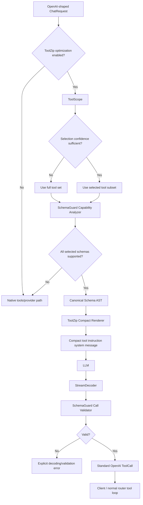

# Deep Technical Architecture & Engineering Design — Nasiko ToolZip

> **Document type:** Master Technical Architecture / Engineering Design Document  
> **Documentation model:** Docs-as-Code / Codex implementation contract  
> **Recommended filename:** `DEEP_TECHNICAL_ARCHITECTURE_TOOLZIP.md`  
> **Status:** Draft for implementation  
> **System:** Nasiko ToolZip  
> **Project:** Nasiko Build-A-Thon — P1 Compact Tool Schemas  
> **Repository:** `https://github.com/YellankiKaushik/Nasiko-Build-a-thon`  
> **Baseline branch:** `main`  
> **Baseline commit inspected:** `70b4e74c169444b9accebbd599d9822d56d66f03`  
> **Primary implementation language:** Rust 2024 edition  
> **Primary owner:** YellankiKaushik  
> **Last updated:** 2026-10-03
> **Architecture revision:** 2.1 — final Codex build specification  
> **Revision notes:** finalizes the exact filename, grammar, JSON Schema semantics, evaluator fallback/error mapping, ToolScope scoring, repo lint/dependency rules, anti-sidecar round-trip verification, open-question status, and time-critical phase gates.

---

# 0. How Codex Must Use This Document

This document is the implementation contract for one combined product that merges three ideas:

1. **ToolZip** — compact schema compiler, model-facing grammar, decoder, and streaming decoder.
2. **SchemaGuard** — schema capability analysis, semantics preservation, validation, fail-closed behavior, and safe fallback.
3. **ToolScope** — conservative tool preselection before compaction, with a full-set fallback when relevance is uncertain.

The combined product is called **ToolZip**. `ToolZip`, `SchemaGuard`, and `ToolScope` are internal subsystems, not separate projects.

Codex MUST:

- inspect the current repository before editing;
- preserve the repository's existing conventions;
- implement in the phases defined in this document;
- keep the official P1 path correct before implementing stretch work;
- avoid unrelated refactors;
- not alter default router behavior unless an explicit opt-in feature is enabled;
- keep `tool-compact/` pure: no IO, no environment reads, no provider calls;
- make every failure explicit rather than silently repairing model output;
- run the required tests after each phase;
- stop and report a blocker instead of inventing missing interfaces;
- never commit secrets, API keys, private prompts, or real user data.

## 0.1 Priority Rule

When requirements conflict, use this order:

1. Official hackathon evaluation contract.
2. Correctness and fail-closed behavior.
3. Schema semantic preservation.
4. Real-model adherence.
5. Token reduction.
6. ToolScope optimization.
7. Router integration and polish.

ToolScope MUST NOT be allowed to jeopardize the official P1 evaluator.

## 0.2 Build Readiness Statement

This revision is intended to be implementation-complete for the hackathon MVP.

Codex SHOULD NOT invent additional architecture before coding. If a detail is not explicitly specified:

1. inspect the current Nasiko code;
2. choose the smallest implementation consistent with this document;
3. preserve default behavior;
4. add a test that makes the choice explicit;
5. document any material deviation in the final implementation report.

Do not expand scope merely because a production-grade extension is imaginable.

---

# 1. Executive Technical Overview

## 1.1 Product Summary

**ToolZip** is an adaptive tool-context optimization layer for Nasiko's LLM router.

Modern agent requests can contain many verbose OpenAI-style tool definitions. The model receives repeated JSON Schema syntax such as `type`, `properties`, `description`, `required`, `items`, and nested structural boilerplate. This consumes prompt tokens before the model starts solving the user's request.

ToolZip reduces this overhead using three coordinated subsystems.

**ToolScope** optionally reduces the number of tools shown to the model by conservatively selecting tools that are relevant to the current request. Its primary optimization objective is **recall**. If selection confidence is insufficient, ToolScope returns the full tool set.

**SchemaGuard** determines whether every selected tool schema can be represented without losing required semantics. Supported schemas are canonicalized into an internal schema AST. Unsupported or ambiguous schemas trigger a native-tool fallback rather than approximate conversion. After model output, SchemaGuard validates every emitted call against the original canonical schema.

**ToolZip** renders the canonical schema AST into a compact, model-readable grammar and injects explicit call-format instructions. Model output is decoded by a streaming-safe state machine and converted back into standard OpenAI-compatible tool calls. Clients never need to know that compaction occurred.

The official P1 evaluator remains the primary success criterion. ToolScope is additive stretch functionality and MUST be disabled in the default official evaluation path unless the challenge contract explicitly changes.

## 1.2 One-Line Pitch

> **ToolZip reduces LLM tool-context overhead by conservatively selecting relevant tools, safely compiling supported JSON schemas into a compact grammar, and validating streamed model calls against the original schemas while falling back to native tool calling whenever correctness cannot be guaranteed.**

## 1.3 Product Pillars

### SCOPE — ToolScope
Send only the tools that are likely to be needed, but fall back to all tools when uncertain.

### ZIP — ToolZip
Represent supported tool schemas with substantially fewer model-facing tokens.

### GUARD — SchemaGuard
Never trade correctness or schema semantics for compression.

## 1.4 Core Product Invariant

```text
Optimization is optional.
Correctness is not.
```

If ToolZip cannot safely optimize a request, the request must continue through the native tool-calling path.

---

# 2. Source of Truth and Official Challenge Constraints

## 2.1 Track

This implementation targets:

```text
P1 — Compact tool schemas without breaking tool calls
```

## 2.2 Required Submission Shape

The submission is a merge-ready fork PR to `Nasiko-Labs/nasiko`.

The P1 implementation may:

- add one root crate: `tool-compact/`;
- add that crate to the root workspace;
- modify `llm-router/` as required for the evaluator and optional integration;
- add tests.

Do not add a separate `submissions/` directory.

PR title MUST begin with:

```text
[compact-tools]
```

Recommended title:

```text
[compact-tools] Add safe compact tool schemas, validation, and conservative tool scoping
```

## 2.3 Required Core Library

Create:

```text
tool-compact/
```

Package name:

```text
nasiko-tool-compact
```

The crate MUST be:

- pure;
- deterministic;
- free of IO;
- free of environment-variable reads;
- free of provider-specific network code;
- independent of `nasiko-llm-router`.

The router depends on `nasiko-tool-compact`, never the reverse.

## 2.4 Required Public Capability

Equivalent public API:

```rust
pub fn encode_tools(tools: &[ToolDef]) -> Result<CompactTools>;

pub fn decode_calls(
    text: &str,
    tools: &[ToolDef],
) -> Result<Vec<ToolCall>>;

pub struct StreamDecoder {
    // incremental decoder that survives split markers
}
```

Recommended additional API:

```rust
pub fn decode_tools(
    compact: &CompactTools,
) -> Result<Vec<ToolDef>>;
```

The additional API exists to verify that schema information survives canonicalization/compaction.

## 2.5 Required Evaluation Command

The following must work:

```bash
curl -fsSL https://registry.nasiko.dev/r/nasiko/compact-tools-eval \
  -o /tmp/compact-tools-eval.json

EVAL_SET=/tmp/compact-tools-eval.json \
OUT=/tmp/out.jsonl \
cargo run --release \
  -p nasiko-llm-router \
  --example compact_tools_eval
```

Default evaluator behavior MUST be:

- offline;
- deterministic;
- no API key required;
- no model call;
- CPU-compatible;
- no required CLI arguments;
- under the challenge time limit;
- one JSONL output record per evaluation case.

Live mode is optional and is activated when the evaluator receives the provider/model environment expected by the challenge.

## 2.6 Official Success Signals

The implementation is evaluated on:

1. round-trip call correctness;
2. decoder behavior;
3. schema preservation;
4. token reduction;
5. live model format adherence;
6. merge readiness;
7. usefulness;
8. code/tests/docs;
9. demo quality.

The public target for compact prompt reduction is **at least approximately 30%**, but compression alone is insufficient. A format that is small but unreliable for real models is a poor solution.

---

# 3. Current Repository State

## 3.1 Repository

```text
https://github.com/YellankiKaushik/Nasiko-Build-a-thon
```

At the baseline inspected for this document, the fork `main` matches upstream `Nasiko-Labs/nasiko` at:

```text
70b4e74c169444b9accebbd599d9822d56d66f03
```

## 3.2 Relevant Existing Architecture

The repository is a Rust workspace.

Relevant existing paths:

```text
Cargo.toml
compress/
llm-router/
  Cargo.toml
  src/
    ir/chat.rs
    compress.rs
    brevity.rs
    config.rs
  examples/
    mint_token.rs
```

The current `llm-router/examples/` directory does not contain `compact_tools_eval.rs`; this project must add it.

## 3.3 Existing Canonical Router Types

`llm-router/src/ir/chat.rs` defines the normalized OpenAI-shaped request/response IR.

Relevant existing types:

```rust
pub struct ChatRequest {
    pub model: Option<String>,
    pub messages: Vec<Message>,
    pub tools: Option<Vec<ToolDef>>,
    pub tool_choice: Option<Value>,
    pub temperature: Option<f64>,
    pub max_tokens: Option<i64>,
    pub stream: Option<bool>,
    pub extra: Map<String, Value>,
}

pub struct ToolDef {
    pub kind: String,
    pub function: FunctionDef,
    pub extra: Map<String, Value>,
}

pub struct FunctionDef {
    pub name: String,
    pub description: Option<String>,
    pub parameters: Option<Value>,
}

pub struct ToolCall {
    pub id: String,
    pub kind: String,
    pub function: FunctionCall,
    pub extra: Map<String, Value>,
}

pub struct FunctionCall {
    pub name: String,
    pub arguments: String,
}
```

`function.arguments` is a JSON string in the OpenAI contract.

## 3.4 Existing Optimization Principles to Preserve

`llm-router/src/compress.rs` already demonstrates important local design conventions:

- work on normalized IR;
- do not mutate unrelated message structure;
- leave requests untouched when an optimization cannot safely apply;
- measure what happened;
- preserve stable behavior.

`llm-router/src/brevity.rs` additionally demonstrates:

- explicit skip reasons;
- per-request decision logic;
- feature flags;
- opt-in behavior;
- deterministic selection where experiments are involved;
- explicit telemetry rather than invisible behavior.

ToolZip should feel architecturally consistent with those components.


## 3.5 Current State vs Target State

This document intentionally contains both **CURRENT** and **TARGET** architecture.

### CURRENT

At the inspected baseline:

- `tool-compact/` does not exist;
- `llm-router/examples/compact_tools_eval.rs` does not exist;
- ToolZip, SchemaGuard, and ToolScope do not exist;
- `llm-router/src/ir/chat.rs` is the canonical router IR;
- `nasiko-compress` and `llm-router/src/brevity.rs` are the closest local design references.

### TARGET

The target architecture is the implementation described in Sections 8–44.

Codex MUST NOT describe a TARGET capability as implemented until the corresponding code and tests exist.

## 3.6 Repository Engineering Rules

The repository's own engineering standards are binding.

Important requirements:

- Rust stable / edition inherited from the workspace;
- dependencies are declared once in root `Cargo.toml` and consumed with `.workspace = true`;
- zero warnings are a merge gate;
- unit tests must be hermetic;
- public library errors must be typed;
- request/model-controlled input must never cause `panic!`, `unwrap()`, or `expect()` in production code;
- keep public APIs minimal;
- avoid unrelated refactors;
- use `cargo fmt`, `cargo check --workspace`, and `cargo clippy --workspace` before declaring the PR ready.

The new pure crate SHOULD mirror `nasiko-compress` defensive linting where practical:

```rust
#![forbid(unsafe_code)]
#![deny(
    clippy::unwrap_used,
    clippy::expect_used,
    clippy::panic
)]
#![cfg_attr(test, allow(
    clippy::unwrap_used,
    clippy::expect_used,
    clippy::panic
))]
```

Do not add a lint if it creates large unrelated cleanup; the intent is to prevent new panic paths in ToolZip code.

---

# 4. Problem Statement

## 4.1 Current Problem

Tool definitions can occupy a significant portion of an LLM request.

A tool definition repeatedly contains verbose JSON Schema structures:

```json
{
  "type": "function",
  "function": {
    "name": "create_calendar_event",
    "description": "Create an event in the user's calendar.",
    "parameters": {
      "type": "object",
      "properties": {
        "title": {
          "type": "string",
          "description": "Event title"
        }
      },
      "required": ["title"]
    }
  }
}
```

When an agent exposes many tools, this overhead compounds.

Two distinct forms of waste exist:

1. **Schema verbosity** — the tools are needed, but the representation is verbose.
2. **Tool-set verbosity** — many supplied tools are irrelevant to the current request.

The system must reduce these costs without changing the client's OpenAI-compatible interface and without allowing invalid model output to turn into executable tool calls.

## 4.2 Root Cause Decomposition

```text
Tool-context cost
├── too many candidate tools
│   └── ToolScope addresses this
└── each tool schema is verbose
    └── ToolZip addresses this

Optimization introduces new correctness risk
├── schema semantics may be lost
├── relevant tools may be removed
├── model output may be malformed
├── model may invent a tool
└── model may send invalid arguments
    └── SchemaGuard addresses these
```

---

# 5. Goals

## 5.1 Technical Goals

| ID | Goal | Measurement |
|---|---|---|
| TG-001 | Preserve tool name and argument semantics | Official round-trip evaluator |
| TG-002 | Fail closed on invalid tool calls | Decoder/validation tests |
| TG-003 | Reduce compact request token count | `o200k_base` comparison |
| TG-004 | Survive marker splits across chunks | StreamDecoder tests |
| TG-005 | Preserve schema meaning for supported subset | `decode_tools` + canonical equality |
| TG-006 | Bypass unsupported schemas safely | Capability-analysis tests |
| TG-007 | Keep official evaluator deterministic | Run twice and byte-diff `OUT` |
| TG-008 | Keep default router behavior unchanged | Integration regression test |
| TG-009 | ToolScope must prioritize recall | Selection benchmark + fallback cases |
| TG-010 | ToolScope must not affect official P1 correctness by default | ToolScope disabled in default evaluator |

## 5.2 Product Goals

- Make tool compaction transparent to clients.
- Give Nasiko a reusable optimization primitive rather than a benchmark-specific patch.
- Make safety behavior explainable.
- Produce measurable optimization reports.
- Allow future router integration without changing the pure library architecture.

---

# 6. Non-Goals

The first implementation does NOT attempt to:

- redesign Nasiko's gateway protocol;
- redesign agent selection;
- intercept providers outside `llm-router`;
- replace OpenAI-compatible client contracts;
- repair malformed model output heuristically;
- use an LLM to repair invalid tool arguments;
- build a database;
- build a standalone SaaS product;
- build a dashboard before the core evaluator works;
- guarantee semantic tool selection using only lexical relevance;
- support every JSON Schema keyword in the first iteration;
- make ToolScope mandatory;
- change Nasiko's default routing behavior.

---

# 7. Architecture Decisions

## ADR-001 — One Combined Product, Three Internal Subsystems

**Decision:** Implement ToolZip, ToolScope, and SchemaGuard as one product.

**Rationale:** All three address different stages of the same tool-context pipeline.

```text
request
  ↓
ToolScope
  ↓
SchemaGuard preflight
  ↓
ToolZip compiler
  ↓
model
  ↓
ToolZip stream decoder
  ↓
SchemaGuard validation
  ↓
native ToolCall
```

## ADR-002 — Official P1 Core Is Independent of ToolScope

**Decision:** ToolScope is opt-in stretch functionality.

**Rationale:** Tool selection can introduce false negatives. The official P1 evaluator primarily measures compaction, decoding, and schema preservation.

**Consequence:** ToolScope can be developed and demonstrated without making official evaluator correctness dependent on it.

## ADR-003 — Fail Closed

**Decision:** Any unknown tool, malformed call, missing required field, incompatible type, invalid enum, or incomplete call returns an error.

**Forbidden behavior:**

```text
guessing missing fields
renaming tools
coercing unrelated values
silently dropping invalid fields
silently changing enums
executing a partially parsed call
```

## ADR-004 — Unsupported Schema Means Native Fallback

**Decision:** The schema analyzer uses an explicit allowlist of supported schema constructs.

Unknown semantics-bearing keywords cause a safe bypass.

## ADR-005 — Canonical AST Before Rendering

**Decision:** Never generate compact text directly from raw JSON.

Pipeline:

```text
JSON Schema
   ↓
SchemaGuard analyzer
   ↓
Canonical Schema AST
   ↓
ToolZip renderer
```

This gives encoding, validation, semantic round-trip verification, deterministic output, and future grammar evolution a shared source of truth.

## ADR-006 — Compact Grammar Must Remain Model-Readable

**Decision:** Optimize redundant JSON Schema syntax, not natural-language comprehensibility.

Do not create an opaque byte-code-like mini-language.

## ADR-007 — Descriptions Are Preserved in V1

**Decision:** Preserve non-empty tool/property descriptions in the canonical AST and compact prompt.

V1 may remove JSON key boilerplate around descriptions, but MUST NOT algorithmically summarize descriptions.

**Rationale:** Automatic description shortening can destroy disambiguating semantics.

## ADR-008 — Router Integration Off by Default

**Decision:** Any production `llm-router` wiring must be controlled by explicit configuration and default to disabled.

With the feature disabled, behavior must remain byte-compatible with the existing path wherever practical.

---

# 8. High-Level Architecture



---

# 9. Repository Target Structure

Recommended target structure:

```text
Nasiko-Build-a-thon/
├── Cargo.toml
│
├── tool-compact/
│   ├── Cargo.toml
│   ├── README.md
│   ├── src/
│   │   ├── lib.rs
│   │   ├── error.rs
│   │   ├── types.rs
│   │   │
│   │   ├── schema/
│   │   │   ├── mod.rs
│   │   │   ├── ast.rs
│   │   │   ├── analyze.rs
│   │   │   ├── render.rs
│   │   │   └── validate.rs
│   │   │
│   │   ├── decode/
│   │   │   ├── mod.rs
│   │   │   ├── parser.rs
│   │   │   └── stream.rs
│   │   │
│   │   ├── scope/
│   │   │   ├── mod.rs
│   │   │   ├── tokenize.rs
│   │   │   ├── score.rs
│   │   │   └── policy.rs
│   │   │
│   │   └── report.rs
│   │
│   └── tests/
│       ├── encode.rs
│       ├── decode.rs
│       ├── stream.rs
│       ├── validation.rs
│       ├── roundtrip.rs
│       ├── unsupported.rs
│       ├── scope.rs
│       └── adversarial.rs
│
└── llm-router/
    ├── Cargo.toml
    ├── examples/
    │   └── compact_tools_eval.rs
    └── src/
        ├── config.rs
        ├── ir/chat.rs
        └── [minimal integration files only if stretch phase is reached]
```

Do not create all modules empty at the start. Add them as implementation phases require them.

---

# 10. Core Domain Types

`tool-compact` owns its own tool types.

Suggested public representation:

```rust
use serde::{Deserialize, Serialize};
use serde_json::{Map, Value};

#[derive(Debug, Clone, Serialize, Deserialize, PartialEq)]
pub struct ToolDef {
    #[serde(rename = "type", default = "function_kind")]
    pub kind: String,
    pub function: FunctionDef,
    #[serde(flatten)]
    pub extra: Map<String, Value>,
}

#[derive(Debug, Clone, Serialize, Deserialize, PartialEq)]
pub struct FunctionDef {
    pub name: String,
    #[serde(default, skip_serializing_if = "Option::is_none")]
    pub description: Option<String>,
    #[serde(default, skip_serializing_if = "Option::is_none")]
    pub parameters: Option<Value>,
}

#[derive(Debug, Clone, Serialize, Deserialize, PartialEq)]
pub struct ToolCall {
    pub name: String,
    pub arguments: Value,
}
```

The library-level `ToolCall` does not own an OpenAI call ID. The router assigns IDs at the integration seam.

`ToolDef.extra` is preserved so the analyzer can see whether the input contains additional tool-level semantics. V1 MUST bypass compaction when a non-empty `extra` map contains data whose semantics ToolZip does not explicitly support.

## 10.1 Compact Result

`CompactTools` is the encoded representation that the caller uses to build the model-facing prompt.

Recommended shape:

```rust
#[derive(Debug, Clone, PartialEq)]
pub struct CompactTools {
    /// Exact deterministic compact grammar sent to the model.
    pub rendered: String,

    /// Structured report describing whether/how the transformation ran.
    pub report: OptimizationReport,
}
```

The library MAY keep parsed/canonical structures privately while encoding/decoding, but `CompactTools` MUST NOT carry a hidden copy of the original full JSON schemas solely to make `decode_tools()` pass.

If `decode_tools()` is implemented, it MUST reconstruct tool definitions from the **same compact representation whose information is model-visible**. A hidden original-schema sidecar does not count as semantic round-trip verification.

## 10.2 Zero-Argument Tools

If `FunctionDef.parameters` is `None` or JSON `null`, V1 treats the tool as a zero-argument function and renders:

```text
tool_name()
```

A decoded call for such a tool MUST use an empty JSON object:

```json
{}
```

Do not accept arbitrary values for a zero-argument tool.

A present but structurally ambiguous schema such as an unconstrained `{}` MUST NOT automatically be treated as a zero-argument schema; analyze it according to the supported-schema policy and bypass when semantics cannot be represented safely.

---

# 11. SchemaGuard — Canonical Schema AST

## 11.1 Purpose

SchemaGuard converts supported JSON Schema into a deterministic internal representation.

The AST is the single semantic source of truth for:

- ToolZip rendering;
- decoded-call validation;
- canonical equality tests;
- capability analysis;
- `decode_tools()` parsing/reconstruction;
- future grammar versions.

## 11.2 Initial Schema AST

Suggested design:

```rust
#[derive(Debug, Clone, PartialEq)]
pub enum SchemaNode {
    String(StringSchema),
    Integer(ScalarSchema),
    Number(ScalarSchema),
    Boolean(ScalarSchema),
    Array(ArraySchema),
    Object(ObjectSchema),
}

#[derive(Debug, Clone, PartialEq, Default)]
pub struct ScalarSchema {
    pub description: Option<String>,
    /// Scalar enum values, if present. Values must match the declared primitive type.
    pub enum_values: Option<Vec<serde_json::Value>>,
}

#[derive(Debug, Clone, PartialEq, Default)]
pub struct StringSchema {
    pub description: Option<String>,
    pub format: Option<String>,
    pub enum_values: Option<Vec<serde_json::Value>>,
}

#[derive(Debug, Clone, PartialEq)]
pub struct ArraySchema {
    pub description: Option<String>,
    pub items: Box<SchemaNode>,
}

#[derive(Debug, Clone, PartialEq)]
pub struct ObjectSchema {
    pub description: Option<String>,
    pub properties: std::collections::BTreeMap<String, ObjectProperty>,
    pub additional_properties: AdditionalPropertiesPolicy,
}

#[derive(Debug, Clone, PartialEq)]
pub struct ObjectProperty {
    pub required: bool,
    pub schema: SchemaNode,
}

#[derive(Debug, Clone, Copy, PartialEq, Eq)]
pub enum AdditionalPropertiesPolicy {
    Allowed,
    Forbidden,
}
```

The exact Rust shape may change if implementation proves a cleaner representation, but the semantic requirements MUST remain.

## 11.3 Deterministic Ordering

Object properties MUST be canonicalized into deterministic order, preferably `BTreeMap`.

Determinism is required for:

- repeatable evaluator output;
- stable token measurement;
- stable snapshots;
- stable prompt caching;
- reproducible tests.

Enum value order SHOULD preserve the original schema order because order is model-visible even when the validation set is logically unordered.

## 11.4 Schema Well-Formedness Checks

Before encoding, reject/bypass malformed schemas such as:

- root parameters schema that is not an object;
- `required` entries that do not name a declared property when `properties` is present;
- duplicate tool names;
- invalid `type` value;
- enum values incompatible with the declared primitive type;
- array schema without supported `items`;
- non-object `properties`;
- unsupported schema-valued `additionalProperties`.

Malformed schema input MUST become a typed error/bypass, never a panic.

---

# 12. SchemaGuard — Supported JSON Schema Subset

## 12.1 Required V1 Support

V1 MUST support:

- object;
- string;
- integer;
- number;
- boolean;
- array;
- `properties`;
- `required`;
- scalar `enum` values compatible with the declared primitive type;
- nested objects;
- nested arrays;
- `items`;
- `description`;
- `format` as preserved model-facing metadata;
- top-level and nested required/optional distinction;
- boolean `additionalProperties`.

`format` is preserved in the compact representation and round trip. V1 is not required to perform semantic format validation unless a specific format validator is explicitly implemented and tested.

## 12.2 Exact `additionalProperties` Semantics

For an object schema:

```text
additionalProperties absent
→ Allowed

additionalProperties: true
→ Allowed

additionalProperties: false
→ Forbidden

additionalProperties: { ...schema... }
→ unsupported in V1 → native fallback
```

During argument validation:

- `Allowed` accepts unknown object keys in addition to declared properties;
- `Forbidden` rejects unknown object keys.

Do not make `additionalProperties: false` the default; that would change JSON Schema semantics.

## 12.3 Primitive Enum Semantics

V1 supports enums on scalar primitive schemas:

- string;
- integer;
- number;
- boolean.

Every enum value MUST be valid for the declared type.

Enums containing objects, arrays, `null`, or mixed incompatible primitive types MUST bypass in V1.

## 12.4 Type Unions and Nullable Schemas

Until explicitly implemented, these MUST bypass:

```json
{"type":["string","null"]}
```

and provider/vendor nullable extensions such as:

```json
{"nullable":true}
```

Do not reinterpret these as ordinary strings or optional properties. Property optionality and a property's ability to contain JSON `null` are different semantics.

## 12.5 Optional V1.1 Constraints

Only add these after the required evaluator path is green:

- `minLength`;
- `maxLength`;
- numeric `minimum`;
- numeric `maximum`;
- `minItems`;
- `maxItems`;
- simple `pattern`.

If one of these is present before support exists, SchemaGuard MUST bypass compaction.

## 12.6 Unsupported-by-Default Keywords

Until explicitly implemented and tested, the analyzer MUST reject/bypass schemas containing semantics-bearing constructs such as:

```text
$ref
$defs
definitions
oneOf
anyOf
allOf
not
if
then
else
const
nullable
dependentSchemas
dependentRequired
patternProperties
contains
prefixItems
unevaluatedProperties
unevaluatedItems
propertyNames
```

Unknown semantics-bearing keywords MUST also bypass by default.

Do not silently delete them.

## 12.7 Annotation Keywords

`description` and `format` are supported and preserved.

Other annotations such as `title`, `default`, `examples`, `deprecated`, `$comment`, or vendor-specific extensions are NOT silently discarded in V1. Unless explicitly implemented, their presence causes native fallback.

This is deliberately conservative because annotations can affect model/tool behavior even when they do not change formal JSON Schema validation.

## 12.8 Unsupported Result

Suggested error:

```rust
CompactError::UnsupportedSchema {
    tool: String,
    path: String,
    keyword: String,
}
```

At the router/evaluator policy layer, this error becomes:

```text
compacted = false
native fallback
```

It MUST NOT become a partially compacted request unless partial per-tool fallback is explicitly implemented and proven safe.

---

# 13. ToolZip Compact Grammar

## 13.1 Design Goals

The grammar must be:

- smaller than JSON Schema;
- easy for LLMs to imitate;
- close to the organizer's illustrative syntax;
- unambiguous;
- deterministic;
- easy to document;
- compatible with nested arrays/objects;
- explicit about optionality;
- explicit about enums;
- robust to model whitespace changes.

## 13.2 Final Grammar V1

Required properties have **no suffix**.

Optional properties use `?`.

This intentionally avoids the redundant `!` marker and stays close to the official illustrative grammar.

Tool definition:

```text
tool_name(required_arg:str, optional_arg?:int) - "Tool description"
```

Primitive aliases:

```text
str   string
int   integer
num   number
bool  boolean
```

Common string format alias:

```text
datetime   string with format "date-time"
```

Other preserved string formats may render as:

```text
str<format-name>
```

Array:

```text
[str]
[int]
[{field:str}]
```

Object:

```text
{field:str,optional?:int}
```

Enum:

```text
public|private
1|2|3
true|false
```

Safe bare string enum values may be emitted without quotes. Enum string values containing whitespace or grammar delimiters MUST use JSON string quoting:

```text
"needs review"|"approved"
```

Property description:

```text
title:str#"Event title"
```

Tool description:

```text
create_calendar_event(...) - "Create an event in the user's calendar."
```

Complete example:

```text
TOOLS
create_calendar_event(
  title:str#"Event title",
  start:datetime#"Start time, ISO 8601",
  duration_min?:int#"Duration in minutes",
  attendees?:[str]#"Attendee emails",
  visibility?:public|private
) - "Create an event in the user's calendar."

CALL
<<call TOOL_NAME JSON_OBJECT>>
```

The actual model-facing renderer SHOULD use a compact single-line representation:

```text
TOOLS
create_calendar_event(title:str#"Event title",start:datetime#"Start time, ISO 8601",duration_min?:int#"Duration in minutes",attendees?:[str]#"Attendee emails",visibility?:public|private) - "Create an event in the user's calendar."
CALL <<call TOOL_NAME JSON_OBJECT>>
```

## 13.3 Binding EBNF-Like Definition

The parser/renderer contract is:

```text
document        = "TOOLS" newline tool_def *(newline tool_def)
                  newline "CALL <<call TOOL_NAME JSON_OBJECT>>"

tool_def        = tool_name "(" [ parameter *("," parameter) ] ")"
                  [ " - " json_string ]

parameter       = property_name [ "?" ] ":" schema_type
                  [ "#" json_string ]

schema_type     = primitive
                | format_type
                | enum_type
                | array_type
                | object_type

primitive       = "str" | "int" | "num" | "bool"

format_type     = "datetime"
                | "str<" format_name ">"

enum_type       = enum_value "|" enum_value *("|" enum_value)

array_type      = "[" schema_type "]"

object_type     = "{" [ parameter *("," parameter) ] "}"

enum_value      = safe_bare_string | json_string | json_number | "true" | "false"
```

The implementation does not need to use a parser-generator, but renderer and `decode_tools()` MUST agree on this contract.

## 13.4 Why Calls Keep JSON Arguments

Do NOT create a second custom language for arguments.

Use:

```text
<<call create_calendar_event {"title":"Retro","duration_min":30}>>
```

Reasons:

- models already know JSON;
- nested values remain expressive;
- validation is straightforward;
- less custom parser surface;
- official challenge examples use this shape;
- most token savings come from schema definitions, not one emitted call.

## 13.5 Safe Identifier Rule

V1 should treat only predictable function/property names as compact-safe.

Recommended safe pattern:

```text
^[A-Za-z_][A-Za-z0-9_.:-]*$
```

If a tool or property name does not satisfy the supported identifier syntax:

- do not rename it silently;
- either implement and test an explicit quoted-name grammar, or
- bypass compaction.

MVP recommendation: bypass unusual identifiers.

## 13.6 Description Escaping

Descriptions are untrusted strings.

They MUST be encoded with JSON string escaping.

Property example:

```text
title:str#"Text containing \"quotes\" safely"
```

Tool example:

```text
send_email(...) - "Text containing \"quotes\" safely"
```

Never concatenate raw description text into grammar delimiters.

## 13.7 Grammar Versioning

V1 grammar is internal to this hackathon feature and does not require a public wire-version field.

However, renderer/parser tests MUST pin exact behavior so a future grammar change cannot silently make stored/evaluated fixtures incompatible.

---

# 14. SchemaGuard — Encoding Preflight

## 14.1 Preflight Algorithm

For each tool:

1. verify `kind == "function"` exactly for V1;
2. reject duplicate tool names before building the lookup table;
3. validate the tool name;
4. if `ToolDef.extra` contains unsupported tool-level metadata, bypass;
5. interpret `parameters == None/null` as a zero-argument tool;
6. otherwise require the root parameters schema to be a supported object schema;
7. reject unsupported schema keywords recursively;
8. validate `required`, `properties`, `items`, enum values, and `additionalProperties` structure;
9. canonicalize the schema into `SchemaNode`;
10. preserve descriptions and supported format metadata;
11. compute deterministic representation.

For the request as a whole:

```text
if any selected tool cannot be safely represented
    => return bypass recommendation
else
    => render all selected tools
```

This all-or-nothing policy is simplest and safest for the hackathon.

A later version may support hybrid native+compact tool sets only if providers can reliably consume them.

---

# 15. SchemaGuard — Decoded Call Validation

## 15.1 Validation Pipeline

Every decoded call MUST pass:

```text
tool-name lookup
    ↓
JSON object parse
    ↓
schema root validation
    ↓
required-field validation
    ↓
property validation
    ↓
nested recursion
    ↓
enum validation
    ↓
success
```

## 15.2 Required Rules

### Unknown tool

```text
<<call delete_everything {...}>>
```

when `delete_everything` was not supplied:

```text
Err(UnknownTool)
```

### Missing required value

Schema:

```text
title:str
```

Call:

```json
{}
```

Result:

```text
Err(InvalidArguments)
```

### Wrong type

Schema:

```text
duration_min?:int
```

Call:

```json
{"duration_min":"thirty"}
```

Result:

```text
Err(InvalidArguments)
```

### Invalid enum

Schema:

```text
visibility?:public|private
```

Call:

```json
{"visibility":"secret"}
```

Result:

```text
Err(InvalidArguments)
```

### Nested object/array

Validation MUST recurse.

### Integer vs number

For an `integer` schema, JSON numeric values that carry a fractional representation are invalid.

Examples:

```text
30   → valid integer
30.5 → invalid integer
```

For a `number` schema, integer and floating JSON numbers are both valid.

### Unknown object keys

Behavior follows canonical `additionalProperties`:

```text
Allowed   → unknown keys accepted
Forbidden → unknown keys rejected
```

### Zero-argument tool

Only `{}` is accepted.

## 15.3 No Coercion

Do NOT coerce:

```text
"30" -> 30
"true" -> true
single object -> one-item array
```

The model either produced valid arguments or it did not.

---

# 16. ToolZip Decoder

## 16.1 Accepted Call Shape

```text
<<call TOOL_NAME JSON_OBJECT>>
```

The decoder MUST support:

- one call;
- multiple calls;
- text before calls;
- text after calls;
- plain text with no calls;
- whitespace variations;
- `>>` inside a quoted JSON string;
- braces inside quoted JSON strings;
- escaped quotes;
- nested arrays;
- nested objects.

## 16.2 Plain Answer Behavior

Input:

```text
The answer is 42.
```

Output:

```rust
Ok(vec![])
```

Absence of a tool call is not an error.

## 16.3 Mixed Free Text

Input:

```text
I will do both.

<<call send_email {"to":["a@example.com"],"subject":"Build","body":"Green"}>>

Then I will schedule the meeting.

<<call create_calendar_event {"title":"Retro","start":"2026-10-04T10:00:00+05:30"}>>
```

Output:

```text
2 validated ToolCall values
```

## 16.4 Partial Failure Policy

If any detected call is malformed or invalid:

```text
return Err(...)
```

Do not return a subset of valid calls from a response that also contains a malformed detected call.

This prevents partial execution when the model's intended atomic response is ambiguous.

---

# 17. StreamDecoder State Machine

## 17.1 Why a State Machine Is Required

This is invalid implementation logic:

```rust
text.split(">>")
```

because `>>` may occur inside JSON strings and markers may be split across chunks.

## 17.2 Required State Model

Recommended states:

```rust
enum DecodeState {
    Searching,
    ReadingToolName,
    WaitingForJson,
    ReadingJson,
    WaitingForClose,
}
```

Additional parser state:

```rust
struct JsonScanState {
    depth: usize,
    in_string: bool,
    escape_next: bool,
}
```

## 17.3 Streaming Example

Chunks:

```text
"<<ca"
"ll create_calendar_event {\"title\":\"Ret"
"ro\",\"start\":\"2026-10-04T10:00:00+05:30\"}>"
">"
```

The parser MUST emit exactly one call after the final marker arrives.

## 17.4 `>>` Inside JSON String

Input:

```text
<<call send_email {"body":"Build >> deployed"}>>
```

The internal `>>` MUST NOT terminate the call.

## 17.5 Recommended API

```rust
pub struct StreamDecoder {
    // internal state
}

impl StreamDecoder {
    pub fn new(tools: &[ToolDef]) -> Result<Self>;

    /// Consumes one text chunk and returns any newly completed,
    /// already-validated calls.
    pub fn push(&mut self, chunk: &str) -> Result<Vec<ToolCall>>;

    /// Fails if the stream ends in an incomplete detected call.
    pub fn finish(&mut self) -> Result<()>;
}
```

`decode_calls(text, tools)` should use the same StreamDecoder internally so batch and streaming behavior cannot diverge.

---

# 18. `decode_tools` Semantic Round-Trip

## 18.1 Purpose

This is the strongest SchemaGuard proof.

```text
native ToolDef
   ↓
canonical AST
   ↓
CompactTools
   ↓
decode_tools
   ↓
reconstructed ToolDef
   ↓
canonical semantic comparison
```

## 18.2 Comparison Rules

Do not compare raw JSON strings.

Compare canonical semantic structures:

- tool name;
- description;
- schema node type;
- requiredness;
- properties;
- nested structure;
- enum values;
- array item schema;
- format metadata.

Key ordering must not matter.

## 18.3 Round-Trip Test Invariant

For every supported schema:

```rust
canonicalize(original)
    == canonicalize(decode_tools(encode_tools(original)))
```

## 18.4 No Hidden-Sidecar Rule

`decode_tools()` MUST parse/reconstruct from the compact grammar in `CompactTools.rendered` (or from an equivalent compact structure that is itself the source of the rendered model-visible representation).

It MUST NOT simply return an original schema stored privately beside the rendered text.

The purpose of this function is to demonstrate that the **compact representation itself** contains enough information to preserve supported schema semantics.

---

# 19. ToolScope

## 19.1 Purpose

ToolScope reduces **tool count**, while ToolZip reduces **schema size**.

Example:

```text
50 native tools
   ↓ ToolScope
6 relevant tools
   ↓ ToolZip
6 compact schemas
```

ToolScope is an optimization, not an authority.

## 19.2 Safety Objective

ToolScope optimizes for **high recall**.

False positive:

```text
an extra irrelevant tool remains
```

Cost:

```text
some additional tokens
```

False negative:

```text
required tool removed
```

Cost:

```text
task may become impossible
```

Therefore false negatives are much more expensive.

## 19.3 V1 Selection Strategy

Use a deterministic local relevance scorer.

No network.
No model.
No embeddings required.

Input:

```rust
pub struct ScopeInput<'a> {
    pub query: &'a str,
    pub tools: &'a [ToolDef],
}
```

Output:

```rust
pub struct ScopeDecision {
    pub selected_indices: Vec<usize>,
    pub confidence: f32,
    pub reason: ScopeReason,
}
```

Possible reasons:

```rust
pub enum ScopeReason {
    NotNeededSmallToolSet,
    ConfidentSubset,
    LowConfidenceFullFallback,
    NoSignalFullFallback,
}
```

## 19.4 Tokenization

Normalize:

- lowercase;
- snake_case;
- kebab-case;
- camelCase/PascalCase;
- alphanumeric words.

Examples:

```text
create_calendar_event
→ create, calendar, event

sendEmail
→ send, email
```

Maintain a small deterministic stop-word set.

Do not use language-model-generated synonyms in V1.

## 19.5 Tool Feature Sources

Extract tokens from:

1. tool name;
2. tool description;
3. top-level property names;
4. required property names.

Relative importance is:

```text
exact tool-name mention          highest
tool-name token overlap          high
required-property overlap        medium
description overlap              medium
optional-property overlap        lower
```

The binding V1 numeric weights are defined in §19.9. Codex MUST use those values unless it records benchmark evidence for a deliberate change.

## 19.6 Conservative Selection Policy

The safety policy is binding:

```text
small tool set
→ keep all

no strong relevance signal
→ keep all

ambiguous selection
→ keep all

confident relevance signal
→ select the matching subset plus the bounded safety tail defined in §19.9
```

The exact thresholds and count rules are defined in §19.9. Do not force a subset simply to report savings.

## 19.7 ToolScope Hard Guarantees

- deterministic for identical input;
- never mutates tool definitions;
- preserves original tool ordering among selected tools;
- never selects a tool that was not present;
- full-set fallback always available;
- disabled by default in official P1 evaluation;
- if a specific `tool_choice` is forced and the router cannot guarantee behavior, bypass optimization.

## 19.8 ToolScope Future Upgrade Path

A future router adapter MAY implement semantic selection using:

- embeddings;
- a local classifier;
- provider-native tool search;
- learned historical tool-use signals.

These are NOT required for the hackathon MVP.

---


## 19.9 Binding V1 Baseline Scoring

To avoid implementation ambiguity, the first ToolScope version SHOULD use this deterministic integer scoring baseline.

### Query source

For standalone library use, the caller supplies `ScopeInput.query`.

For optional router integration, use the most recent textual `user` message only. If no textual user content is available, return the full tool set.

### Token sources

Build de-duplicated normalized token sets for:

- tool name;
- tool description;
- required property names;
- optional property names.

### Score

For each tool:

```text
+24  exact normalized full tool name occurs in the query
+8   per distinct tool-name token also present in the query
+4   per distinct required-property token also present
+2   per distinct description token also present
+1   per distinct optional-property token also present
```

Do not count the same normalized token twice within one feature source.

### Selection policy

```text
tool_count <= 8
→ full set

no tool score >= 8
→ full set

otherwise:
→ select every tool with score >= 8
→ include at most one safety-tail tool with score 4..7
→ preserve original relative order

if selected_count > max(12, ceil(tool_count * 0.40))
→ full set because pruning is not sufficiently selective
```

`confidence` is reporting metadata, not permission to violate the fallback rules.

Suggested deterministic report value:

```text
confidence = min(1.0, max_score / 24.0)
```

An implementation may tune these constants only if tests/benchmark evidence is recorded. Do not tune against individual public challenge case IDs.


# 20. Adaptive Optimization Policy

## 20.1 Purpose

One combined product needs one policy decision.

Suggested:

```rust
pub enum OptimizationPlan {
    Native,
    CompactAll,
    SelectAndCompact,
}
```

Decision inputs:

```rust
pub struct OptimizationContext<'a> {
    pub query: Option<&'a str>,
    pub tools: &'a [ToolDef],
    pub scope_enabled: bool,
    pub compact_enabled: bool,
    pub forced_tool_choice: bool,
}
```

## 20.2 Policy

```text
compaction disabled
→ Native

no tools
→ Native/no-op

forced tool choice not proven safe
→ Native

ToolScope disabled
→ SchemaGuard on all tools
    supported → CompactAll
    unsupported → Native

ToolScope enabled
→ ToolScope
    low confidence → full set
    confident → selected set
→ SchemaGuard
    supported → SelectAndCompact or CompactAll
    unsupported → Native
```

## 20.3 No Partial Unsafe Optimization

For V1:

```text
one unsupported selected schema
→ native fallback for the whole request
```

This keeps behavior easy to reason about.

---

# 21. Optimization Report

ToolZip should expose structured evidence.

Suggested type:

```rust
#[derive(Debug, Clone, Default)]
pub struct OptimizationReport {
    pub input_tool_count: usize,
    pub selected_tool_count: usize,
    pub schemas_compacted: usize,
    pub schemas_bypassed: usize,
    pub plan: OptimizationPlan,
    pub scope_confidence: Option<f32>,
    pub bypass_reasons: Vec<BypassReason>,
}
```

Do not put tokenizer dependencies into the library just for reporting.

Token counts belong in the evaluator/integration layer.

---

# 22. Error Model

Suggested public error enum:

```rust
#[derive(Debug, thiserror::Error)]
pub enum CompactError {
    #[error("unsupported tool kind for {tool}: {kind}")]
    UnsupportedToolKind {
        tool: String,
        kind: String,
    },

    #[error("unsupported schema keyword {keyword} at {path} for tool {tool}")]
    UnsupportedSchema {
        tool: String,
        path: String,
        keyword: String,
    },

    #[error("unsupported tool name: {0}")]
    UnsupportedToolName(String),

    #[error("malformed compact call")]
    MalformedCall,

    #[error("incomplete compact call at end of stream")]
    IncompleteCall,

    #[error("unknown tool: {0}")]
    UnknownTool(String),

    #[error("invalid arguments for tool {tool}: {reason}")]
    InvalidArguments {
        tool: String,
        reason: String,
    },

    #[error("invalid schema for tool {tool}: {reason}")]
    InvalidSchema {
        tool: String,
        reason: String,
    },
}
```

Errors that may contain user content should avoid logging complete sensitive argument values by default.

---

# 23. Router Conversion Seam

Because `nasiko-tool-compact` cannot depend on `nasiko-llm-router`, conversion lives in `llm-router`.

Conceptual functions:

```rust
fn to_compact_tool(
    tool: &crate::ir::ToolDef,
) -> nasiko_tool_compact::ToolDef;

fn from_compact_call(
    call: nasiko_tool_compact::ToolCall,
    id: String,
) -> crate::ir::ToolCall;
```

The router assigns tool-call IDs.

Do not add router imports inside `tool-compact`.

## 23.1 Router Integration Safety Carve-Outs

If stretch router integration is implemented, V1 MUST use the native path for cases whose semantics are not fully covered.

Native fallback is required when:

- `tool_choice` is an explicit forced function;
- `tool_choice` uses an unsupported provider-specific shape;
- prior conversation history contains tool calls/results and compact-history translation is not implemented;
- the selected schema set contains an unsupported schema;
- compact response decoding fails;
- a provider path cannot safely translate compact textual calls back into the expected response shape.

For `tool_choice == "none"`, prefer native pass-through in V1 rather than changing request semantics.

For absent/automatic tool choice, compact mode may proceed if all other checks pass.

### Non-streaming response seam

The simplest stretch integration is:

```text
provider text response
→ decode_calls
→ validated library ToolCall values
→ router assigns deterministic/unique call IDs
→ serialize arguments with serde_json::to_string
→ populate normal OpenAI-shaped assistant tool_calls
```

Do not attempt streaming response transformation until non-streaming behavior is correct and tested.


---

# 24. Compact Request Construction

## 24.1 Default Evaluator Request

Given native messages and selected tools:

1. preserve original messages;
2. do not send native `tools` in the compact request;
3. inject one system instruction containing:
   - fixed reference time required by the challenge;
   - compact tool definitions;
   - explicit call grammar;
   - rule to emit no call when no tool is needed;
4. set temperature `0` in live evaluation;
5. preserve relevant request fields.

Recommended placement:

```text
existing leading system messages
ToolZip system message
remaining original messages
```

Do not rewrite author-provided system messages.

## 24.2 ToolZip System Message

Example:

```text
Reference time: 2026-10-02, timezone Asia/Kolkata.

Available tools:
create_calendar_event(...)

When a tool is required, emit exactly:
<<call TOOL_NAME JSON_OBJECT>>

You may emit multiple calls.
Use only listed tools.
Arguments must satisfy the schema.
If no tool is needed, answer normally and emit no call.
```

Keep instructions concise because instructions themselves count toward token overhead.

---

# 25. Official Evaluator Design

File:

```text
llm-router/examples/compact_tools_eval.rs
```

## 25.1 Responsibilities

- read `EVAL_SET`;
- read optional live-mode environment;
- construct compact requests;
- write one output JSON object per input case;
- run decoder cases chunk-by-chunk;
- expose raw outputs in live mode;
- never calculate authoritative challenge scores;
- remain deterministic in offline mode.

## 25.2 Required Output Shapes

Case result:

```json
{
  "id": "ct-001",
  "compact_request": {},
  "compacted": true,
  "rendered_calls": "<<call ...>>",
  "roundtrip_calls": []
}
```

Decoder case:

```json
{
  "id": "dc-002",
  "decoded": {
    "calls": []
  }
}
```

Error form should match the challenge's expected error labels when applicable:

```json
{
  "id": "dc-err",
  "decoded": {
    "error": "unknown_tool"
  }
}
```

or:

```json
{
  "id": "dc-err",
  "decoded": {
    "error": "invalid_arguments"
  }
}
```

## 25.3 Live Mode

When the challenge-defined endpoint/model environment is provided:

- send `compact_request` to the OpenAI-compatible endpoint;
- temperature `0`;
- add raw model text;
- decode it;
- report decoded live calls or the decode error.

Never commit API keys.

## 25.4 Token Measurement

Use a pinned `tiktoken-rs` version in the evaluator development dependency surface only.

Use:

```text
o200k_base
```

Measure the complete native request body and compact request body.

Do not add `tiktoken-rs` to the pure `nasiko-tool-compact` library.

---


## 25.5 Input Dataset Contract

The evaluator must deserialize the public/private dataset generically.

Expected top-level fields include:

```text
schema_version
purpose
tools
cases
decoder_cases
```

Normal case fields include:

```text
id
tools              # tool names referencing the top-level tools array
messages
expected           # expected {name, arguments} calls
match              # optional, including free_text_fields
```

Decoder case fields include:

```text
id
note               # optional
tools
chunks
expected           # calls or error
```

Do not assume only the public tool names exist.

Build a top-level map by `function.name`, reject duplicate names, and resolve each case's named tools generically.

Preserve the case's requested tool order.

## 25.6 Native Fallback Output

If a normal case cannot be safely compacted:

```text
compacted = false
```

and `compact_request` MUST be the native OpenAI-shaped request that would actually be sent, including native `tools`.

Do not emit a half-compact request.

Bypassed cases intentionally receive 0% compact-schema savings in organizer scoring.

## 25.7 Expected-Call Renderer

The evaluator needs a deterministic helper that renders the case's expected calls into ToolZip call syntax before round-trip decoding.

Recommended library/evaluator helper:

```rust
fn render_calls(calls: &[ToolCall]) -> Result<String>;
```

Output example:

```text
<<call send_email {"to":["sam@example.com"],"subject":"Build status","body":"The build is green."}>>
<<call create_calendar_event {"title":"Retro","start":"2026-10-04T10:00:00+05:30"}>>
```

Use `serde_json` for argument serialization. Do not hand-build JSON strings.

Because ToolZip uses the organizer-compatible `<<call ...>>` grammar, decoder-case chunks can be fed exactly as supplied by the dataset.

## 25.8 Evaluator Error Mapping

Map internal errors to the challenge's evaluator labels:

```text
UnknownTool
→ "unknown_tool"

MalformedCall
IncompleteCall
InvalidArguments
schema-validation failure on a detected call
→ "invalid_arguments"
```

Unsupported-schema errors in normal compaction cases are not decoder errors; they cause `compacted:false`.

Do not expose unstable Rust error strings as the evaluator contract.

## 25.9 Fixed Reference Time

Only the evaluation/model prompt uses the challenge's fixed reference:

```text
today = 2026-10-02
timezone = Asia/Kolkata
```

Do not derive this value from the machine clock.

This keeps relative-date live tests deterministic across runs.

## 25.10 Live OpenAI-Compatible Response Handling

When `PROVIDER_BASE_URL` and `MODEL` are present:

1. build the same `compact_request`;
2. set the request's model to `MODEL`;
3. use temperature `0`;
4. POST to the OpenAI-compatible chat-completions endpoint;
5. if an optional bearer-key env var is supported, read it only in the evaluator/binary layer;
6. extract assistant text from the response;
7. write `raw_output`;
8. run ToolZip decoding and write `live_calls` or the stable error label.

The pure library must remain unaware of these environment variables and network calls.

# 26. Official Evaluation Isolation from ToolScope

This is mandatory.

Default:

```text
ToolScope OFF
SchemaGuard ON
ToolZip ON
```

Reason:

The official benchmark must measure P1 compaction without introducing avoidable tool-selection false negatives.

Optional custom/demo mode may enable ToolScope, but its results must be clearly separated from official P1 measurements.

Never claim ToolScope savings as official compact-schema savings unless the organizer's evaluation explicitly includes it.

---

# 27. Testing Strategy

## 27.1 Unit Test Categories

### Encoding

- flat object;
- required/optional fields;
- primitives;
- enum;
- array;
- nested object;
- nested arrays;
- descriptions;
- format;
- deterministic property ordering.

### Decoding

- one call;
- multiple calls;
- no calls;
- text before call;
- text after call;
- whitespace variation;
- malformed marker;
- malformed JSON;
- unknown tool.

### Streaming

- `<<call` split at every possible byte/character boundary;
- tool name split;
- JSON split;
- closing marker split;
- escaped quote split;
- `>>` inside string;
- nested braces;
- multiple calls across chunks;
- stream ends mid-call.

### Validation

- missing required;
- wrong primitive;
- invalid enum;
- nested invalid value;
- array item invalid;
- unknown field behavior according to `additionalProperties` policy.

### Unsupported Schemas

Each unsupported keyword must have an explicit bypass/error test.

### Round Trip

```text
ToolDef → encode_tools → decode_tools → canonical compare
```

### ToolScope

- small tool set => full set;
- exact tool name mention;
- multi-tool request;
- weak signal => full fallback;
- no signal => full fallback;
- deterministic output;
- original order preserved;
- no unknown tools produced.

## 27.2 Property Tests

Recommended properties:

```text
decode(render(valid_call)) == valid_call

canonical(original_tool)
==
canonical(decode_tools(encode_tools(original_tool)))

same input
→ same encoded bytes

same stream text split differently
→ same calls
```

Use `proptest` only if it can be added without delaying the core build. Otherwise implement deterministic generated test loops.

## 27.3 Adversarial Tests

Include:

```text
description containing #, quotes, <<call, >>
argument string containing >>
argument string containing {
argument string containing }
escaped backslashes
deeply nested object
empty object
empty array
Unicode text
very long free text
unknown tool followed by valid tool
valid tool followed by malformed tool
duplicate tool calls
```

---

# 28. Quality Gates

Before moving from one phase to the next:

```bash
cargo fmt --all -- --check
cargo check -p nasiko-tool-compact
cargo test -p nasiko-tool-compact
```

After evaluator exists:

```bash
cargo check -p nasiko-llm-router --example compact_tools_eval
```

Before PR:

```bash
cargo test -p nasiko-tool-compact
cargo test -p nasiko-llm-router
cargo fmt --all -- --check
cargo clippy -p nasiko-tool-compact --all-targets
cargo clippy -p nasiko-llm-router --all-targets
```

If repository-wide pre-existing warnings block strict clippy, document that and ensure no new warnings are introduced by modified code.

---

# 29. Security Architecture

## 29.1 Assets

Important assets:

- tool definitions;
- tool descriptions;
- model output;
- tool arguments;
- API keys in optional live evaluation;
- client message content.

## 29.2 Primary Threats

| ID | Threat | Control |
|---|---|---|
| THR-001 | Model invents tool | Exact tool-name lookup |
| THR-002 | Model emits invalid argument | Recursive SchemaGuard validation |
| THR-003 | Delimiter injection from description | JSON-string escaping |
| THR-004 | Parser terminates on `>>` inside string | String-aware JSON state machine |
| THR-005 | Unsupported schema semantics lost | Capability allowlist + bypass |
| THR-006 | ToolScope removes required tool | High-recall policy + full fallback |
| THR-007 | Secrets committed during live test | Environment-only credentials |
| THR-008 | Partial malformed response causes partial execution | Whole-response fail-closed policy |

## 29.3 Prompt Injection Note

Tool descriptions are already model-visible in native tool calling.

ToolZip does not attempt to solve malicious tool-description prompt injection generally.

However, compact rendering MUST prevent a description from structurally escaping the ToolZip grammar.

## 29.4 Sensitive Logging

Do not log complete argument payloads by default in production integration.

Evaluation output may contain synthetic benchmark arguments because the benchmark requires them.

---

# 30. Performance Architecture

## 30.1 Pure Library Targets

No fabricated latency number is treated as achieved.

Design targets:

- linear processing relative to schema size for analysis/rendering;
- linear scan relative to model output length for decoding;
- no network dependency;
- no global mutable state;
- bounded recursion or explicit depth protection for hostile schemas;
- deterministic output.

## 30.2 Recommended Defensive Limits

Add configurable library limits only if needed:

```rust
pub struct Limits {
    pub max_schema_depth: usize,
    pub max_tools: usize,
    pub max_properties_per_object: usize,
    pub max_call_bytes: usize,
}
```

Do not impose arbitrary low limits that break realistic tools.

Default values must be documented and tested if this type is implemented.

---

# 31. Observability

The pure library does not emit network telemetry.

Prefer returning structured reports/results.

Potential router-level metrics:

```text
toolzip_requests_total
toolzip_compacted_total
toolzip_bypassed_total
toolzip_decode_errors_total
toolzip_validation_errors_total
toolzip_tools_input_total
toolzip_tools_selected_total
toolzip_encode_duration_us
toolzip_decode_duration_us
```

Potential bypass labels:

```text
disabled
unsupported_schema
unsupported_name
forced_tool_choice
scope_low_confidence
no_tools
```

Do not implement production metrics before the official evaluator is green.

---

# 32. Configuration

## 32.1 Pure Library

No environment reads.

Configuration is passed explicitly as structs.

Example:

```rust
pub struct CompactConfig {
    pub scope: ScopeConfig,
    pub limits: Limits,
}
```

## 32.2 Router Integration

Only the binary/router configuration layer may read environment variables.

Recommended stretch flags:

```text
TOOL_COMPACT_ENABLED=false
TOOL_SCOPE_ENABLED=false
```

Default MUST remain:

```text
false
```

Possible ToolScope tuning variables:

```text
TOOL_SCOPE_MIN_TOOLS
TOOL_SCOPE_MAX_SELECTED
TOOL_SCOPE_THRESHOLD
```

Do not add these until ToolScope's pure API is stable.

---


## 32.3 Dependency Policy

For `nasiko-tool-compact`, prefer only existing workspace dependencies:

```text
serde
serde_json
thiserror
```

Add another dependency only when there is a concrete need.

Per repository convention, every external dependency MUST be declared once in the root workspace and consumed with `.workspace = true`.

If `tiktoken-rs` is added for measurement, pin an exact version in root workspace dependencies and use it only from evaluator/dev code, not the pure library.

## 32.4 No Hidden Environment Access

A repository search before PR should confirm that no file under `tool-compact/src/` calls:

```text
std::env
reqwest
tokio::net
filesystem APIs
```

unless the architecture is explicitly revised. The pure crate is intentionally hermetic.

# 33. Feature Matrix

| Capability | MVP | Stretch | Default official eval |
|---|---:|---:|---:|
| ToolZip compact grammar | Yes | — | Enabled |
| SchemaGuard capability analysis | Yes | — | Enabled |
| SchemaGuard call validation | Yes | — | Enabled |
| StreamDecoder | Yes | — | Enabled |
| `decode_tools` | High priority | — | Enabled if available |
| ToolScope lexical selection | Yes after core | — | Disabled |
| ToolScope semantic/embedding selection | No | Yes | Disabled |
| Router integration | No | Yes | Disabled |
| Router streaming integration | No | Yes | Disabled |
| Anthropic-specific integration | No | Yes | Disabled |
| Forced `tool_choice` optimization | No | Yes | Native fallback |
| UI dashboard | No | No | N/A |

---

# 34. Build Phases

## Phase 0 — Branch and Baseline

Create:

```bash
git checkout -b compact-tools
```

Baseline:

```bash
cargo check -p nasiko-llm-router
```

Do not modify code until baseline compilation status is known.

## Phase 1 — Crate Skeleton and Types

Deliver:

```text
tool-compact/Cargo.toml
src/lib.rs
src/types.rs
src/error.rs
workspace wiring
llm-router dependency wiring
```

Acceptance:

- crate compiles;
- no IO/env/provider dependency;
- public types serialize/deserialize where needed.

## Phase 2 — SchemaGuard Analyzer and AST

Deliver:

```text
schema/ast.rs
schema/analyze.rs
```

Acceptance:

- required V1 schema subset parses;
- unknown semantic keyword fails/bypasses;
- deterministic property order;
- recursive nested schema support.

## Phase 3 — ToolZip Encoder

Deliver:

```text
schema/render.rs
encode_tools
```

Acceptance:

- explicit grammar documented;
- stable rendered bytes;
- descriptions escaped;
- required/optional distinction visible;
- nested types represented correctly.

## Phase 4 — SchemaGuard Validator

Deliver:

```text
schema/validate.rs
```

Acceptance:

- unknown tools rejected;
- required fields enforced;
- primitive types enforced;
- enums enforced;
- nested recursion works;
- no coercion.

## Phase 5 — Decoder + StreamDecoder

Deliver:

```text
decode/parser.rs
decode/stream.rs
decode_calls
```

Acceptance:

- marker splits;
- multiple calls;
- free text;
- no-call answer;
- `>>` in strings;
- escaped quotes;
- incomplete streams fail.

## Phase 6 — Semantic Round Trip

`decode_tools()` is high-value but optional in the official challenge. Implement it here only if the core encoder/validator/decoder are already stable.

Deliver:

```text
decode_tools
roundtrip tests
```

Acceptance:

```text
canonical(original) == canonical(reconstructed)
```

for every supported fixture.

**Time-critical override:** if this phase takes materially longer than expected or threatens the submission schedule, defer `decode_tools()` until immediately after the official evaluator is green. Never delay `compact_tools_eval.rs` for optional round-trip reconstruction.

## Phase 7 — Official Evaluator

Deliver:

```text
llm-router/examples/compact_tools_eval.rs
```

Acceptance:

- exact required command runs;
- reads `EVAL_SET`;
- writes `OUT`;
- deterministic offline output;
- decoder cases use StreamDecoder chunk-by-chunk.

## Phase 8 — Token Optimization

Only after correctness passes.

Work:

- remove redundant grammar whitespace;
- remove redundant schema words;
- keep descriptions;
- compare complete request-body tokens;
- target >=30% where the public set permits.

Do not optimize by deleting semantics.

## Phase 9 — ToolScope

Deliver:

```text
scope/tokenize.rs
scope/score.rs
scope/policy.rs
```

Acceptance:

- deterministic;
- high-recall fallback behavior;
- official evaluator default unchanged;
- custom benchmark demonstrates tool-count reduction.

## Phase 10 — Optional Router Integration

Only after all above.

Deliver:

- feature flag;
- conversion seam;
- non-streaming integration first;
- default-off regression test.

---


## 34.1 Hackathon Stop Conditions

Feature development MUST stop and return to core fixes when any of the following is true:

- `nasiko-tool-compact` does not compile;
- core library tests are failing;
- official evaluator does not run;
- two offline evaluator runs differ;
- unsupported schemas are silently compacted;
- a decoder error case produces a guessed call;
- ToolScope changes default official-evaluator behavior;
- optional router integration breaks existing router tests.

ToolScope, observability polish, and router integration are removed from the critical path before compromising the official P1 core.


# 35. Codex Work Packages

These packages are intentionally separable.

## CODEX-WP-01 — Baseline and Crate Skeleton

**Goal:** Introduce `nasiko-tool-compact` without behavior changes.

**Owned files:**

```text
Cargo.toml
tool-compact/Cargo.toml
tool-compact/src/lib.rs
tool-compact/src/types.rs
tool-compact/src/error.rs
llm-router/Cargo.toml
```

**Do not implement:** parser, ToolScope, router wiring.

**Acceptance:**

```bash
cargo check -p nasiko-tool-compact
cargo check -p nasiko-llm-router
```

## CODEX-WP-02 — SchemaGuard AST + Analyzer

**Goal:** Parse the supported JSON Schema subset into canonical AST.

**Owned files:**

```text
tool-compact/src/schema/*
tool-compact/tests/unsupported.rs
```

**Acceptance:**

- supported fixtures parse;
- unsupported semantic keywords produce `UnsupportedSchema`;
- nested arrays/objects work;
- deterministic output.

## CODEX-WP-03 — ToolZip Encoder

**Goal:** Render canonical AST into the ToolZip grammar.

**Owned files:**

```text
tool-compact/src/schema/render.rs
tool-compact/tests/encode.rs
```

**Acceptance:**

- exact grammar snapshots;
- descriptions escaped;
- required/optional correct;
- repeated run produces identical output.

## CODEX-WP-04 — SchemaGuard Validator

**Goal:** Validate decoded JSON values against canonical schema.

**Owned files:**

```text
tool-compact/src/schema/validate.rs
tool-compact/tests/validation.rs
```

**Acceptance:**

- all invalid categories fail;
- no coercion;
- recursive structures work.

## CODEX-WP-05 — ToolZip Decoder and StreamDecoder

**Goal:** Correctly parse compact calls from arbitrary text/chunks.

**Owned files:**

```text
tool-compact/src/decode/*
tool-compact/tests/decode.rs
tool-compact/tests/stream.rs
tool-compact/tests/adversarial.rs
```

**Acceptance:**

- official-style chunk splits;
- `>>` in strings;
- nested JSON;
- multiple calls;
- plain answers;
- malformed responses fail closed.

## CODEX-WP-06 — `decode_tools` + Round Trip

**Goal:** Prove supported schema semantics survive.

**Owned files:**

```text
tool-compact/src/lib.rs
tool-compact/src/schema/*
tool-compact/tests/roundtrip.rs
```

**Acceptance:**

- canonical semantic equality;
- no key-order dependence.

## CODEX-WP-07 — Official Evaluator

**Goal:** Implement hackathon execution contract.

**Owned files:**

```text
llm-router/examples/compact_tools_eval.rs
llm-router/Cargo.toml
```

**Acceptance:**

```bash
EVAL_SET=/tmp/compact-tools-eval.json \
OUT=/tmp/out.jsonl \
cargo run --release \
-p nasiko-llm-router \
--example compact_tools_eval
```

works offline.

## CODEX-WP-08 — ToolScope

**Goal:** Add deterministic conservative preselection.

**Owned files:**

```text
tool-compact/src/scope/*
tool-compact/tests/scope.rs
```

**Acceptance:**

- conservative full fallback;
- exact-name and lexical relevance tests;
- deterministic;
- no official eval default change.

## CODEX-WP-09 — Integration Review

**Goal:** Review the combined system, not add features.

Check:

- dependency direction;
- public API clarity;
- error consistency;
- duplicated logic;
- panic paths;
- unsafe assumptions;
- test gaps;
- docs;
- format/clippy.

---

# 36. Codex Master Prompt

Use the following after placing this document in the repository:

```text
You are implementing the Nasiko ToolZip project described in
DEEP_TECHNICAL_ARCHITECTURE_TOOLZIP.md.

Treat that document as the technical source of truth.

Before making changes:
1. Inspect the current git status and repository.
2. Confirm the current branch.
3. Read:
   - root Cargo.toml
   - llm-router/Cargo.toml
   - llm-router/src/ir/chat.rs
   - llm-router/src/compress.rs
   - llm-router/src/brevity.rs
   - DEEP_TECHNICAL_ARCHITECTURE_TOOLZIP.md
4. Do not refactor unrelated code.
5. Preserve current default behavior.

Implement only the requested work package.

For every work package:
- state the files you intend to modify;
- implement the smallest complete change;
- add tests;
- run the acceptance commands;
- report test results;
- report any deviation from the architecture document;
- do not silently invent missing contracts;
- do not commit secrets.

Critical invariants:
- tool-compact is pure: no IO, env reads, or provider code;
- tool-compact never depends on nasiko-llm-router;
- unknown/invalid calls fail closed;
- unsupported schemas bypass instead of losing semantics;
- batch decoding and streaming decoding share one implementation path;
- ToolScope is conservative and does not affect the default official P1 evaluation;
- experimental router behavior is opt-in and off by default.
```

Then append:

```text
Implement CODEX-WP-XX only.
```

---

# 37. Evaluation and Evidence Plan

## 37.1 Official Evidence

Run:

```bash
curl -fsSL https://registry.nasiko.dev/r/nasiko/compact-tools-eval \
  -o /tmp/compact-tools-eval.json
```

Then:

```bash
EVAL_SET=/tmp/compact-tools-eval.json \
OUT=/tmp/out-1.jsonl \
cargo run --release \
-p nasiko-llm-router \
--example compact_tools_eval

EVAL_SET=/tmp/compact-tools-eval.json \
OUT=/tmp/out-2.jsonl \
cargo run --release \
-p nasiko-llm-router \
--example compact_tools_eval

diff -u /tmp/out-1.jsonl /tmp/out-2.jsonl
```

Expected:

```text
no diff
```

## 37.2 Custom Evidence

Keep custom cases separate from organizer data.

Custom categories:

- 1 tool;
- 10 tools;
- 50 tools;
- large nested schemas;
- unsupported schema fallback;
- multi-call response;
- malformed tool;
- ToolScope strong match;
- ToolScope ambiguous query;
- ToolScope no-signal fallback.

---

# 38. Demo Architecture

The demo should prove the three subsystems as one product.

## Demo Step 1 — Native Cost

Show:

```text
48 tools
native schema token count
```

Use actual measured values only.

## Demo Step 2 — ToolScope

Show:

```text
48 candidate tools
→ 6 selected tools
```

Then show the reason/confidence and explain:

```text
If confidence were low, ToolScope would keep all 48.
```

## Demo Step 3 — SchemaGuard Preflight

Show:

```text
5 schemas supported
1 unsupported
```

For V1 all-or-nothing mode, demonstrate the request falling back to native if the unsupported tool is included.

For a separate supported demo set, continue to compaction.

## Demo Step 4 — ToolZip

Show native JSON vs compact grammar and measured token difference.

## Demo Step 5 — Valid Model Call

```text
<<call create_calendar_event {...}>>
```

Show the standard OpenAI-compatible ToolCall after decoding.

## Demo Step 6 — SchemaGuard Attack

Try:

```text
unknown tool
invalid enum
missing required field
wrong type
```

Show explicit rejection.

## Demo Step 7 — Streaming

Feed split chunks and show no tool call is emitted until a complete validated call is available.

## Demo Step 8 — Round Trip

Show:

```text
original schema semantic hash/equality
==
reconstructed schema semantic hash/equality
```

Do not invent a cryptographic hash unless implemented. Canonical equality is sufficient.

---

# 39. PR Description Template

```markdown
## Track

Compact tool schemas

## Summary

ToolZip combines:
- compact tool-schema compilation;
- SchemaGuard semantic analysis and call validation;
- conservative ToolScope preselection as optional stretch functionality.

## Core behavior

- Canonical JSON Schema AST
- Compact model-facing grammar
- Streaming-safe decoder
- Fail-closed validation
- Unsupported-schema native fallback
- Schema round-trip verification
- Official evaluator
- Optional ToolScope

## How to run

```bash
curl -fsSL https://registry.nasiko.dev/r/nasiko/compact-tools-eval \
  -o /tmp/compact-tools-eval.json

EVAL_SET=/tmp/compact-tools-eval.json \
OUT=/tmp/out.jsonl \
cargo run --release \
-p nasiko-llm-router \
--example compact_tools_eval
```

## Measured results

Fill only with actual measurements.

- Public-set round trip:
- Public decoder cases:
- Token reduction:
- Live model(s), if tested:
- ToolScope custom benchmark:

## Known limits

List all unsupported JSON Schema constructs.
State that ToolScope is optional and default-off for official P1 evaluation.
State router integration status accurately.

## Safety behavior

Unknown tools, malformed calls, missing required arguments,
wrong types, and enum violations return errors rather than guessed calls.
```

---

# 40. Risks

| ID | Risk | Impact | Mitigation |
|---|---|---|---|
| RISK-001 | Compact grammar saves tokens but models fail to follow it | High | Stay close to familiar JSON/call syntax; live test |
| RISK-002 | Schema analyzer silently drops semantics | Critical | Allowlist keywords; bypass unknown semantics |
| RISK-003 | Streaming parser breaks on delimiters inside strings | High | JSON-aware state machine |
| RISK-004 | ToolScope removes required tool | High | High-recall design + full fallback + default-off official eval |
| RISK-005 | Too much stretch work prevents valid submission | High | Phase gates; core first |
| RISK-006 | `decode_tools` only appears to preserve schema | Medium | Canonical AST equality tests |
| RISK-007 | Token optimization deletes useful descriptions | High | Preserve descriptions V1 |
| RISK-008 | Router integration changes existing behavior | High | Default-off flag + regression test |
| RISK-009 | Overfitting public evaluator | High | Generic grammar/validator; custom adversarial tests |
| RISK-010 | Unnecessary new dependencies slow build | Medium | Prefer serde/serde_json/thiserror + std |

---

# 41. Known Limitations for V1

Expected and acceptable if documented:

- not every JSON Schema keyword is supported;
- ToolScope uses deterministic lexical relevance rather than semantic embeddings;
- ToolScope cannot guarantee perfect relevance;
- router integration may be partial or absent;
- provider-native forced `tool_choice` may trigger native fallback;
- live adherence may vary between model families;
- descriptions remain a material share of compact prompt tokens;
- `format` may be preserved as model guidance without full format validation.

---

# 42. Open Questions

Only genuinely unresolved implementation choices remain here. Resolved architectural questions are no longer listed as open.

| ID | Question | Resolution rule |
|---|---|---|
| OQ-001 | Exact pinned `tiktoken-rs` version? | Resolve against the current Cargo registry/toolchain, pin it, and keep it out of the pure library |
| OQ-002 | Which exact `llm-router` seam is safest for optional integration? | Decide only after the official evaluator and core tests are green |
| OQ-003 | Should numeric/string validation constraints be added beyond the required subset? | Add only after the required public/private-compatible path is stable |
| OQ-004 | What exact bearer-key environment variable should optional live mode accept? | Match the organizer proxy/runtime contract when known; never make it required for offline mode |

The following are **already resolved** and MUST NOT be reopened during MVP implementation:

- `additionalProperties`: absent/`true` = allowed, `false` = forbidden, schema-valued = bypass;
- ToolScope query source for optional router integration: most recent textual user message;
- unsupported selected schema: V1 uses whole-request native fallback;
- duplicate/malformed detected calls: fail the whole decode;
- ToolScope official evaluator behavior: disabled by default.

---

# 43. Definition of Done

## Required P1 Core

- [ ] `tool-compact/` exists as `nasiko-tool-compact`
- [ ] crate is in workspace
- [ ] crate has no IO/env/provider code
- [ ] crate does not depend on `nasiko-llm-router`
- [ ] canonical schema AST implemented
- [ ] supported-schema analyzer implemented
- [ ] unsupported schema bypass implemented
- [ ] compact grammar documented
- [ ] `encode_tools` implemented
- [ ] `decode_calls` implemented
- [ ] `StreamDecoder` implemented
- [ ] unknown tool fails
- [ ] missing required argument fails
- [ ] wrong type fails
- [ ] invalid enum fails
- [ ] nested object validation works
- [ ] nested array validation works
- [ ] `additionalProperties` default/true/false semantics are tested
- [ ] duplicate tool names fail preflight
- [ ] zero-argument tools are tested
- [ ] scalar enum type consistency is tested
- [ ] type unions/nullable schemas bypass safely
- [ ] `decode_tools` does not use a hidden original-schema sidecar
- [ ] multiple calls work
- [ ] plain no-call answers work
- [ ] text before/after calls works
- [ ] split markers work
- [ ] `>>` inside JSON strings works
- [ ] `decode_tools` implemented if feasible
- [ ] semantic round-trip tests pass
- [ ] evaluator command works
- [ ] evaluator offline mode deterministic
- [ ] native fallback cases emit `compacted:false` with native `tools`
- [ ] evaluator errors map to stable `unknown_tool` / `invalid_arguments` labels
- [ ] fixed evaluation reference time is hard-coded to the challenge value, not wall clock
- [ ] public sample passes screening behavior
- [ ] token reduction measured
- [ ] unsupported cases documented

## Combined Product

- [ ] ToolScope implemented
- [ ] ToolScope deterministic
- [ ] ToolScope high-recall fallback implemented
- [ ] ToolScope disabled by default for official evaluation
- [ ] OptimizationReport implemented or equivalent evidence available
- [ ] demo demonstrates SCOPE + ZIP + GUARD
- [ ] README explains combined product clearly

## Stretch

- [ ] opt-in router flag
- [ ] default-off behavior test
- [ ] non-streaming router path
- [ ] streaming router path if time remains
- [ ] live-model adherence evidence

---

# 44. Final Implementation Principle

The combined product should be remembered as:

```text
ToolScope decides how much tool context to expose.
ToolZip decides how compactly to represent it.
SchemaGuard decides whether the optimization is safe and whether model output is executable.
```

Or, more compactly:

```text
SCOPE → ZIP → GUARD
```

The architectural rule is:

> **Never spend correctness to buy token savings.**

The hackathon-valid implementation is complete when ToolZip + SchemaGuard satisfy the official P1 evaluator. ToolScope then adds a clearly isolated, conservative optimization layer that makes the combined product more differentiated without compromising the required submission.

---

# Implementation notes — Revision 2.1 applied

The implemented V1 adds the smallest grammar distinctions needed for semantic
round trips: enums keep their primitive type (`str=public|private`, `num=1|2`),
including singleton enums; `!` marks `additionalProperties:false`; `(...)`
distinguishes an empty open object from a zero-argument `()` tool. Other string
formats are JSON-quoted inside `str<"format">`. Object/array/root descriptions
use the same escaped `#"description"` annotation. Property identifiers exclude
`:` to avoid separator ambiguity; unusual names bypass rather than being renamed.

Function-level unknown metadata is retained alongside tool-level metadata so
extensions such as `strict` cannot silently disappear. `finish()` consumes the
stream and returns the complete response; results from `push()` are provisional
and must not execute before finalization. Duplicate JSON object keys fail closed.

Policy/report evidence is returned by `optimize_tools` rather than stored in
`CompactTools`; the latter holds rendered text only. Router wiring is skipped.
The router's only dependency on the new library is a development dependency for
the evaluator/demo. Tokenization is also development-only, pinned to 0.12.1.
The README records actual public/custom measurements and limitations.
