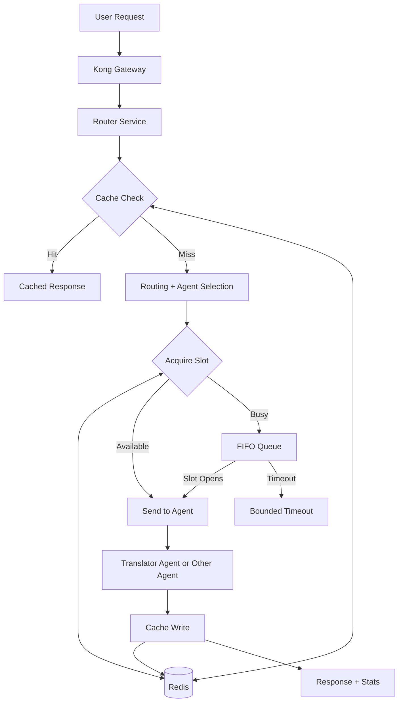

# Resilient Agent Request Layer

This project is my buildathon submission built on top of Nasiko.

I turned Nasiko's router into a **resilient request-management layer** for multi-agent systems. The goal was to solve two common platform problems:

- repeated requests wasting compute
- burst traffic overloading a single agent

My solution adds **caching, per-agent concurrency control, queueing, and live operational visibility** directly into the router path.

## What I Built

The router now acts as a control layer between the gateway and the agent fleet.

### 1. Request Caching

- repeated requests are fingerprinted with SHA-256
- Redis is checked before calling an agent
- identical requests can be served instantly from cache

Result:
- faster repeated responses
- reduced duplicate agent computation

### 2. Per-Agent Concurrency Control

- each agent has a configurable `max_concurrent` limit
- excess traffic is placed into a FIFO queue
- queue timeout creates bounded, predictable overload behavior

Result:
- one overloaded agent does not destabilize the system
- traffic is shaped instead of failing unpredictably

### 3. Atomic Enforcement

The concurrency cap is enforced atomically in Redis using a Lua script.

That means:
- queue head check
- active request count check
- slot acquisition
- queue pop

all happen in one atomic Redis operation.

This is important because `max_concurrent=1` actually means `1` even under concurrent load.

### 4. Operational Visibility

I added:

- `GET /router/stats`
- `GET /router/controls/{agent_name}`
- `PUT /router/controls/{agent_name}`
- `POST /router/cache/clear`
- `GET /router/dashboard`

There is also a live dashboard that shows:

- cache hit rate
- total requests
- queued requests
- queue timeouts
- per-agent active requests
- per-agent queue depth
- per-agent concurrency limits

## Architecture



## How To Explain It To Judges

Use this explanation:

> I built a resilient request layer inside Nasiko's router. In multi-agent systems, repeated requests waste compute and burst traffic can overload one agent. My solution sits between the gateway and the agent fleet and adds three things in one path: request caching, per-agent concurrency control with queueing, and live operational visibility.

> First, repeated requests are cached in Redis so the router can return results immediately instead of recomputing them. Second, each agent gets a configurable concurrency cap, and excess traffic waits in a FIFO queue instead of overwhelming the system. Third, operators can monitor and control the behavior live through stats endpoints, a dashboard, and a demo script.

> The technical highlight is that concurrency enforcement is atomic using a Redis Lua script, so the system stays correct under concurrent load.

Short version:

> I turned Nasiko's router from a simple dispatcher into a control layer that can cache, queue, observe, and control agent traffic.

## Best Demo Story

### Step 1: Show The Dashboard

Open:

- `http://localhost:9100/router/dashboard`

Say:

> This is the live operational dashboard for the resilient request layer. Everything here updates in real time.

### Step 2: Run The Demo Script

```powershell
python scripts/demo_resilient_request_layer.py
```

Say:

> The demo script verifies the required behaviors with PASS and FAIL checks.

### Step 3: Cache Demo

What happens:

- first request is a cache miss
- second identical request is a cache hit

Say:

> The first request goes through the full pipeline. The second identical request is a cache hit, so no agent compute is wasted.

### Step 4: Overload Demo

What happens:

- the agent limit is reduced
- burst traffic is sent
- the router manages overload with queueing and bounded timeout behavior

Say:

> When I constrain the agent and send burst traffic, the router shapes that traffic instead of letting the system degrade unpredictably.

### Step 5: Observability Demo

Say:

> The dashboard and stats endpoint let operators observe cache effectiveness, queue behavior, timeouts, and per-agent runtime state live.

## Demo Commands

### Get A Bearer Token

```powershell
$creds = Get-Content .\orchestrator\superuser_credentials.json | ConvertFrom-Json
$body = @{
  access_key    = $creds.access_key
  access_secret = $creds.access_secret
} | ConvertTo-Json

$response = Invoke-RestMethod -Method Post `
  -Uri "http://localhost:9100/auth/users/login" `
  -ContentType "application/json" `
  -Body $body

$response.token
```

Paste that token into the dashboard if you want to use:

- `Clear Cache`
- per-agent concurrency updates

### Run The Full Demo

```powershell
python scripts/demo_resilient_request_layer.py
```

### Open The Dashboard

```text
http://localhost:9100/router/dashboard
```

## KPI Mapping

| Problem Statement Goal | Evidence |
|---|---|
| Faster repeated responses | cache hit on second identical request |
| Reduced duplicate processing | Redis cache writes and cache hits |
| Stable overload handling | per-agent concurrency limits, queueing, bounded timeouts |
| Real-time monitoring dashboards | live dashboard + `/router/stats` |

## Why This Stands Out

- integrated into a real agent platform, not a toy app
- uses Redis for both caching and traffic-control state
- atomic concurrency enforcement via Lua
- live dashboard for judges
- self-verifying demo script with PASS/FAIL output

## Important Notes

- read-only dashboard stats are easy to view publicly
- mutation actions still require a bearer token
- the strongest line in the demo is:

> queued, not rejected

- the best closing line is:

> This turns the router from a dispatcher into an operational control layer: cache, queue, observe, and control.
