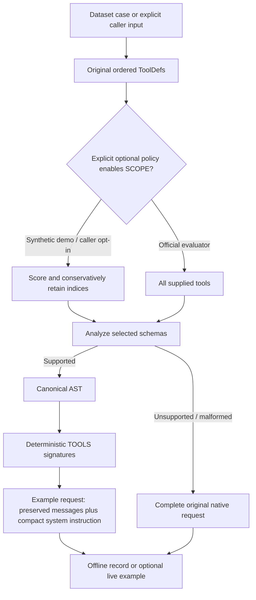

# ToolZip Project Walkthrough

Audited on 2026-10-03 against the actual implementation on `compact-tools`. Start with this guide; use [the final audit](TOOLZIP_FINAL_AUDIT.md) for verification evidence and [the library README](tool-compact/README.md) for the compact contract. The large architecture document retains original design history; this guide describes implemented behavior.

## 1. Problem: repeated tool schemas consume context

A native tool definition repeats structural JSON keys such as `function`, `parameters`, `properties` and `type`. A model sees these definitions on each request even when only a few tools are relevant. This consumes input tokens and context capacity. ToolZip represents supported schema semantics as readable signatures. It preserves useful descriptions and keeps call arguments as JSON so existing JSON tooling remains useful.

This is a representation compiler for a defined schema subset, with validation on both sides. It is not general text summarization and does not execute tools.

## 2. Why Nasiko needs this

Nasiko routes model requests and can expose many tool definitions. Conceptually, this compiler belongs between a caller's native tools and a provider request, with its decoder between provider output and tool execution. This submission intentionally implements a standalone pure library and evaluator examples. No production `llm-router/src` request path uses ToolZip. Savings shown here are measured request-body token counts, not measured production cost or latency.

## 3. SCOPE → ZIP → GUARD

- **ToolScope / SCOPE:** optional deterministic lexical selection of a conservative subset. Uncertainty retains all candidates.
- **ToolZip / ZIP:** canonical supported schemas become deterministic, model-readable grammar. `decode_tools` reconstructs semantics from that grammar.
- **SchemaGuard / GUARD:** preflight rejects unsupported or malformed schemas before compaction; after output, recursive validation rejects invalid arguments.

GUARD participates before rendering and after JSON parsing. The official evaluator compacts all supplied tools and does not call SCOPE. The separate synthetic demo enables SCOPE explicitly.

## 4. End-to-end request flow

This diagram describes the implemented examples and pure optional policy. Production router integration remains future work.



The request example additionally chooses native fallback for constrained tool choice, tool history, response format, `parallel_tool_calls:false` and empty tools. It removes native `tools` only when it actually inserts compact definitions. It preserves original message values and their relative order, inserting the compact instruction after leading system messages.

## 5. End-to-end response flow

```mermaid
sequenceDiagram
    participant M as Model or offline fixture
    participant A as Example / caller
    participant D as StreamDecoder
    participant J as Strict JSON parser
    participant G as SchemaGuard
    participant X as Tool executor (outside library)
    A->>D: new(supplied tools), schema preflight
    M->>A: text chunks
    A->>D: push(valid UTF-8 chunk)
    D->>D: find marker, resolve name, collect string-aware JSON
    D->>J: complete JSON object and closing marker
    J-->>D: duplicate-free, representable JSON
    D->>G: validate against canonical schema
    G-->>D: valid call or typed error
    D-->>A: newly completed PROVISIONAL calls
    A->>D: finish() after entire response
    alt all detected calls valid and complete
        D-->>A: complete ordered validated calls
        A->>X: caller may execute after success
    else any malformed, incomplete, unknown or invalid call
        D-->>A: error; reject whole response
    end
```

The demo constructs OpenAI-shaped calls after finalization, including a caller-assigned ID and JSON-string `function.arguments`. The library returns only names and JSON values. Neither the library nor evaluator executes a tool.

## 6. Native ToolDef example

```json
{
  "type": "function",
  "function": {
    "name": "echo",
    "description": "Echo text",
    "parameters": {
      "type": "object",
      "required": ["text"],
      "additionalProperties": false,
      "properties": {
        "text": {"type": "string", "description": "Text to echo"},
        "mode": {"type": "string", "enum": ["public", "private"]}
      }
    }
  }
}
```

`ToolDef` owns `kind` (serialized as `type`), `FunctionDef` and an extension map. `FunctionDef` owns name, optional description, optional parameters and an extension map. Unknown extensions survive deserialization so preflight can reject them; they are not silently erased.

## 7. Exact compact grammar

That example renders as:

```text
TOOLS
echo(mode?:str=public|private,text:str(Text to echo))! - Echo text
```

Properties are alphabetically ordered through `BTreeMap`; supplied tool order and enum order remain intact.

| Semantics | Current syntax |
|---|---|
| Required property | `text:str` |
| Optional property | `mode?:str` |
| String / integer / number / boolean | `str` / `int` / `num` / `bool` |
| Homogeneous array | `[str]`, nested `[[int]]` |
| Nested object | `{city:str,unit?:str}` |
| Closed object | `{city:str}!` or function signature ending `)!` |
| Scalar enum | `str=public\|private`, `int=1\|2`, `bool=true\|false` |
| String enum with a delimiter in its value | JSON-quoted `str="a\|b"` |
| String format | `datetime` for `date-time`; otherwise `str<"email">` |
| Schema description | `str(Text to echo)` or `str("Text with (parentheses)")` |
| Function description | ` - Echo text` or ` - "Text with (parentheses)"` |
| Missing/null parameters | `ping()`, accepting only `{}` |
| Empty open root object | `anything(...)` |
| Empty closed root object | `nothing()!` |

Nonempty descriptions with no parentheses, quotation marks, backslashes or control characters use bounded bare text. Other descriptions use JSON strings, including `("")` for an explicitly empty description. Unicode and leading/trailing spaces round-trip exactly. Descriptions containing `#`, `>>` or `<<call` cannot escape their annotation boundary. This structural protection does not prove a model will ignore malicious natural-language instructions in descriptions.

Enum strings use bare words only when nonempty, initially alphabetic and otherwise ASCII alphanumeric/underscore/hyphen; other string values use JSON quotation. Numeric and boolean enum members retain primitive types. Presence, closed-object policy and annotations attach to the relevant AST node, including nested arrays and root objects.

`CompactTools` contains only `rendered:String`. There is no original-schema sidecar. `decode_tools` parses the rendered grammar, rebuilds tool schemas and validates the reconstruction. The parser also accepts earlier `#"JSON description"` annotations, quoted function descriptions and the old `CALL <<call TOOL_NAME JSON_OBJECT>>` footer. The renderer emits no footer; the request builder supplies the call instruction once.

## 8. Valid compact call

```text
<<call echo {"mode":"public","text":"Build >> deployed"}>>
```

Only the wrapper is compact syntax. The arguments remain a JSON object. `>>` inside a JSON string is ordinary text. A plain answer with no call markers produces an empty call list. Repeated valid calls are allowed and preserve response order.

## 9. How the decoder works

`decode_calls` constructs a `StreamDecoder`, pushes the entire text, then calls `finish`. Batch and streaming share the same state machine:

| State | Purpose |
|---|---|
| Searching | Track overlapping `<<call` prefixes while ignoring surrounding prose |
| AfterMarker | Require separation after the marker |
| ToolName | Collect a safe name and verify it belongs to the supplied tools |
| JsonStart | Require an object opener |
| Json | Track bracket nesting, string state and backslash escaping |
| CloseStart | After complete JSON, require the first `>` |
| CloseEnd | Require the second `>`, parse and validate, then return to Searching |

No call is emitted before both closing characters arrive. Strings prevent braces, brackets and `>>` from affecting framing. The JSON visitor rejects duplicate keys at every object depth. Numeric checks reject literals that serde_json would round into a different value, including out-of-range integers and excessively precise decimals.

Any error is sticky. Already collected internal calls are cleared; later `push` and `finish` return an error. A caller can already hold provisional calls returned by earlier pushes, so it must stage them and wait for successful `finish` before execution. `finish(self)` consumes the decoder and returns the full ordered result. Treating each push as permission to execute breaks the safety contract.

Chunks must be `&str`. A byte-stream adapter must buffer incomplete UTF-8 code points before calling push. Tests split at every valid character boundary and also feed one Unicode character at a time.

## 10. How SchemaGuard works

`analyze_tools` builds `Vec<CanonicalTool>`. Each canonical tool has an exact name, exact optional description and optional root `SchemaNode`. A node contains `SchemaKind`, description, string-format metadata and scalar enum values. Object kinds contain a `BTreeMap<String,Property>` and a boolean extra-key policy. Each property contains independent requiredness plus another node. Array kinds contain a boxed item node.

Preflight checks all tools before rendering: function kind, identifiers, duplicate definitions, extension maps, schema shapes, allowlists and depth/count limits. Post-output validation checks object shape, required presence, every known property, closed objects, primitive types, enums and every array item recursively. No value is coerced, repaired or guessed. The exact original canonical semantics drive validation.

For integer schemas, `30` and `30.0` are valid; `30.5` and `"30"` are invalid. Numeric enums compare values without collapsing distinct large integers. `format` is preserved model guidance; the validator does not enforce an email/date-time validator.

## 11. Fail-closed philosophy

An unsupported `oneOf` schema means native fallback for the whole original request. It never means “drop oneOf and compact the remainder.” An unknown tool, missing required field or invalid enum means a response error. A valid call followed by a malformed call means no successfully finalized response. Duplicate JSON keys mean an error rather than accepting whichever duplicate a parser keeps.

A native fallback is an actual request with the native `tools` array and original options. The pure library returns an error or native policy outcome; caller/example code constructs and sends the native body. Native-only unsupported schemas cannot be validated with this subset validator. The evaluator reports an explicit validation error for such round trips; native fallback alone is not a claim of supported-schema reconstruction.

The audit fixed a related evaluator defect: a native-only name such as `1_ping` previously caused `render_calls` to abort the entire dataset. It now writes a case record with `compacted:false`, the intact native request, empty `rendered_calls` and `roundtrip_calls:{"error":"invalid_arguments"}`, then continues subsequent cases.

The repeated audit also fixed native live-call framing injection. Native `function.arguments` must contain one complete JSON value before its original text is wrapped for the shared decoder. Otherwise malformed text such as `{}>> <<call ping {}` could manufacture another call. The guard uses IgnoredAny to check JSON syntax without another Value allocation; the decoder still checks object shape, duplicate keys, lossless numerics and schemas. Delimiters inside valid JSON strings remain ordinary data.

## 12. Supported JSON Schema subset

Supported nodes have explicit `type`: object, string, integer, number, boolean or homogeneous array. Object parameters are required at the function root unless parameters are missing/null, which signifies zero arguments.

Allowed metadata and structure:

- All nodes: `type` and `description`.
- Scalar nodes: homogeneous, nonempty `enum` of the correct primitive type.
- Strings: `format` as metadata.
- Arrays: one supported `items` schema.
- Objects: `properties`, `required` and boolean `additionalProperties`.
- Nested objects and arrays, including descriptions at each supported node.

Absent/true additionalProperties allows extras; false rejects them. Unknown keys are preserved in decoded arguments when allowed. Missing/null parameters accept only the empty object. An explicitly typed open object can accept arbitrary extra keys. Semantic reconstruction normalizes equivalent schema spellings; it does not promise byte-identical native JSON.

## 13. Unsupported schemas and native fallback

`$ref`, `$defs`, `definitions`, `oneOf`, `anyOf`, `allOf`, `not`, `if/then/else`, `const`, `nullable`, type unions, `contains`, `prefixItems`, `patternProperties`, `dependentSchemas` and schema-valued additionalProperties are unsupported. All other unknown annotations/keywords also fail preflight, including constraints such as `minimum`, `pattern` and `default`. Object/array enums are unsupported. Unconstrained `{}` schemas and malformed shapes are rejected.

Names begin with ASCII alphabetic or underscore, followed by ASCII alphanumeric or `_.:-`; property names exclude the colon. Unsupported identifiers and duplicate tool definitions fail preflight. This conservative boundary is narrower than all possible native provider definitions.

## 14. ToolScope algorithm and conservative behavior

Normalization splits snake_case, kebab-case, camelCase, PascalCase and acronym boundaries; it lowercases Unicode alphanumeric words. A fixed 17-word English stop list filters matching token sets. Exact name phrase matching uses the unfiltered normalized words.

| Source | Score |
|---|---|
| Exact normalized tool-name phrase appears contiguously | +24 |
| Each distinct overlapping name token | +8 |
| Each distinct overlapping top-level required property-name token | +4 |
| Each distinct overlapping function-description token | +2 |
| Each distinct overlapping top-level optional property-name token | +1 |

Repeated words do not multiply source token scores. Scores saturate instead of overflowing. Nested properties and property descriptions are not scoring sources.

At eight tools or fewer, retain all. With no signal or no score reaching 8, retain all. Otherwise retain every score ≥8 plus at most one highest-scoring candidate in [4,8), breaking ties by original index. Return all if that selection exceeds `max(12,ceil(40% of candidates))` or already includes every tool. Returned indices preserve original order. Confidence is `min(max_score/24,1)`, an explanation heuristic, not calibrated probability or a recall guarantee.

`optimize_tools` requires explicit compaction and selection flags. Disabled, empty-tool and forced-choice cases are native. When selected schemas fail preflight, its native outcome retains ALL original indices, not just selected tools. It returns a typed report with plan, counts, confidence and bypass reasons, with no I/O or tokenizer.

## 15. Evaluator and unseen-data contract

`compact_tools_eval` reads `EVAL_SET` and writes `OUT`. Dataset `tools` are indexed generically by function name; duplicate names fail clearly. Case name lists resolve in supplied order. No public IDs are used as control flow.

Each normal case writes `id`, `compact_request`, `compacted`, `rendered_calls` and `roundtrip_calls`. Each decoder case writes `id` and `decoded`. Decoder chunks go through individual `push` calls followed by `finish`. Labels are stable: unknown names become `unknown_tool`; other compact failures become `invalid_arguments`.

Five supported case options are forwarded: `tool_choice`, `max_tokens`, `top_p`, `parallel_tool_calls`, `response_format`. Unknown dataset metadata is not sent as arbitrary provider configuration. The builder preserves constrained options using full native fallback. Missing dataset tool references, invalid dataset structure, I/O errors and live HTTP failures remain fatal; the evaluator is not a general recovery engine for corrupt datasets.

Offline default is deterministic: no provider, key or machine clock is required. Both `PROVIDER_BASE_URL` and `MODEL` must be configured for live mode; a partial configuration errors. Compact instructions use `2026-10-02 Asia/Kolkata`. The live adapter posts to the supplied chat-completions endpoint (or appends `/chat/completions`), sets model and temperature 0, optionally uses `PROVIDER_API_KEY` or `OPENAI_API_KEY` and has a 60-second timeout. It records assistant content in `raw_output` and decoded/validated results in `live_calls`. It is a non-streaming HTTP example; provider streaming transport is future work.

## 16. Public token result and measurement

The public dataset was fetched and checked independently during this audit.

| Case | Native request tokens | Compact request tokens | Canonical schema reconstruction |
|---|---:|---:|---|
| ct-001 | 253 | 164 | Equal |
| ct-002 | 262 | 173 | Equal |
| ct-003 | 141 | 114 | Equal |
| Total | **656** | **451** | All equal |

`1 - 451/656 = 0.3125 = 31.25%`. This clears the approximate 30% target on the small public sample.

`tiktoken-rs=0.12.1` and `o200k_base` tokenize the complete `serde_json::to_string` request body for both paths, including message wrappers, preserved options, descriptions and injected instructions. Native and compact measurements share the same request builder. They do not count just tool definitions, use characters/4, or omit compact instruction overhead. Counts are an offline full-body metric, not provider-billed usage; live model/temperature additions and response tokens are not part of this offline comparison. Unseen-case savings and real-model adherence are not established.

## 17. Custom ToolScope demo

`toolzip_demo` generates 48 tools with repeatable schemas and an explicit `mail_send and calendar_create` query. It retains those two. Both `quantum bananas` and broad `record` queries retain all 48.

| Synthetic path | Tokens | Reduction versus synthetic native |
|---|---:|---:|
| Native 48 tools | 5345 | — |
| ZIP only, all 48 | 2365 | 55.75% |
| SCOPE + ZIP, two tools | 157 | 97.06% |

The fixture labels itself synthetic and not organizer scores. This favorable lexical selection example is not a general relevance/recall benchmark. Demo schema reconstruction is equal; stream emissions are `[0,0,0,1]`; unknown tool, invalid enum and unsupported-schema fallback checks are true.

## 18. Repository map: every contribution module

| File or module | Responsibility |
|---|---|
| Root `Cargo.toml` | Workspace member/path dependency and pinned example tokenizer |
| `Cargo.lock` | Reconciled workspace lock graph; no existing registry package version replacements |
| `tool-compact/Cargo.toml` | Pure crate: serde, serde_json, thiserror |
| `tool-compact/src/lib.rs` | Public reexports, batch decoder and encode/decode/validate/render entry points; unsafe/panic lint guards |
| `types.rs` | Owned ToolDef, FunctionDef, ToolCall and rendered-only CompactTools |
| `error.rs` | Typed CompactError and Result alias |
| `report.rs` | Explicit optimization policy, native fallback reasons and structured outcome/report |
| `schema/mod.rs` | Internal schema wiring and identifier validation |
| `schema/ast.rs` | Canonical tool, node, kind and property representations |
| `schema/analyze.rs` | Fail-closed schema preflight, allowlists, canonicalization and limits |
| `schema/render.rs` | Stable readable signatures, enum and exact description rendering |
| `schema/parse.rs` | Actual grammar reconstruction; cursor-based fallible parsing and compatibility forms |
| `schema/validate.rs` | Recursive arguments, requiredness, enums, extra-key and numeric semantics |
| `decode/mod.rs` | Internal parser/stream wiring and StreamDecoder export |
| `decode/parser.rs` | Duplicate-free JSON visitor and lossless-number verification |
| `decode/stream.rs` | Seven-state framing, string/escape/depth handling, bounds and atomic finish |
| `scope/mod.rs` | Public scope types and selector reexports |
| `scope/tokenize.rs` | Deterministic normalized word/token extraction |
| `scope/score.rs` | Exact-name and distinct-source weighted scoring |
| `scope/policy.rs` | Conservative thresholds, safety tail, fallback and ordering |
| `llm-router/Cargo.toml` | Example-only dev dependencies; no production tool-compact dependency |
| `llm-router/examples/compact_tools/dataset.rs` | Dataset deserialization, duplicate detection and ordered name resolution |
| `compact_tools/request.rs` | Shared complete native/compact requests, fallback and AST-derived notation legend |
| `compact_tools/live.rs` | Optional HTTP adapter, raw content capture, validated result handling and hermetic tests |
| `compact_tools_eval.rs` | Env/file orchestration, per-case JSONL, expected-call roundtrip and stable labels |
| `compact_tools_tokens.rs` | Full-body o200k counts and public schema-semantic equality check |
| `toolzip_demo.rs` | Clearly labeled synthetic 48-tool SCOPE/ZIP/GUARD demonstration |
| `tool-compact/README.md` | Active API/grammar/safety contract and runnable doctest |
| `DEEP_TECHNICAL_ARCHITECTURE_TOOLZIP.md` | Original design with current implementation appendix and historical labels |
| `TOOLZIP_DEMO.md` | Two-minute demo script and measured results |
| `TOOLZIP_PROJECT_WALKTHROUGH.md` | This contributor guide |
| `TOOLZIP_FINAL_AUDIT.md` | Requirement matrix and independently rerun acceptance evidence |

The nine integration-test files are mapped in section 20. Internal parser/renderer modules remain private; the canonical AST is intentionally public for semantic equality and request legend inspection. No public API refactor was needed.

## 19. Important Rust APIs

```rust
pub fn encode_tools(tools: &[ToolDef]) -> Result<CompactTools>;
pub fn decode_tools(compact: &CompactTools) -> Result<Vec<ToolDef>>;
pub fn decode_calls(text: &str, tools: &[ToolDef]) -> Result<Vec<ToolCall>>;
pub fn validate_call(call: &ToolCall, tools: &[ToolDef]) -> Result<()>;
pub fn render_calls(calls: &[ToolCall]) -> Result<String>;
pub fn analyze_tools(tools: &[ToolDef]) -> Result<Vec<CanonicalTool>>;
impl StreamDecoder {
    pub fn new(tools: &[ToolDef]) -> Result<Self>;
    pub fn push(&mut self, chunk: &str) -> Result<Vec<ToolCall>>;
    pub fn finish(self) -> Result<Vec<ToolCall>>;
}
pub fn select_tools(input: ScopeInput<'_>) -> ScopeDecision;
pub fn optimize_tools(context: OptimizationContext<'_>) -> OptimizationOutcome;
```

`encode_tools`, `decode_calls` and `StreamDecoder` are required P1 interfaces. `decode_tools` implements semantic reconstruction; `validate_call`, `render_calls` and `analyze_tools` expose project helpers. Selection and optimization reports are project-added stretch APIs.

Encoding returns all compiled tools or a typed error; callers arrange native fallback. Reconstruction parses rendered text or errors. Batch/stream decoding returns validated ordered calls or rejects the entire response. `validate_call` returns unit or a validation error without modifying the call. `render_calls` checks name syntax and object shape then serializes; it does NOT validate against a schema. A manually constructed `ToolCall` is not a type-level proof of validity. `analyze_tools` returns supported canonical semantics or an error. SCOPE returns a decision without claiming schema validity. Optimization converts compaction errors into a native outcome with reasons.

```rust
use nasiko_tool_compact::{ToolDef, StreamDecoder, analyze_tools, decode_tools, encode_tools};
use serde_json::json;

fn example() -> Result<(), Box<dyn std::error::Error>> {
    let tools: Vec<ToolDef> = serde_json::from_value(json!([
        {"function":{"name":"ping"}}
    ]))?;
    let compact = encode_tools(&tools)?;
    let rebuilt = decode_tools(&compact)?;
    assert_eq!(analyze_tools(&tools)?, analyze_tools(&rebuilt)?);

    let mut decoder = StreamDecoder::new(&tools)?;
    let provisional = decoder.push("<<ca")?;
    assert!(provisional.is_empty());
    let _stage_only = decoder.push("ll ping {}>>")?;
    let calls = decoder.finish()?;
    assert_eq!(calls.len(), 1);
    // Only here may an external executor act on calls.
    Ok(())
}
```

`CompactError` distinguishes unsupported schema, invalid schema, malformed/incomplete calls, unknown tool, invalid arguments, resource bounds and invalid grammar. Error messages avoid full argument payloads, although tool names and argument paths can contain caller-controlled identifiers.

## 20. Tests and what they prove

| Test file/category | Tests | Important evidence |
|---|---:|---|
| `types.rs` | 1 | Unknown metadata retained for preflight |
| `encode.rs` | 3 | Exact grammar, empty/open/closed/zero-argument distinctions, escaping |
| `unsupported.rs` | 5 | Supported nested metadata, unsupported keyword allowlists, duplicates, malformed shapes, depth |
| `validation.rs` | 4 | Recursive types, numeric/enum semantics, extras, zero arguments, unknown names |
| `stream.rs` | 6 | Every character split, marker completion, prose/repeated calls, atomic sticky errors, incomplete/deep input, response/call-count limits |
| `roundtrip.rs` | 4 | Supported semantic reconstruction, rendered-text parsing, hostile exact descriptions, positive legacy compatibility |
| `adversarial.rs` | 6 | Generated schemas/chunks, hostile strings, lossy numbers, partial-result rejection, call size/depth |
| `scope.rs` | 3 | Determinism/order, fallback, weights and safety tail |
| `policy.rs` | 2 | Explicit opt-in, forced choices, selected-schema whole-original fallback |
| README doctest | 1 | Executable public API example |
| Evaluator example | 9 | Request equivalence/fallback, chunks and labels, AST legend, native-only name recording, live/native adapters and native framing rejection |
| Existing router suite | 379 passing | Existing router tests remain green; 7 infrastructure-dependent tests ignored |

Totals: 34 core integration tests plus one doctest; nine evaluator tests. Hermetic HTTP mocks prove request/response adapter behavior, not real-model language adherence. Tests cover required and adversarial behavior but are not a formal proof or exhaustive fuzzer campaign.

## 21. Current limitations

Real-model adherence is **NOT VERIFIED LOCALLY**. Production router integration, real provider stream/history translation and forced-choice compaction are skipped. Full JSON Schema support and format validation are absent. Names follow a conservative grammar. Lexical SCOPE can miss paraphrases or indirect relevance; the confidence is only a heuristic.

Resource limits are 4096 tools, 4096 properties per object, schema/JSON depth 64, 1 MiB per call, 16 MiB per response, 4096 calls and 16 MiB compact grammar input. Encoding does not impose a total rendered-output byte limit, and caller-owned JSON values/dataset files are allocated before all limits apply. These bounds protect the parser paths they cover, not every allocation in a future server. Long ordinary descriptions can still dominate tokens.

Plain text ending with a partial marker (for example `<<ca` or a trailing `<`) is conservatively rejected as incomplete. Native fallback for unsupported schemas is preserved but cannot be validated with the supported-subset decoder. Offline output determinism and 31.25% savings apply to the tested public sample, not every private case. Grammar escaping protects structure; prompt-injection resilience and tool execution authorization remain separate production concerns.

## 22. Demo talking points

### 90-second explanation

Tool definitions repeat a lot of structural JSON on every model request. ToolZip compiles supported JSON Schemas into short signatures while retaining names, descriptions, required fields, types, enums, arrays and nested objects. Calls keep their arguments as JSON, wrapped in a small marker.

The safety boundary is SchemaGuard. It first checks whether every schema can be represented exactly. Unsupported semantics retain the entire native request. After output, one shared batch and streaming decoder finds complete calls, parses strict JSON and validates arguments. Calls are provisional until the entire response finishes successfully, so a valid first call followed by a broken second call cannot become a successfully finalized execution list.

On the public sample, complete request bodies measure 656 native tokens and 451 compact tokens: 31.25% fewer. Three round trips and five decoder cases pass, and two offline runs are byte-identical. Optional ToolScope chooses a conservative lexical subset; the separate 48-tool demo reaches 157 tokens after selection, but that is a synthetic result and SCOPE never changes official evaluation. The library is pure and production router behavior is unchanged. Real-model adherence remains to be verified by live evaluation.

### Two-minute technical explanation

The model needs tool semantics, but native definitions repeatedly encode those semantics through verbose JSON keys. Our pure Rust compiler starts from owned OpenAI-shaped definitions. SchemaGuard analyzes an explicit subset into a canonical AST: ordered object properties, independent requiredness, boolean extra-key policy, arrays, typed scalar enums, descriptions and string-format metadata. Any unknown keyword fails preflight. A caller can then retain the complete original native request.

The renderer converts supported nodes into typed signatures. Optional properties carry a question mark, closed objects an exclamation mark, arrays brackets and descriptions bounded annotations. Unsafe description text remains JSON quoted. CompactTools stores only rendered text; the inverse parser reconstructs schemas from that visible grammar. Canonical equality establishes tested semantic round trips without a hidden schema copy.

The response protocol is a call marker around a function name and JSON object. A seven-state decoder tracks marker prefixes, tool names, nested brackets, string state and escapes across chunks. It does not mistake double greater-than signs inside strings for an ending marker. Strict parsing rejects duplicate keys and numeric rounding, and recursive validation rejects missing fields, wrong types, invalid enums and forbidden extras. Failures are sticky; successful finish consumes the decoder and commits the full response. The caller must not execute push results early.

The official example resolves tools generically, preserves messages and options, writes one record per normal or decoder case, and uses a fixed date. It operates offline by default. Full serialized request token counts use pinned o200k_base: 656 to 451, or 31.25%, with three call cases and five decoder cases matching expected output. The separate lexical selector is opt-in and falls back to all tools under uncertainty. Mocks exercise the live adapter, while real-model adherence and production integration remain explicit limits. This submission demonstrates a safe compiler and decoder, not a claim that every model or arbitrary schema has already been validated.

### Exact Windows demo commands

These commands use this machine's installed Rust and Visual Studio 2022 Build Tools. Run them in PowerShell in order. Clearing MODEL/base keeps the demo offline without altering saved credentials.

```powershell
Set-Location -LiteralPath 'C:\Users\YellankiKaushik\Desktop\KAUSHIK\ALL Projects\Nasiko - Build - a - thon\Nasiko-Build-a-thon-repo'
Import-Module 'C:\Program Files (x86)\Microsoft Visual Studio\2022\BuildTools\Common7\Tools\Microsoft.VisualStudio.DevShell.dll'
Enter-VsDevShell -VsInstallPath 'C:\Program Files (x86)\Microsoft Visual Studio\2022\BuildTools' -SkipAutomaticLocation -DevCmdArguments '-arch=x64 -host_arch=x64'
$env:PATH = "$env:USERPROFILE\.cargo\bin;$env:PATH"
$env:PROVIDER_BASE_URL = $null
$env:MODEL = $null
$env:EVAL_SET = Join-Path $env:TEMP 'toolzip-demo-dataset.json'
Invoke-WebRequest -Uri 'https://registry.nasiko.dev/r/nasiko/compact-tools-eval' -OutFile $env:EVAL_SET
$env:OUT = Join-Path $env:TEMP 'toolzip-demo-a.jsonl'
cargo run --release -p nasiko-llm-router --example compact_tools_eval
$demoFirst = $env:OUT
$env:OUT = Join-Path $env:TEMP 'toolzip-demo-b.jsonl'
cargo run --release -p nasiko-llm-router --example compact_tools_eval
& "$env:WINDIR\System32\fc.exe" /b $demoFirst $env:OUT
Get-Content -LiteralPath $env:OUT
cargo run -p nasiko-llm-router --example compact_tools_tokens
cargo run -p nasiko-llm-router --example toolzip_demo
```

Expected: eight JSONL records, no binary differences, public totals 656/451/0.3125; synthetic 48 candidates, two selected, counts 5345/2365/157 and safety booleans true. The first download needs network; the evaluator itself is offline. Cargo may fetch dependencies if they are not already cached.


## 23. Likely judge questions

| Question | Answer |
|---|---|
| Why not gzip? | A model needs readable semantic text. A compressed binary blob would require a separate decompression mechanism and adds little directly usable guidance. |
| Why retain JSON arguments? | It keeps a standard data representation, nested structures and existing tooling while limiting custom syntax to framing and schema signatures. |
| Why not embeddings for SCOPE? | Lexical selection is deterministic, dependency-free and explainable. Embedding recall, latency and external access need a separate benchmark. |
| Why fail closed? | Saving tokens cannot justify inventing unsupported schema semantics or accepting an invalid execution request. |
| Why not compact unsupported schemas approximately? | Dropping a constraint changes the contract; native fallback preserves the original definition. |
| What about `>>` inside strings? | The stream tracks string and escape state; closing markers are recognized after complete JSON, not within strings. |
| Why skip runtime integration? | It is optional stretch work. This keeps production provider defaults unchanged while proving the compiler/evaluator boundary. |
| How do you know semantics are retained? | Rendered grammar is independently parsed into ToolDefs and compared as canonical ASTs; focused/generated tests cover the supported subset. |
| How are tokens measured? | Pinned tiktoken 0.12.1/o200k_base counts the entire serialized native and compact request bodies, including instruction overhead. |
| Why exclude SCOPE from official evaluation? | P1 evaluates representation and decoding of supplied tools; narrowing candidates would alter the test contract. |
| What happens with an unknown tool? | A typed UnknownTool error; the evaluator maps it to unknown_tool and rejects the whole response. |
| What happens with oneOf? | Unsupported preflight; an actual complete native request is retained. Subset decoding cannot claim to validate it. |
| How are chunk boundaries handled? | Marker/name/JSON/ending state persists across valid UTF-8 chunks; every character boundary is tested. |
| Why preserve descriptions? | They carry task meaning and argument guidance. Removing them may save tokens while harming tool choice and adherence. |
| Why is 31.25% meaningful? | It clears the public small-sample target after counting full request overhead; it is not an unseen-dataset guarantee. |
| Could grammar hurt adherence? | Yes. Offline reconstruction and mocks do not measure model compliance; live model evaluation is still needed. |
| What would production integration require? | Explicit opt-in request policy, provider response/history translation, UTF-8 transport buffering, safe finalization/execution and live adherence/recall evaluation. |
| Biggest limitation? | No verified real-model adherence. Schema support and lexical recall are also deliberately bounded. |
| How does this differ from normal prompt compression? | It compiles a typed schema contract and validates outputs; it does not summarize arbitrary prose. |
| Why is SchemaGuard essential? | It is the shared semantic authority before rendering and after model output, separating token savings from execution correctness. |
| Do valid duplicate calls fail? | No. Repeated calls remain valid and ordered. Duplicate tool definitions and duplicate JSON keys fail. |
| Can I execute a call from push? | Stage it only. Execute after finish succeeds, because a later malformed call rejects the whole response. |
| What does confidence 1 mean? | Maximum lexical score reached 24 or more. It is not a probability, a semantic proof or guaranteed recall. |
| Is date-time validated? | Its format label is preserved; V1 does not implement a date-time constraint validator. |
| Are 30 and 30.0 both integers? | Both are mathematically integral and accepted; fractions and string numerals are rejected. |
| Are there hidden native schemas in CompactTools? | No. Only rendered text is stored; reconstruction reads that text. |
| Does native fallback validate arbitrary schemas? | No. It preserves the request; unsupported-subset validation returns an explicit error. |
| What did the final audits actually fix? | Native-only expected-call names no longer abort JSONL evaluation, and native argument text cannot inject additional framed calls. The audits also added limit/legacy tests and corrected documentation. |
