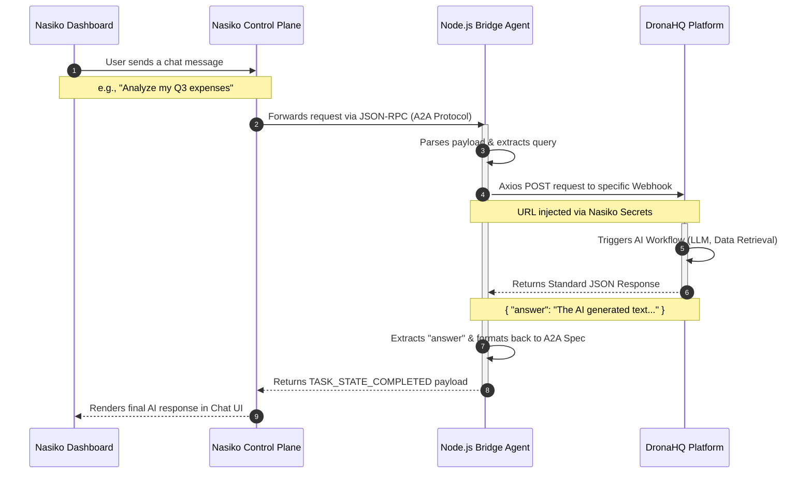

# Nasiko & DronaHQ Integration Workflow

This document outlines the end-to-end architecture and data flow for the AI Agent suite built during the hackathon.

## System Architecture Flowchart

## Agent Components

We built three distinct agents using this exact same bridge architecture:
1. **Business Intelligence Agent** (`bi-agent`)
2. **Finance Advisor Agent** (`finance-agent`)
3. **Customer Feedback Agent** (`feedback-agent`)

### How the Bridge Works
Because DronaHQ and Nasiko speak two different data languages, the Bridge Agent acts as the translator. 
- It listens on port `8000` for Nasiko's strict A2A (Agent-to-Agent) JSON-RPC protocol.
- It translates that into a simple HTTP POST request for DronaHQ's webhooks.
- It securely holds the DronaHQ Webhook URL in isolated environment variables using `nasiko secrets`.
- When DronaHQ finishes processing the AI logic synchronously, the bridge translates the custom `{ "answer": "..." }` JSON back into Nasiko's required markdown message format.
