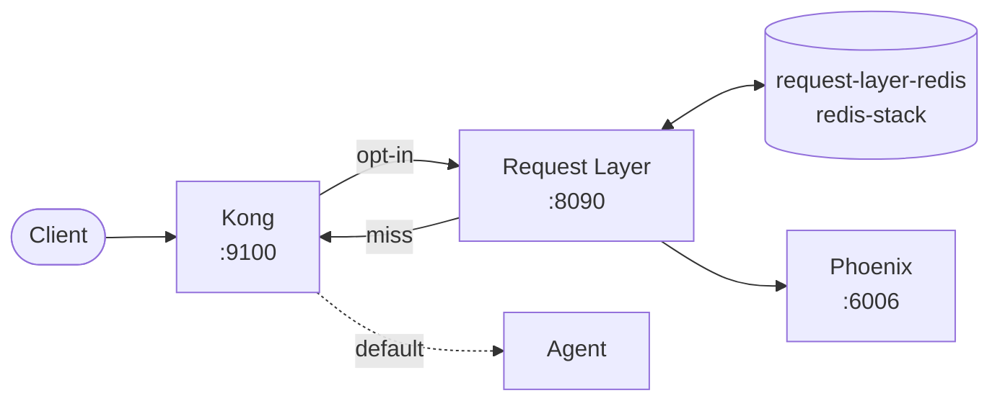
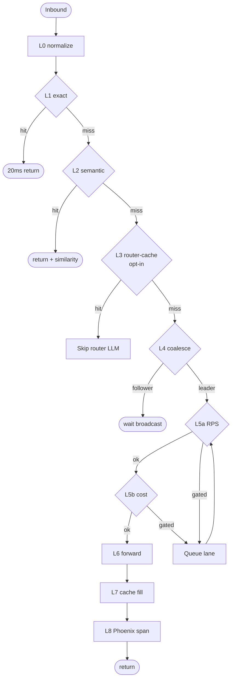

# Request Management Layer

A request-control service that sits between Kong and the Nasiko agent
fleet. Caches responses, coalesces concurrent identical requests, applies
per-agent rate limits with priority queueing, and emits Phoenix spans
annotated with cache savings.

It is opt-in: with this service stopped (or with no Kong route pointing
at it) the platform behaves exactly as it does today.

## Architecture



## Pipeline

Each inbound request walks an 8-stage pipeline:

| Stage | Module | Purpose |
| --- | --- | --- |
| L0 | `normalize.py` | canonicalize the request body |
| L1 | `cache/exact.py` | SHA-256 keyed Redis lookup |
| L2 | `cache/semantic.py` | embedding-based vector lookup (per agent) |
| L3 | `cache/router_cache.py` | cache routing decisions on `/router/route` (opt-in) |
| L4 | `coalesce.py` | collapse concurrent identical requests to one origin call |
| L5a | `ratelimit.py` | per-agent token bucket |
| L5b | `ratelimit.py` | rolling $/min cost meter |
| L5c | `queue.py` | three-lane priority queue for soft overflow |
| L6 | `forward.py` | httpx call to the agent (via Kong) |
| L7 | `proxy.py` | cache fill (exact + semantic in a single Redis pipeline) |
| L8 | `phoenix.py` | annotate spans with savings attribution |



`proxy.ProxyPipeline` composes them. `main.py` is the FastAPI entry point.

## Run locally

The service ships inside Nasiko's `docker-compose.local.yml`:

```sh
docker compose -f docker-compose.local.yml --env-file .nasiko-local.env up -d \
  nasiko-request-layer request-layer-redis
curl http://localhost:8090/health
```

To opt the bundled translator agent into the layer, point its Kong
upstream at `http://nasiko-request-layer:8090`. The full runbook lives in
[`docs/request-layer.md`](../../docs/request-layer.md).

## Tests

```sh
pytest agent-gateway/request_layer/tests
```

Tests run against an in-memory async Redis fake; no running stack is
required.

## Configuration

Every knob is an environment variable; see [`src/config.py`](src/config.py).

| Variable | Default | Purpose |
| --- | --- | --- |
| `REQUEST_LAYER_PORT` | `8090` | uvicorn bind port |
| `REQUEST_LAYER_REDIS_URL` | `redis://request-layer-redis:6379/0` | dedicated Redis Stack instance |
| `REQUEST_LAYER_SEMANTIC_THRESHOLD` | `0.95` | cosine floor for semantic-cache hits |
| `REQUEST_LAYER_ROUTER_CACHE_ENABLED` | `false` | opt in to the routing-decision cache |
| `REQUEST_LAYER_DEFAULT_RPS` | `50` | per-agent token-bucket size |
| `REQUEST_LAYER_DEFAULT_COST_CAP_USD_PER_MIN` | `1.0` | per-agent dollar cap |
| `REQUEST_LAYER_PHOENIX_ENDPOINT` | `http://phoenix-observability:4317` | OTLP target |

## Why a dedicated Redis?

The semantic cache uses `FT.CREATE` / `FT.SEARCH` (RediSearch) for vector
lookups. Nasiko's main `redis` runs the lightweight `redis:7-alpine`
image, which does not include these commands. To avoid modifying a hot
dependency for every existing service, this layer ships its own
`request-layer-redis` instance running `redis/redis-stack-server`. Both
Redis deployments are independent.

## Why opt-in?

Mergeability. With this service stopped, no agent traffic flows through
it — existing platform behavior is bit-for-bit unchanged. Operators flip
individual Kong routes through the layer when they want the gains; they
can flip them back at any time.
