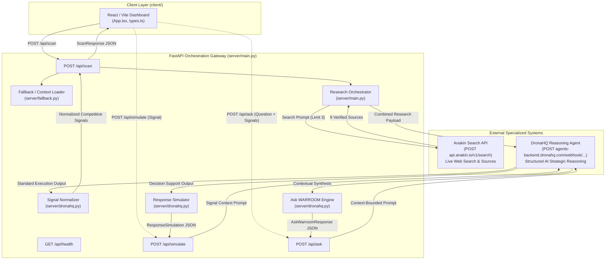

# Technical Architecture

> **A focused, evidence-grounded competitive intelligence architecture.**

---

## 1. System Overview

WARROOM is structured as a lightweight, stateless FastAPI application acting as an orchestration gateway between live web research (Anakin.io) and structured strategic reasoning (DronaHQ).



---

## 2. Layer Responsibilities

### 2.1 Presentation Layer (`client/`)
- **Technology**: React 18, TypeScript, Vite, Vanilla CSS.
- **Responsibility**: Provides a real-time command dashboard displaying:
  - Monitored company profile and competitor targets.
  - Live research evidence card stream (source titles, snippets, direct URLs).
  - AI reasoning status indicator (`completed`, `pending`, `insufficient_evidence`, `error`).
  - Formatted competitive signals broken down by competitor, category, headline, and impact.
- **State**: The UI is currently frozen to serve as a pure presentation consumer while backend contracts stabilize.

### 2.2 API Orchestration Gateway (`server/main.py`)
- **Technology**: FastAPI, Pydantic v2, Uvicorn, Python 3.11+.
- **Responsibility**:
  - Handles incoming `/api/scan` and `/api/health` requests.
  - Loads default company context (`PayFlow`) from `data/company_context.json` when custom context is not supplied.
  - Generates context-aware search queries for each monitored competitor.
  - Mediates API calls to external providers without exposing credentials to the client.
  - Implements error boundaries ensuring reasoning failures do not discard collected web research.

### 2.3 Research Layer (`server/anakin.py`)
- **Technology**: `httpx.AsyncClient`.
- **Target**: `POST https://api.anakin.io/v1/search` with header `X-API-Key`.
- **Responsibility**:
  - Executes synchronous, low-latency live web search queries for each competitor.
  - Extracts title, URL, snippet, and available publication/update timestamps.
  - Validates response schemas and enforces timeouts (20.0s).

### 2.4 Reasoning & Extraction Layer (`server/dronahq.py`)
- **Technology**: `httpx.AsyncClient` with custom JSON/markdown normalizers.
- **Target**: DronaHQ webhook URL with header `api-key`.
- **Responsibility**:
  - Packages company context, target segments, and all competitor research items into an instruction-rich prompt.
  - Dispatches request to the published DronaHQ agent webhook.
  - Consumes the DronaHQ Standard response format synchronously from the `"response"` field.
  - Unpacks markdown-fenced codeblocks (```` ```json ... ``` ````) and handles both stringified JSON and pre-parsed dicts/lists.
  - Maps external schema variants (`competitive_signals`, `change`, `signal_classification`, `significance_explanation`) into the canonical `CompetitiveSignal` model.
  - Attaches verified source URLs to each generated signal.

---

## 3. Repository Structure

The repository maintains a clean, modular structure with strictly defined separation of concerns:

```text
~/WarRoom/
├── .env.example              # Template for required environment variables
├── .gitignore                # Git exclusions (.env, .venv, node_modules, etc.)
├── company_context.json      # (Referenced via data/company_context.json)
├── data/
│   └── company_context.json  # Benchmark PayFlow company profile and competitors
├── requirements.txt          # Python dependencies (FastAPI, httpx, pydantic, pytest)
├── pytest.ini                # Pytest configuration (asyncio mode auto)
├── server/
│   ├── __init__.py           # Package marker
│   ├── config.py             # Settings loader reading .env via python-dotenv
│   ├── schemas.py            # Pydantic data contracts (ScanResponse, CompetitiveSignal, SignalOverlap, DepartmentImpact)
│   ├── fallback.py          # Loader for default company context and benchmark data
│   ├── anakin.py             # Anakin Search API client (synchronous search)
│   ├── dronahq.py            # DronaHQ webhook client and signal normalization
│   └── main.py               # FastAPI application, route handlers, and CORS setup
├── tests/
│   ├── test_health.py        # /api/health endpoint test
│   ├── test_anakin.py        # Anakin search formatting, parsing, and error tests
│   ├── test_dronahq.py       # DronaHQ response parsing, markdown, and failure tests
│   ├── test_scan.py          # Full /api/scan integration and resilience tests
│   ├── test_simulate.py      # /api/simulate response simulation tests
│   └── test_ask.py           # /api/ask contextual Q&A and URL filtering tests
├── client/
│   ├── package.json          # Frontend dependencies
│   ├── tsconfig.json         # TypeScript configuration
│   ├── vite.config.ts        # Vite configuration (proxies /api to localhost:8000)
│   ├── index.html            # Single page app entry HTML
│   └── src/
│       ├── main.tsx          # React application root
│       ├── App.tsx           # Dashboard layout and scan trigger
│       ├── api.ts            # Client API client calling /api/scan
│       ├── types.ts          # TypeScript interfaces matching server schemas
│       ├── styles.css        # Clean dark-mode CSS styles
│       └── components/       # UI subcomponents (Navbar, CompanyCard, SignalCard, etc.)
└── docs/                     # Engineering documentation suite
```

---

## 4. Architectural Principles: Why Simple Wins

1. **No Speculative Microservices**:
   WARROOM runs as a single FastAPI process. Splitting search, extraction, and reasoning into separate microservices would introduce latency, network failure points, and operational burden without adding value for this stage.
2. **Stateless Scan Execution**:
   Scans run on-demand and return complete context in a single round-trip. Eliminating a database in the MVP avoids synchronization bugs, schema migrations, and stale caches.
3. **Evidence Grounding Over Conversational Hallucination**:
   Rather than asking an ungrounded LLM "What is Cashfree doing?", WARROOM gathers live web snippets via Anakin first, then restricts DronaHQ reasoning strictly to the collected evidence.
4. **Resilient Failure Boundaries**:
   If DronaHQ's reasoning service is temporarily down or returns unparseable text, the scan response still succeeds and returns the 9 verified Anakin search sources, ensuring the user is never left blind.
