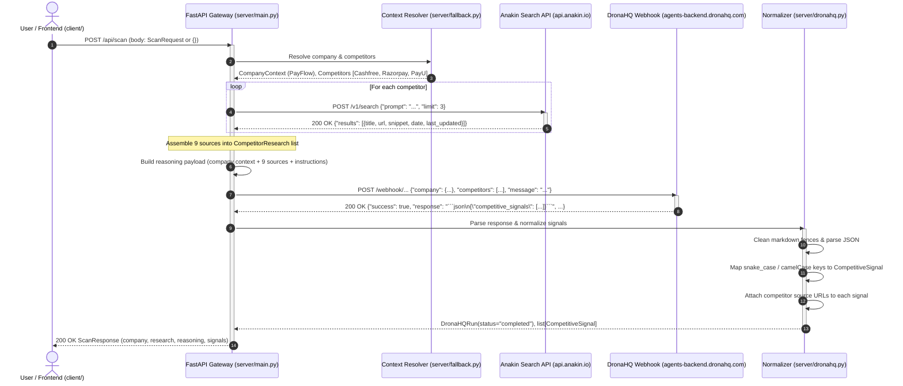
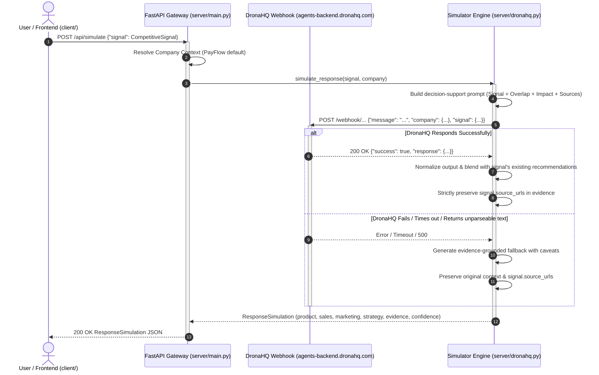
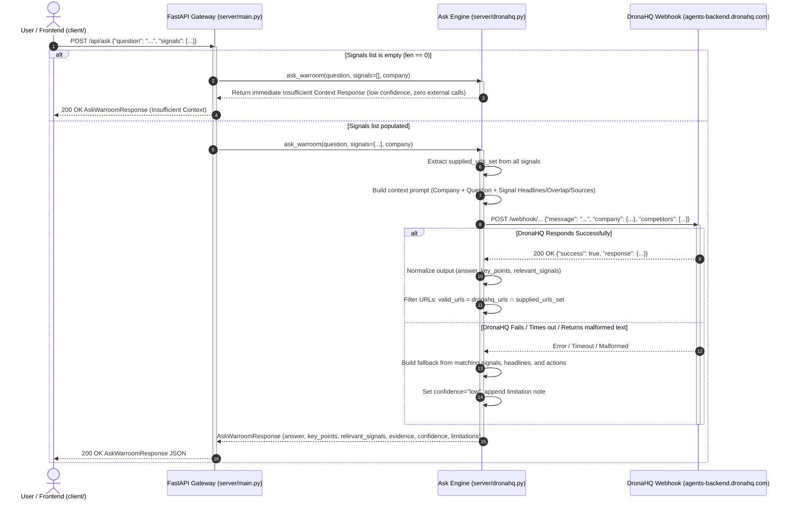

# Data Flow & Request Lifecycle

> **End-to-end trace of data movement, schema transformations, and system boundaries across a WARROOM scan.**

---

## 1. Scan Sequence Diagram



---

## 2. Step-by-Step Data Transformations

### Step 1: Client Request (`POST /api/scan`)
The client initiates a scan. An empty request payload `{}` directs the server to use the benchmark demo profile.

```json
// Request Body
{}
```

Alternatively, custom parameters can be provided:
```json
{
  "company": {
    "name": "CustomPay",
    "products": ["Checkout", "Invoicing"],
    "target_customers": ["Enterprise"]
  },
  "competitors": [
    {"name": "Stripe"},
    {"name": "Adyen"}
  ]
}
```

### Step 2: Context Resolution
In `server/fallback.py`, default settings are loaded from `data/company_context.json`:
- **Company**: `PayFlow`
- **Products**: `["Payment Gateway", "Reconciliation", "FraudShield"]`
- **Target Customers**: `["SMB", "Mid-Market"]`
- **Competitors**: `["Cashfree", "Razorpay", "PayU"]`

### Step 3: Search Query Construction & Live Retrieval
In `server/main.py`, a targeted search prompt is synthesized for each competitor:
```python
search_prompt = f"{competitor.name} {' '.join(company.products)} {' '.join(company.target_customers)}"
```
*Example prompt for Cashfree:*
`"Cashfree Payment Gateway Reconciliation FraudShield SMB Mid-Market"`

FastAPI dispatches an asynchronous HTTP POST request to Anakin:
```http
POST https://api.anakin.io/v1/search
Content-Type: application/json
X-API-Key: [REDACTED]

{
  "prompt": "Cashfree Payment Gateway Reconciliation FraudShield SMB Mid-Market",
  "limit": 3
}
```

### Step 4: Ingestion of Anakin Web Evidence
Anakin returns verified search results with snippets and source URLs:
```json
{
  "results": [
    {
      "title": "Cashfree Payments Launches 'RiskShield' to Empower Merchants Curb Cyber Payment Frauds",
      "url": "https://www.cashfree.com/news-room/cashfree-payments-launches-riskshield...",
      "snippet": "Cashfree Payments has launched RiskShield, a risk management solution aimed at curbing cyber payment frauds in real-time...",
      "date": null,
      "last_updated": null
    },
    {
      "title": "Riskshield: Powerful Fraud & Chargeback Protection",
      "url": "https://www.cashfree.com/risk-shield-payment-gateway",
      "snippet": "RiskShield Fraud-Free Payments, Guaranteed Peace of Mind. 80% Reduction in losses due to payment fraud...",
      "date": null,
      "last_updated": null
    },
    {
      "title": "RiskShield Overview",
      "url": "https://www.cashfree.com/docs/payments/risk-shield/overview",
      "snippet": "Use the Cashfree RiskShield Analytics Dashboard to evaluate your fraud profile...",
      "date": null,
      "last_updated": null
    }
  ]
}
```
This is repeated across Cashfree, Razorpay, and PayU, resulting in 9 structured `ResearchResult` models stored in `all_research: list[CompetitorResearch]`.

### Step 5: Assembling the DronaHQ Reasoning Payload
In `server/main.py`, the research results are assembled into a reasoning context:
```json
{
  "message": "Analyze the following competitor research for PayFlow (Products: Payment Gateway, Reconciliation, FraudShield; Segments: SMB, Mid-Market). Extract meaningful competitive signals based only on the provided evidence.",
  "company": {
    "name": "PayFlow",
    "products": ["Payment Gateway", "Reconciliation", "FraudShield"],
    "target_customers": ["SMB", "Mid-Market"]
  },
  "competitors": [
    {
      "name": "Cashfree",
      "research": [
        {
          "title": "Cashfree Payments Launches 'RiskShield'...",
          "url": "https://www.cashfree.com/news-room/cashfree-payments-launches-riskshield...",
          "snippet": "Cashfree Payments has launched RiskShield, a risk management solution..."
        },
        // ...
      ]
    },
    // Razorpay, PayU ...
  ]
}
```

### Step 6: Dispatch to DronaHQ Webhook
FastAPI sends the payload to the DronaHQ agent:
```http
POST https://agents-backend.dronahq.com/webhook/738f3984-794f-49c6-b315-ed949bd27f6f
Content-Type: application/json
api-key: [REDACTED]
```

### Step 7: Consuming the DronaHQ Response
DronaHQ executes its agent reasoning pipeline synchronously in Standard response mode and returns:
```json
{
  "success": true,
  "thread_id": "a945643b-1d54-42d9-9fb5-c28729668125",
  "run_id": "0eced073-00b1-4c5b-baf7-817b029974eb",
  "message": "Agent run completed successfully. See 'response' for execution output.",
  "response": "```json\n{\n  \"competitive_signals\": [\n    {\n      \"competitor\": \"Cashfree\",\n      \"change\": \"Launch of RiskShield, a real-time risk management solution for payment gateways.\",\n      \"signal_classification\": {\n        \"type\": \"product\",\n        \"significance\": \"SIGNIFICANT\"\n      },\n      \"significance_explanation\": \"RiskShield aims to reduce fraudulent activities by up to 40%...\",\n      \"affected_products\": [\"FraudShield\"],\n      \"affected_segments\": [\"SMB\", \"Mid-Market\"]\n    }\n  ]\n}\n```"
}
```

### Step 8: Signal Normalization & Evidence Linking
In `server/dronahq.py`:
1. The markdown backticks ```` ```json ... ``` ```` are stripped.
2. The JSON payload is parsed.
3. The items under `"competitive_signals"` are iterated.
4. For each item:
   - `competitor` is verified (`"Cashfree"`).
   - `headline` is extracted from `change`, `changed`, or `title`.
   - `category` is extracted from `signal_classification.type` or `signal_type` (`"product"`).
   - `summary` is extracted from `significance_explanation`.
   - `significance` is extracted from `signal_classification.significance` (`"SIGNIFICANT"`).
   - `overlap` is populated with `products` (`["FraudShield"]`) and `customer_segments` (`["SMB", "Mid-Market"]`).
   - `impact` is mapped across `product`, `sales`, `marketing`, and `strategy`.
   - `recommended_actions` extracts investigation recommendations and sales battlecards.
   - `confidence` is assigned (`"high"` based on verified web snippets).
   - `source_urls` are linked from `all_research["Cashfree"]`.
5. Yields a canonical, strongly typed `CompetitiveSignal` object.

### Step 9: Final Response Delivery to Client
FastAPI responds with HTTP 200 and the complete `ScanResponse`:
```json
{
  "company": {
    "name": "PayFlow",
    "products": ["Payment Gateway", "Reconciliation", "FraudShield"],
    "target_customers": ["SMB", "Mid-Market"]
  },
  "research": [
    { "competitor": "Cashfree", "results": [ ... 3 sources ... ] },
    { "competitor": "Razorpay", "results": [ ... 3 sources ... ] },
    { "competitor": "PayU", "results": [ ... 3 sources ... ] }
  ],
  "reasoning": {
    "status": "completed",
    "thread_id": "ff29f551-ffca-42d2-9e64-4b3ffdf35dea",
    "run_id": "2b916f71-b240-42c1-9fbc-435921d56f0f",
    "message": "Agent run completed successfully. See 'response' for execution output."
  },
  "signals": [
    {
      "competitor": "Cashfree",
      "category": "product",
      "headline": "Launch of RiskShield, a real-time risk management solution for payment gateways.",
      "summary": "The introduction of RiskShield signifies Cashfree's commitment to enhancing security for merchants, potentially attracting businesses concerned with fraud...",
      "significance": "SIGNIFICANT",
      "overlap": {
        "products": ["FraudShield"],
        "customer_segments": ["SMB", "Mid-Market"]
      },
      "impact": {
        "product": "MEDIUM",
        "sales": "LOW",
        "marketing": "HIGH",
        "strategy": "LOW"
      },
      "recommended_actions": [
        "Investigate enhancements in fraud prevention and risk management features within the FraudShield product to closely match industry leaders’ offerings."
      ],
      "confidence": "high",
      "source_urls": [
        "https://www.cashfree.com/news-room/cashfree-payments-launches-riskshield...",
        "https://www.cashfree.com/risk-shield-payment-gateway",
        "https://www.cashfree.com/docs/payments/risk-shield/overview"
      ]
    }
    // Razorpay signal ...
    // PayU signal ...
  ]
}
```

---

## 3. Response Simulation Lifecycle (`POST /api/simulate`)



---

## 4. Ask WARROOM Lifecycle (`POST /api/ask`)



