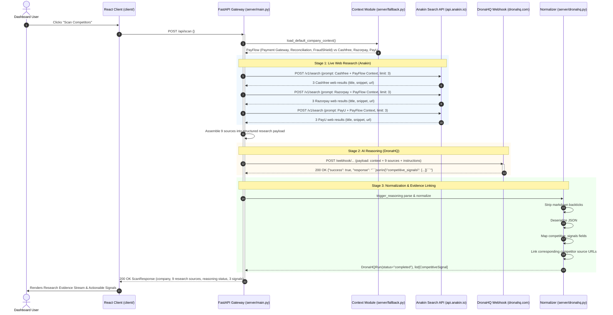

# Diagram: Scan Sequence

> **Detailed sequential trace of an end-to-end competitive scan operation.**

```mermaid
sequenceDiagram
    autonumber
    actor User as Dashboard User
    participant Frontend as React Client (client/)
    participant FastAPI as FastAPI Gateway (server/main.py)
    participant Fallback as Context Module (server/fallback.py)
    participant Anakin as Anakin Search API (api.anakin.io)
    participant DronaHQ as DronaHQ Webhook (dronahq.com)
    participant Normalizer as Normalizer (server/dronahq.py)

    User->>Frontend: Clicks "Scan Competitors"
    Frontend->>FastAPI: POST /api/scan {}
    activate FastAPI

    FastAPI->>Fallback: load_default_company_context()
    Fallback-->>FastAPI: PayFlow (Payment Gateway, Reconciliation, FraudShield) vs Cashfree, Razorpay, PayU

    rect rgb(240, 248, 255)
        note over FastAPI,Anakin: Stage 1: Live Web Research (Anakin)
        FastAPI->>Anakin: POST /v1/search (prompt: Cashfree + PayFlow Context, limit: 3)
        Anakin-->>FastAPI: 3 Cashfree web results (title, snippet, url)
        FastAPI->>Anakin: POST /v1/search (prompt: Razorpay + PayFlow Context, limit: 3)
        Anakin-->>FastAPI: 3 Razorpay web results (title, snippet, url)
        FastAPI->>Anakin: POST /v1/search (prompt: PayU + PayFlow Context, limit: 3)
        Anakin-->>FastAPI: 3 PayU web results (title, snippet, url)
    end

    FastAPI->>FastAPI: Assemble 9 sources into structured research payload

    rect rgb(255, 250, 240)
        note over FastAPI,DronaHQ: Stage 2: AI Reasoning (DronaHQ)
        FastAPI->>DronaHQ: POST /webhook/... (payload: context + 9 sources + instructions)
        activate DronaHQ
        DronaHQ-->>FastAPI: 200 OK {"success": true, "response": "```json\n{\"competitive_signals\": [...]}```"}
        deactivate DronaHQ
    end

    rect rgb(240, 255, 240)
        note over FastAPI,Normalizer: Stage 3: Normalization & Evidence Linking
        FastAPI->>Normalizer: trigger_reasoning parse & normalize
        Normalizer->>Normalizer: Strip markdown backticks
        Normalizer->>Normalizer: Deserialize JSON
        Normalizer->>Normalizer: Map competitive_signals fields
        Normalizer->>Normalizer: Link corresponding competitor source URLs
        Normalizer-->>FastAPI: DronaHQRun(status="completed"), list[CompetitiveSignal]
    end

    FastAPI-->>Frontend: 200 OK ScanResponse (company, 9 research sources, reasoning status, 3 signals)
    deactivate FastAPI

    Frontend->>User: Renders Research Evidence Stream & Actionable Signals
```
