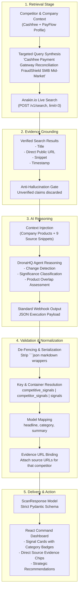

# Diagram: Signal Lifecycle

> **The transformation stages of competitive data from raw web search snippet to verified strategic signal.**

```mermaid
flowchart TD
    subgraph S1 ["1. Retrieval Stage"]
        A1["Competitor & Company Context\n(Cashfree + PayFlow Profile)"]
        A2["Targeted Query Synthesis\n'Cashfree Payment Gateway Reconciliation FraudShield SMB Mid-Market'"]
        A3["Anakin.io Live Search\n(POST /v1/search, limit=3)"]
        A1 --> A2 --> A3
    end

    subgraph S2 ["2. Evidence Grounding"]
        B1["Verified Search Results\n- Title\n- Direct Public URL\n- Snippet\n- Timestamp"]
        B2["Anti-Hallucination Gate\nUnverified claims discarded"]
        A3 --> B1 --> B2
    end

    subgraph S3 ["3. AI Reasoning"]
        C1["Context Injection\n(Company Products + 9 Source Snippets)"]
        C2["DronaHQ Agent Reasoning\n- Change Detection\n- Significance Classification\n- Product Overlap Assessment"]
        C3["Standard Webhook Output\nJSON Execution Payload"]
        B2 --> C1 --> C2 --> C3
    end

    subgraph S4 ["4. Validation & Normalization"]
        D1["De-Fencing & Serialization\nStrip ```json markdown wrappers"]
        D2["Key & Container Resolution\ncompetitive_signals | competitor_signals | signals"]
        D3["Model Mapping\nheadline, category, summary"]
        D4["Evidence URL Binding\nAttach source URLs for that competitor"]
        C3 --> D1 --> D2 --> D3 --> D4
    end

    subgraph S5 ["5. Delivery & Action"]
        E1["ScanResponse Model\nStrict Pydantic Schema"]
        E2["React Command Dashboard\n- Signal Cards with Category Badges\n- Direct Source Evidence Chips\n- Strategic Recommendations"]
        D4 --> E1 --> E2
    end
```
