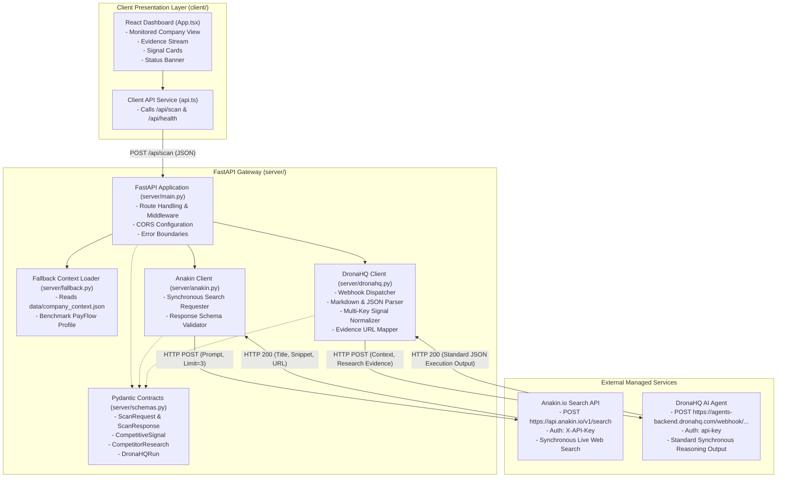

# Diagram: System Architecture

> **Component architecture and communication boundaries for the WARROOM platform.**

```mermaid
graph TB
    subgraph Client ["Client Presentation Layer (client/)"]
        Dashboard["React Dashboard (App.tsx)\n- Monitored Company View\n- Evidence Stream\n- Signal Cards\n- Status Banner"]
        APIClient["Client API Service (api.ts)\n- Calls /api/scan & /api/health"]
        Dashboard --> APIClient
    end

    subgraph Backend ["FastAPI Gateway (server/)"]
        Router["FastAPI Application (server/main.py)\n- Route Handling & Middleware\n- CORS Configuration\n- Error Boundaries"]
        ContextLoader["Fallback Context Loader (server/fallback.py)\n- Reads data/company_context.json\n- Benchmark PayFlow Profile"]
        AnakinClient["Anakin Client (server/anakin.py)\n- Synchronous Search Requester\n- Response Schema Validator"]
        DronaHQClient["DronaHQ Client (server/dronahq.py)\n- Webhook Dispatcher\n- Markdown & JSON Parser\n- Multi-Key Signal Normalizer\n- Evidence URL Mapper"]
        Schemas["Pydantic Contracts (server/schemas.py)\n- ScanRequest & ScanResponse\n- CompetitiveSignal\n- CompetitorResearch\n- DronaHQRun"]

        Router --> ContextLoader
        Router --> AnakinClient
        Router --> DronaHQClient
        Router -.-> Schemas
        AnakinClient -.-> Schemas
        DronaHQClient -.-> Schemas
    end

    subgraph External ["External Managed Services"]
        AnakinAPI["Anakin.io Search API\n- POST https://api.anakin.io/v1/search\n- Auth: X-API-Key\n- Synchronous Live Web Search"]
        DronaHQWebhook["DronaHQ AI Agent\n- POST https://agents-backend.dronahq.com/webhook/...\n- Auth: api-key\n- Standard Synchronous Reasoning Output"]
    end

    APIClient -->|"POST /api/scan (JSON)"| Router
    AnakinClient -->|"HTTP POST (Prompt, Limit=3)"| AnakinAPI
    AnakinAPI -->|"HTTP 200 (Title, Snippet, URL)"| AnakinClient
    DronaHQClient -->|"HTTP POST (Context, Research Evidence)"| DronaHQWebhook
    DronaHQWebhook -->|"HTTP 200 (Standard JSON Execution Output)"| DronaHQClient
```
