# MCP Gateway — Technical Design

**Version:** Final architecture (current decided design)
**Scope:** Full system — architecture, data model, request flows, security model, API surface, observability, and rollout status.

---

## Table of Contents

1. Executive Summary
2. Problem Statement
3. Goals & Non-Goals
4. Core Concepts & Terminology
5. High-Level Architecture
6. Module & Crate Layout
7. Identity & Security Model
8. Data Model (Postgres Schema)
9. Request Flows
10. Auth Types & Credential Injection
11. Caching Strategy
12. Permission Model — Deep Dive
13. Composio Integration
14. Observability & Usage Integration
15. Extension Seams
15a. Optional Tool Outcome Attestation (TOA) gate
16. Configuration Reference
17. API Surface
18. Security Hardening Summary

---

## 1. Executive Summary

The MCP Gateway is the platform's single tool-calling surface for every deployed agent. It gives an agent one fixed, permanent URL through which it can reach every tool the agent's caller has connected — whether that tool is a pre-built SaaS integration (Composio: Gmail, Slack, GitHub, Google Calendar, …) or a custom, self-hosted MCP server someone on the platform registered.

Adding, removing, sharing, or restricting a tool is a data change, not a code change. No agent is ever redeployed or reconfigured when the set of tools available to its caller changes. The gateway resolves, on every single request, exactly who is calling, what they are allowed to reach, and how to authenticate and forward that call — merging everything into one unified Model Context Protocol (MCP) tool surface.

This document describes the complete, decided architecture: the request-time identity model, the Postgres schema (unified connector registry with owner-controlled sharing), the caching and permission-resolution pipeline, and the security hardening applied to the design after a dedicated audit pass.

---

## 2. Problem Statement

An agent is only as useful as the actions it can take in the outside world — sending an email, searching the web, querying an internal system, calling a company API. Every one of those actions is a distinct **tool**, typically gated behind its own authentication scheme and typically tied to one specific person's account, not the agent's.

Without a centralized gateway, each agent — and each agent's author — would have to solve the same set of problems independently and repeatedly:

- Where do credentials for third-party services live, and how are they kept safe?
- How does a token get refreshed before it expires, without the agent ever noticing?
- Who is allowed to use which tool, and how is that enforced per call, not just per deployment?
- If two different tool backends both happen to define a tool with the same name, how do calls not collide?
- How does a person share a tool they've configured with someone else, without handing over their own login?

Solving these per-agent does not scale, and it is a security liability — credentials scattered across many independently-built, independently-trusted agent containers instead of concentrated in one hardened, auditable service.

**The MCP Gateway exists to make "give this agent a new capability" a configuration action — safe, permissioned, instantaneous, and requiring zero changes to the agent's own code.**

---

## 3. Goals & Non-Goals

### Goals

- **One fixed URL** every agent uses for every tool call, for the lifetime of that agent, regardless of how many tools or providers sit behind it.
- **Two tool-provider kinds, one interface:**
  - *Composio-backed integrations* — pre-built SaaS connectors, OAuth handled by Composio's own infrastructure.
  - *Custom MCP servers* — self-hosted or third-party servers speaking the Model Context Protocol directly, with the platform handling OAuth 2.1 / API key / basic-auth / URL-parameter authentication itself.
- **Per-user credentials, always.** Sharing a tool with someone never shares the underlying login — everyone connects with their own account.
- **Per-agent, per-user, per-tool permission control** — allow, ask-for-approval, or block, expressible down to a single tool via glob patterns.
- **Owner-controlled sharing** of custom MCP servers — by username or platform-wide — mirroring the sharing model the platform already uses for agents.
- **Zero plaintext credentials.** Every stored secret is encrypted at rest with a per-user key.
- **Instant permission propagation.** A permission change must be visible on the very next tool call, not after some cache-expiry delay.

### Non-Goals

- This is not a general-purpose API gateway or reverse proxy — its scope is exclusively the MCP tool-calling surface.
- It does not manage agent deployment, builds, or agent-to-agent orchestration; those are handled by other platform subsystems and are explicitly out of scope here.
- It does not replace the platform's existing agent-to-agent access control (`agent_grants`/`agent_acl`) — it reuses that model's *shape* for a different resource, but does not touch or duplicate it.
- It does not sign or verify tool-delivery attestations on every live `tools/call`. Optional [TOA](https://github.com/Carmel-Labs-Inc/toa) verify belongs at connector register / enable / promote time (CI or ops), not on the hot path. See §15a.

---

## 4. Core Concepts & Terminology

A single naming rule governs every table, field, and conversation about this system — it exists specifically to prevent the two provider kinds from being confused with each other:

| Term | Meaning | Never means |
|---|---|---|
| **Toolkit** | A Composio-specific integration (e.g. the Gmail toolkit, the Slack toolkit) | A custom MCP server |
| **MCP server** | A self-hosted or third-party server speaking MCP directly | A Composio integration |
| **Connector** | The neutral umbrella term used only where a table or concept must represent *either* kind | A synonym for "toolkit" |

Every table or API response that uses "connector" always carries an explicit `provider_type` discriminator (`composio` or `mcp_server`) — the ambiguity lives in one column value, never in a name.

**Other core concepts:**

- **Connector** — one row in the registry representing either a Composio integration or a custom MCP server.
- **Ownership** — Composio connectors have no owner (always globally available; every user connects their own account to it). Custom MCP server connectors always have an owner — even one registered by a platform admin — and are private until explicitly shared.
- **Grant** — a record that an owner has shared their connector with a specific user (by username) or with everyone on the platform.
- **Connection** — one person's own credential/session state for a connector. Never shared, even when the connector itself is.
- **Permission** — for a given (caller, agent, connector) triple: whether the connector is enabled for that agent at all, and whether any individual tool within it is allowed, blocked, or requires approval.
- **Delegation token** — the short-lived, signed credential an agent presents on every call, proving "I am acting on behalf of this specific user, as this specific agent" without ever holding that user's real session credential.

---

## 5. High-Level Architecture

**This is a single-server design.** All identity validation, agent proxying, and MCP routing run inside one process — the control-plane server. There is no separate edge/proxy service in front of it; the server's own middleware layers are the trust boundary. This is a deliberate simplicity choice: one process to operate, one fewer network hop, one fewer place for a trust decision to be implemented inconsistently.

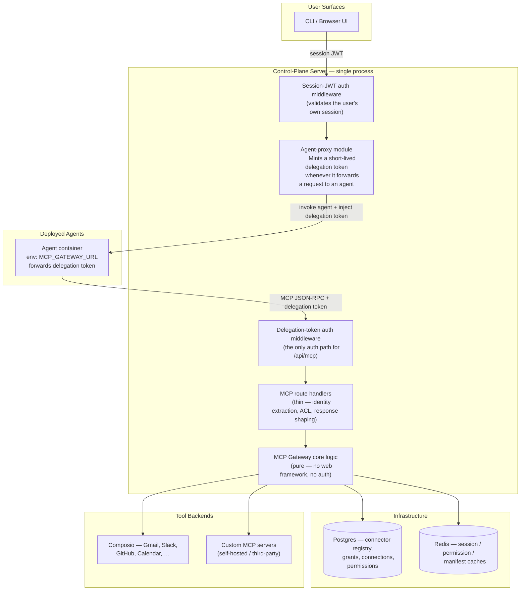

**Two request paths, both terminating in the same process:**

1. **Agent runtime calls (the hot path).** Agent → the server's `/api/mcp` endpoint with its delegation token → the delegation-token middleware validates it directly and resolves identity → the MCP route handlers. This route is deliberately **not** behind the normal session-JWT middleware — an agent never holds a user's real session credential (the agent-proxy module strips `Authorization`/`Cookie` before ever forwarding a request to an agent container, specifically so an agent can never replay a user's platform credentials). The delegation token is the *only* credential this route accepts.
2. **Management / UI calls.** A person's own session JWT → the normal session-auth middleware → MCP management routes (connect, share, configure permissions, browse the catalog) — the same authentication path every other management route on the platform already uses.

**The two-layer *code* split (independent of the single-process deployment above):**

- **A pure logic layer** — a standalone library crate with no knowledge of HTTP, web frameworks, or authentication. It only answers questions like "what can this caller reach" and "how do I format this specific tool call." This is what allows the gateway's behavior to be extended (as the Nasiko enterprise edition does) without copy-pasting business logic.
- **A thin routing layer** on top, inside the server, responsible only for identity extraction, access-control gating, and shaping the HTTP response.

Every function in the logic layer takes plain values (a user id, an agent id) and never a web-framework type — this is what keeps it testable and reusable independent of how a request physically arrived, even though today everything runs in one process.

---

## 6. Module & Crate Layout

```
mcp-gateway/                        ← pure logic crate (no AppState, no axum handlers)
└── src/
    ├── lib.rs                      module declarations + public re-exports
    ├── state.rs                    McpState { db, redis, http_client, providers, config }
    ├── config.rs                   McpConfig::from_config(&Config)
    ├── error.rs                    McpError → JSON-RPC error mapping + HTTP status mapping
    ├── types.rs                    JSON-RPC types, AuthType, Stance, MCPServerConfig
    ├── repo.rs                     every sqlx query against the mcp_* tables
    ├── net.rs                      SSRF guard + DNS-rebinding-hardened resolver
    ├── cache.rs                    Redis get/set/delete primitives
    ├── authorizer.rs               ConnectorAuthorizer trait — the swappable "Layer 1"
    │                               reachability check (owner ∪ user/public grant)
    ├── permissions.rs              permission engine + management view functions
    ├── session.rs                  credential injection + session resolution
    ├── aggregator.rs               tools/list fan-out, namespacing, merge, manifest cache
    ├── router.rs                   route_tool() — name → backend resolution
    ├── protocol.rs                 JSON-RPC handlers (initialize / ping / tools-list / tools-call)
    ├── catalog.rs                  connector catalog view + platform registration
    ├── connectors.rs               MCP connector registration, probe, CRUD
    ├── connect.rs                  unified connect/disconnect orchestration
    ├── credentials.rs              per-user credential store + normalization
    ├── oauth.rs                    OAuth 2.1 discovery, PKCE, signed state, token exchange
    ├── webhooks.rs                 Composio webhook signature verification + processing
    ├── injector.rs                 deploy-time env-var injection (MCP_GATEWAY_URL)
    └── provider/
        ├── mod.rs                  ToolProvider trait + provider registry
        ├── composio.rs              Composio v3/v3.1 HTTP client
        └── generic.rs               streamable-HTTP MCP client (5 auth types)

server/                              ← the single control-plane binary — everything runs here
└── src/
    ├── auth/middleware.rs          session-JWT auth middleware (require_auth) — for every
    │                               management route, including MCP management routes
    ├── agent_proxy.rs               forwards requests to agent containers; strips the caller's
    │                               real credentials; mints the short-lived delegation token
    │                               for the agent to use against /api/mcp
    └── mcp/                        ← thin MCP route layer (uses AppState, Claims, ACL)
        ├── mod.rs                  router assembly
        ├── service.rs              thin wrappers forwarding extracted identity + plain
        │                           values into the mcp-gateway crate
        └── handlers/
            ├── mod.rs              shared ApiError, identity helpers
            ├── gateway.rs          POST /api/mcp — delegation-token auth middleware +
            │                       JSON-RPC entry point (the only route not behind require_auth)
            ├── catalog.rs          catalog + auth-config management routes
            ├── connectors.rs       MCP connector management routes
            ├── sharing.rs          connector share/list/revoke routes
            ├── connect.rs          connect/disconnect/oauth-callback routes
            ├── credentials.rs      credential management routes
            ├── oauth.rs            OAuth authorize/callback/status/revoke routes
            ├── permissions.rs      per-agent connector/tool permission routes
            └── webhooks.rs         Composio webhook receiver route
```

**The governing rule for the crate/route split:** a function belongs in the crate unless it specifically needs a session JWT, an access-control check, usage tracking, or flow-event publishing — in which case, and only in which case, it stays in the thin route layer inside `server`. Every route handler reduces to: extract identity → check access → call into the crate → shape the response.

---

## 7. Identity & Security Model

### 7.1 The core constraint

An agent is **untrusted, user-authored code**. It is deployed once but serves requests from many different users over its lifetime. Identity therefore cannot be baked into the agent at deploy time — it must be established **per request**. And an agent must never be able to impersonate a different user, or borrow a different agent's tool permissions.

### 7.2 The delegation token

The server solves this with a short-lived, signed delegation token — an actor-pattern JWT binding two identities together: the calling user, and the acting agent. Minting and validating both happen inside the same server process, in two different modules, not across a network hop to a separate service.

- When the server's agent-proxy module forwards a request to an agent container on a user's behalf, it mints a delegation token: `sub = user_id`, `act = agent_id`, `aud = "mcp"`, a short expiry (minutes, not hours).
- That token is injected into the agent's inbound request as a header, and the caller's real session credential (`Authorization`, `Cookie`) is stripped before the request ever reaches the agent container — an agent can never replay a user's actual platform credentials.
- The agent forwards this same delegation-token header when it calls the server's fixed `/api/mcp` URL.
- A dedicated auth middleware — mounted only on that one route, replacing the normal session-JWT middleware entirely — validates the token (signature, audience, expiry) and resolves the caller's identity directly from its claims.

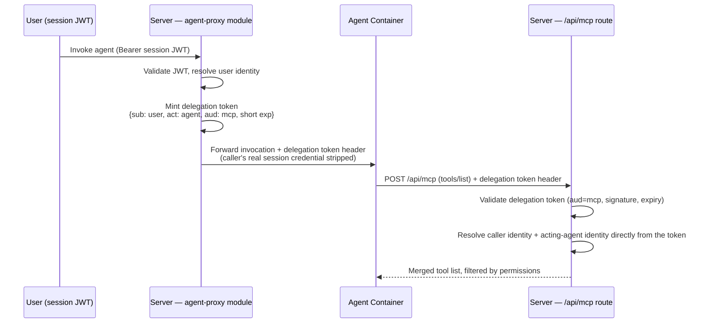

**Why this is safe:** the token binds both principals and is signed only by the server itself — an agent cannot forge or extend it, cannot use it past its short expiry, and cannot use it for anything outside the `aud=mcp` scope. It is stateless (no database write per request), so it costs nothing at scale. And because minting and validating happen in the same process, there is no additional network boundary where the token's meaning could be misinterpreted.

### 7.3 Encryption at rest

Every credential the gateway ever stores — API keys, OAuth access tokens, refresh tokens — is encrypted before it reaches the database, using a key derived per-user. Nothing is ever stored in plaintext, and credential fields are write-only at the API level: no endpoint ever returns a stored credential's value, only its presence/status.

### 7.4 SSRF protection

A user can register a custom MCP server at an arbitrary URL. Two protections apply before the platform will ever make a request to it:

1. **Registration-time validation** — the URL is resolved and checked against private, loopback, link-local, and metadata-endpoint address ranges before the server is ever saved.
2. **Connect-time pinning** — the actual outbound HTTP client used for custom-server traffic resolves DNS itself and rejects any address that fails the same check *at the moment of connection*, not just at registration. This closes the DNS-rebinding gap where a hostname could legitimately resolve to a public address at registration time and a private one later.

### 7.5 Least-privilege default

Nothing is visible, connected, or usable by default. A custom MCP server is invisible to everyone but its owner until an explicit grant exists. Ownership and grants gate *visibility* before any tool-level permission is even consulted — a two-layer check, described fully in §12.

---

## 8. Data Model (Postgres Schema)

### 8.1 Design principles

- **Reuse the platform's existing identity tables.** Every reference to "who" or "which agent" is a foreign key into the platform's existing `users` and `agents` tables — nothing about identity is duplicated anywhere in this schema.
- **One registry, not two.** Composio integrations and custom MCP servers live in a single table, distinguished by a `provider_type` discriminator. This is a deliberate fix over an earlier two-table design: a single downstream reference column cannot cleanly point at two different parent tables, and a shared registry avoids that structural problem entirely.
- **Cascading cleanup, deliberate exceptions.** Deleting a connector automatically removes every dependent row (grants, connections, tool catalog entries, permission overrides). Deleting the *owner* of a still-shared connector is the one deliberate exception — it is blocked, not cascaded, because silently destroying a resource other people are actively using must never be a side effect of an unrelated action.
- **Default-allow, not default-insert.** Nowhere in this schema does "no row" mean "no access." A missing permission-override row means fully allowed; a row only ever exists to *restrict*. This is what makes sharing take effect on all of a grantee's agents immediately, with zero rows written at share time.

### 8.2 Entity-relationship overview

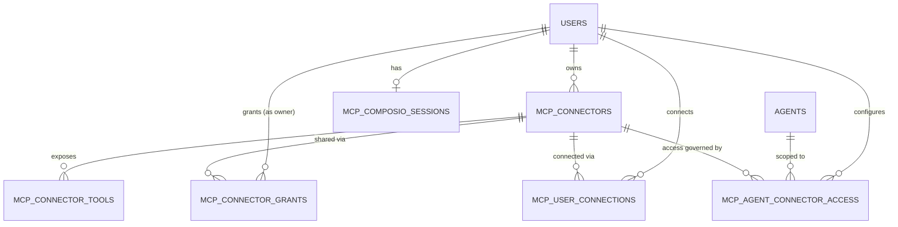

### 8.3 Table specifications

#### `mcp_connectors` — the unified registry

One row per Composio integration or custom MCP server. `provider_type` says which; provider-specific columns are populated only for the matching type.

```sql
CREATE TABLE mcp_connectors (
    id                          UUID PRIMARY KEY DEFAULT gen_random_uuid(),
    provider_type               TEXT NOT NULL CHECK (provider_type IN ('composio', 'mcp_server')),
    owner_id                    UUID REFERENCES users(id) ON DELETE RESTRICT,
    name                        TEXT NOT NULL,           -- display label only, NOT the tool-routing key
    display_name                TEXT,
    logo_url                    TEXT,
    description                 TEXT,

    -- Composio-only fields (NULL when provider_type = 'mcp_server')
    auth_config_id              TEXT,
    auth_scheme                 TEXT DEFAULT 'OAUTH2',
    use_composio_managed        BOOLEAN,

    -- MCP-server-only fields (NULL when provider_type = 'composio')
    url                          TEXT,
    transport                    TEXT DEFAULT 'streamable_http',
    auth_type                    TEXT CHECK (auth_type IN ('none','bearer','basic','oauth2','url_param')),
    url_param_name                TEXT,
    credential_header_name        TEXT DEFAULT 'Authorization',
    headers                       JSONB,
    is_active                     BOOLEAN DEFAULT true,
    oauth_authorization_endpoint  TEXT,
    oauth_token_endpoint          TEXT,
    oauth_client_id               TEXT,
    oauth_client_secret            TEXT,   -- encrypted at rest

    created_at                  TIMESTAMPTZ NOT NULL DEFAULT now(),
    updated_at                  TIMESTAMPTZ NOT NULL DEFAULT now(),

    CONSTRAINT chk_provider_fields CHECK (
        (provider_type = 'composio'  AND auth_config_id IS NOT NULL AND url IS NULL) OR
        (provider_type = 'mcp_server' AND url IS NOT NULL AND auth_config_id IS NULL)
    )
);

CREATE UNIQUE INDEX uq_connectors_name_owner ON mcp_connectors(name, owner_id);
CREATE UNIQUE INDEX uq_connectors_name_platform ON mcp_connectors(name) WHERE owner_id IS NULL;
CREATE INDEX idx_connectors_owner ON mcp_connectors(owner_id);
```

**Constraint rationale:** the CHECK is two-directional on purpose — it does not just forbid the wrong provider's fields from being filled in, it *requires* the right provider's required fields to be present. An earlier version of this constraint only enforced the first half, which would have allowed an empty, unusable connector (no URL, no auth config) to be inserted silently.

**Tool-routing note:** every tool exposed by an MCP-server connector is namespaced as `{prefix}__{tool_name}` when merged into an agent's tool list. That prefix is derived from `id`, **never from `name`** — `name` is unique only *within one owner's scope*, so once sharing exists, two different owners' connectors visible to the same grantee could legitimately share a `name`. An id-derived prefix cannot collide regardless of who owns what; `name` exists purely for display.

#### `mcp_connector_grants` — owner-controlled sharing

Mirrors the platform's existing agent-sharing pattern (`agent_grants`) rather than inventing a new shape.

```sql
CREATE TABLE mcp_connector_grants (
    id            UUID PRIMARY KEY DEFAULT gen_random_uuid(),
    connector_id  UUID NOT NULL REFERENCES mcp_connectors(id) ON DELETE CASCADE,
    grant_type    TEXT NOT NULL CHECK (grant_type IN ('user', 'public')),
    grantee_id    TEXT NOT NULL,             -- a user id as text, or '*' meaning everyone
    granted_by    UUID NOT NULL REFERENCES users(id),
    created_at    TIMESTAMPTZ NOT NULL DEFAULT now(),

    UNIQUE (connector_id, grant_type, grantee_id),
    CONSTRAINT chk_public_sentinel CHECK (
        (grant_type = 'public' AND grantee_id = '*') OR
        (grant_type != 'public' AND grantee_id != '*')
    )
);

CREATE INDEX idx_grants_grantee ON mcp_connector_grants(grantee_id, grant_type);
CREATE INDEX idx_grants_connector ON mcp_connector_grants(connector_id);
```

**Revocation must clean up, not just block.** Deleting a grant row correctly stops future access, but on its own leaves the grantee's stored credential (in `mcp_user_connections`) untouched. If the same connector is ever re-granted to that same person later, a stale, silently-reactivated credential would be a real problem. **Revoking a grant must, in the same transaction, also remove that grantee's connection row for the connector.**

#### `mcp_connector_tools` — the synced tool catalog

Persisted so permission-configuration screens render instantly without a live backend call.

```sql
CREATE TABLE mcp_connector_tools (
    id              UUID PRIMARY KEY DEFAULT gen_random_uuid(),
    connector_id    UUID NOT NULL REFERENCES mcp_connectors(id) ON DELETE CASCADE,
    tool_name       TEXT NOT NULL,
    description     TEXT,
    default_stance  TEXT NOT NULL DEFAULT 'allow' CHECK (default_stance IN ('allow','ask','block')),
    last_synced_at  TIMESTAMPTZ,

    UNIQUE (connector_id, tool_name)
);
```

`last_synced_at` exists so staleness is visible rather than silent — this catalog is a cache of what the live backend reports, not the enforcement source of truth (see §9.2).

#### `mcp_user_connections` — per-user credential/connection state

One row per (user, connector) covering every auth shape uniformly.

```sql
CREATE TABLE mcp_user_connections (
    id                        UUID PRIMARY KEY DEFAULT gen_random_uuid(),
    user_id                    UUID NOT NULL REFERENCES users(id) ON DELETE CASCADE,
    connector_id               UUID NOT NULL REFERENCES mcp_connectors(id) ON DELETE CASCADE,
    status                     TEXT NOT NULL CHECK (status IN ('INITIATED','ACTIVE','EXPIRED')),

    -- Composio-flavored fields
    connected_account_id        TEXT,
    redirect_url                 TEXT,
    oauth_url                    TEXT,

    -- credential storage (format determined by joining to mcp_connectors.auth_type)
    encrypted_credential          TEXT,
    encrypted_refresh_token        TEXT,
    token_expires_at               TIMESTAMPTZ,
    scope                          TEXT,

    created_at                  TIMESTAMPTZ NOT NULL DEFAULT now(),
    updated_at                  TIMESTAMPTZ NOT NULL DEFAULT now(),

    UNIQUE (user_id, connector_id)
);

CREATE INDEX idx_user_connections_user ON mcp_user_connections(user_id);
```

**No `credential_type` column, deliberately.** An earlier draft stored the auth format on this row too — but it is fully determined by joining to `mcp_connectors.auth_type` and could never legitimately disagree with it. Storing it twice was pure duplication; the credential-formatting code joins to the connector instead.

#### `mcp_composio_sessions` — Composio's durable session id

Composio's own "Tool Router" session concept has no equivalent on the custom-server side, so it is intentionally kept separate rather than forced into a shared shape.

```sql
CREATE TABLE mcp_composio_sessions (
    id                    UUID PRIMARY KEY DEFAULT gen_random_uuid(),
    user_id                UUID NOT NULL UNIQUE REFERENCES users(id) ON DELETE CASCADE,
    composio_session_id    TEXT NOT NULL,
    created_at            TIMESTAMPTZ NOT NULL DEFAULT now(),
    updated_at            TIMESTAMPTZ NOT NULL DEFAULT now()
);
```

Nothing about *which toolkits are currently connected* is cached here — that is derived live from `mcp_user_connections` on demand, so the two can never drift out of sync.

#### `mcp_agent_connector_access` — the permission override layer

```sql
CREATE TABLE mcp_agent_connector_access (
    id             UUID PRIMARY KEY DEFAULT gen_random_uuid(),
    user_id         UUID NOT NULL REFERENCES users(id) ON DELETE CASCADE,   -- the caller, not necessarily the agent's owner
    agent_id        UUID NOT NULL REFERENCES agents(id) ON DELETE CASCADE,
    connector_id    UUID NOT NULL REFERENCES mcp_connectors(id) ON DELETE CASCADE,
    enabled         BOOLEAN NOT NULL DEFAULT true,
    tool_rules      JSONB NOT NULL DEFAULT '[]',   -- [{ "pattern": "SEND_*", "stance": "block" }, ...]
    created_at      TIMESTAMPTZ NOT NULL DEFAULT now(),
    updated_at      TIMESTAMPTZ NOT NULL DEFAULT now(),

    UNIQUE (user_id, agent_id, connector_id)
);

CREATE INDEX idx_access_user_agent ON mcp_agent_connector_access(user_id, agent_id);
```

**The single most important rule in the entire schema:** the absence of a row for a (user, agent, connector) triple means fully allowed. A row only ever exists to *restrict* — disable the whole connector for that agent, or apply specific allow/ask/block rules. This is what makes "share once, every one of the grantee's agents gets it" true with zero rows written at share time.

**Known tradeoff:** collapsing what was previously two tables' worth of one-row-per-rule storage into a single `tool_rules` JSONB array loses a database-level uniqueness guarantee that used to prevent two conflicting rules for the same tool pattern. Application code is now responsible for validating and de-duplicating rules before writing them — the database will not catch a contradictory array on its own.

**Implementation-order rule (security-critical, not a schema detail):** this table must never be consulted on its own. Every access check evaluates ownership/grant status *first* (§12); only if that passes does this table's rules get applied. An `enabled = true` row here must never grant access by itself if the underlying grant was revoked.

---

## 9. Request Flows

### 9.1 `tools/list` — aggregation, filtering, caching

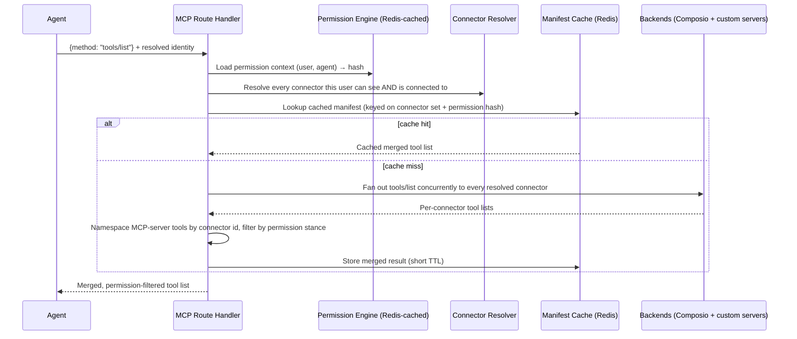

The manifest cache key is bound to **both** the caller's current connector set *and* their current permission hash. Either changing — a new connection, a revoked grant, an edited rule — changes the key, so a stale answer can never be served; there is no "wait a few minutes for it to catch up."

### 9.2 `tools/call` — routing and enforcement

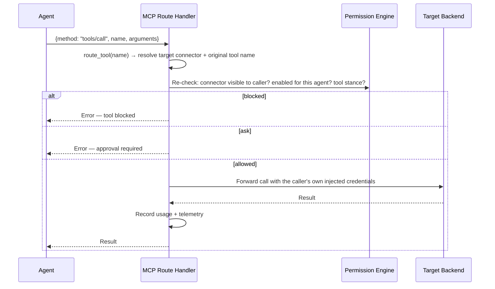

The permission check is repeated in full at call time, not only at list time — this closes the window where a tool could be listed as available and then blocked a moment before it's actually invoked.

### 9.3 Connecting a connector (unified across auth types)

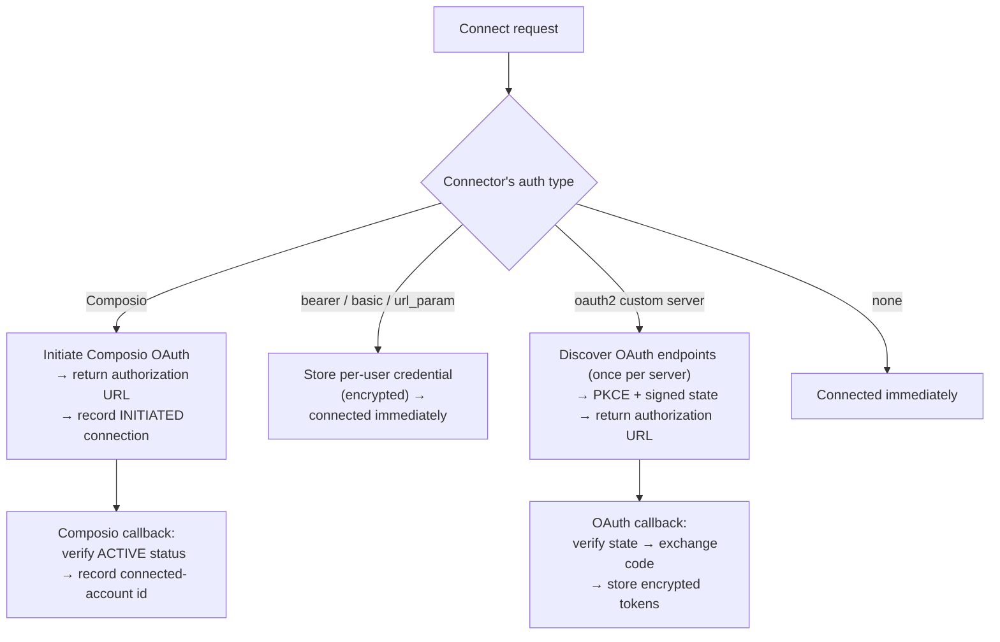

### 9.4 Sharing a custom MCP server

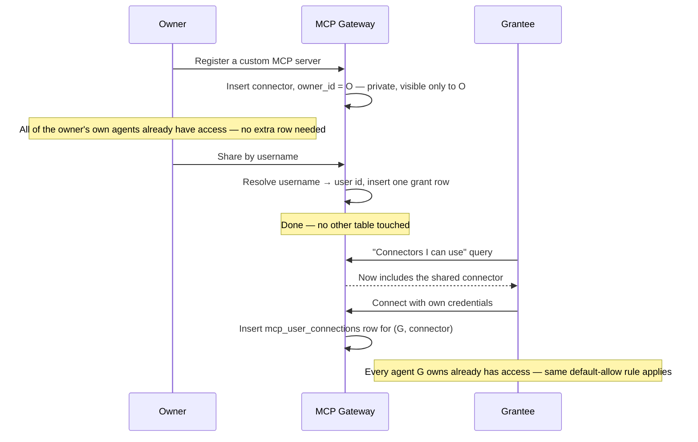

### 9.5 Revoking a share

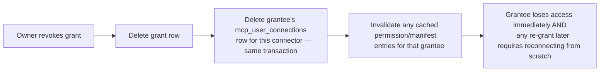

### 9.6 Permission change → immediate cache invalidation

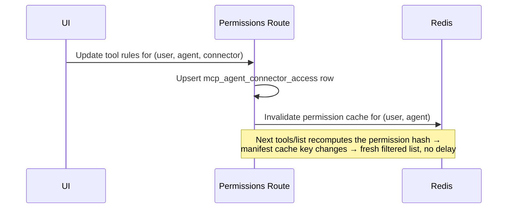

### 9.7 Composio token-expiry webhook

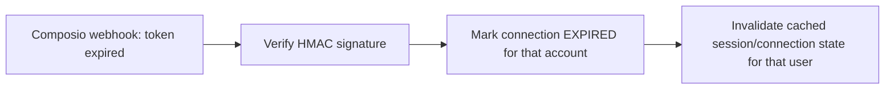

---

## 10. Auth Types & Credential Injection

The gateway supports every authentication shape a custom MCP server might require, resolved uniformly at request time from `mcp_user_connections` joined against `mcp_connectors.auth_type`:

| Auth type | Injection | Notes |
|---|---|---|
| `none` | Nothing | — |
| `bearer` | `Authorization: Bearer <token>` (or a custom header name) | Auto-prefixed with `Bearer` if the stored value omits it |
| `basic` | `Authorization: Basic <base64(user:pass)>` | Base64-encoded automatically on connect |
| `url_param` | `?<param>=<value>` appended to the request URL | Never exposed in headers |
| `oauth2` | `Authorization: Bearer <access_token>` | Automatically refreshed when close to expiry, using the stored refresh token |
| Composio | Resolved MCP session URL + headers from the active Composio session | Managed entirely by Composio's OAuth infrastructure |

Credentials are loaded in two batched queries per request (no N+1 pattern) — one for user connections, one for OAuth tokens — and a connector with no credential/token stored for the calling user is silently skipped rather than causing the whole request to fail.

---

## 11. Caching Strategy

All caching lives in Redis, shared across every server replica (this is a horizontally-scaled service — an in-process cache would be inconsistent across instances). Every key is namespaced:

| Cache | Key shape | Invalidated by |
|---|---|---|
| Permission context | keyed by (user, agent) | Any write to `mcp_agent_connector_access` for that pair |
| Connector/session resolution | keyed by user | Any connect / disconnect / grant / revoke / webhook event for that user |
| Merged tool manifest | keyed by (connector set fingerprint, permission hash) | Automatically — either component changing changes the key itself |

The permission hash is the mechanism that ties cache correctness to actual state: it's a deterministic digest of every active rule and disabled-connector flag for a (user, agent) pair. Any meaningful change recomputes to a different hash, which is itself the manifest cache's key component — there is no separate "please also remember to invalidate the manifest cache" step to forget.

---

## 12. Permission Model — Deep Dive

Every access decision resolves through exactly two layers, checked strictly in this order:

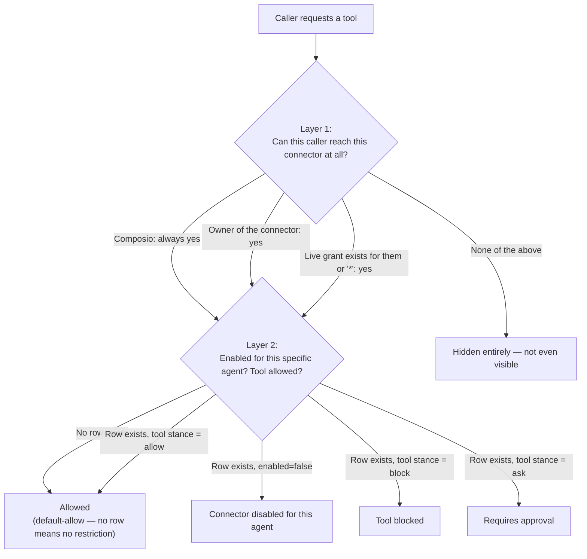

**Why the ordering is security-critical, not just logical:** Layer 2 must never be evaluated independently of Layer 1. If an implementation ever asks "is there an `enabled=true` row?" without first re-confirming that Layer 1 currently passes, a revoked grant that left behind a stale permissive row would continue to let someone in — precisely the failure mode a revocation flow must never have. Layer 1 gates whether Layer 2 is even consulted, on every single check, with no shortcut path.

---

## 13. Composio Integration

Composio exposes no native Rust SDK, so integration is a direct HTTP client against Composio's own versioned API, built entirely behind the `ToolProvider` trait so it can be mocked in tests and swapped for an alternative implementation if needed. The client covers:

- **Auth-config registration** — registering a toolkit's OAuth application with Composio.
- **Connection initiation** — starting a user's OAuth flow and returning the authorization URL.
- **Connection status sync** — resolving Composio's connected-account id and current status.
- **Revocation** — disconnecting a user's account from a toolkit.
- **Tool Router session lifecycle** — creating, reusing, and patching the per-user session that Composio's aggregated MCP endpoint is served through, and resolving the session URL and headers needed to reach it.

All requests authenticate with a single platform-level API key; response parsing is deliberately tolerant of minor shape variation across Composio's endpoints, since the exact envelope for some responses is not fully documented — this isolation is exactly why the trait boundary exists: a shape correction only ever touches the Composio client, nothing else in the system.

---

## 14. Observability & Usage Integration

Every tool call is recorded into the platform's existing observability and usage-tracking sinks — nothing about MCP tool calls requires a new dashboard or a new query surface:

- **Usage tracking** — every successful or failed tool call is recorded with its operation type, the acting agent, latency, and outcome, feeding into the platform's existing per-user/per-agent usage reporting and cost attribution.
- **Metrics** — tool-call counters and latency histograms carry the tool name and agent identity as attributes, consistent with the platform's broader generative-AI metrics.
- **Distributed tracing** — trace context is propagated through the delegation-token flow so a tool call taken during a multi-agent conversation remains attributable to the originating trace.

---

## 15. Extension Seams

Following the platform's established pattern of trait-based extension points rather than forked code paths:

| Trait / seam | Implementation |
|---|---|
| `ToolProvider` | Composio client, custom-MCP-server client |
| `ConnectorAuthorizer` | Owner ∪ user/public-grant reachability check (Layer 1) |
| Instrumentation injector | Injects the fixed gateway URL at deploy time |
| Management-route access gate | Owner / public-grant / platform-admin checks |

No new authentication scheme is introduced for management routes — they reuse the same access-control primitives the rest of the platform's resource-management routes already use. Extended behavior on these seams — including team- and department-scoped connector sharing — is available in the Nasiko enterprise edition.

---

## 15a. Optional Tool Outcome Attestation (TOA) gate

Nasiko already probes and ACL-gates connectors. That is necessary and not the same as proving tool *delivery* quality from an outside probe.

[TOA](https://github.com/Carmel-Labs-Inc/toa) (`toa/0.1`) is an Apache-2.0 signed JSON evidence format for MCP tool delivery (reach, invoke, functional, shape, and related layers). It is not a wire protocol. It is not meant to run on every live `tools/call`.

**Suggested fit (optional, off by default):** before promoting or enabling a custom MCP connector for agents, ops or CI can require a recent attestation and run offline `toa-verify` with a pinned emitter public key. Any party can emit if they sign the schema. AgentStatus is one optional emitter. No AgentStatus account is required to verify.

```yaml
      # After connector probe / register checks in your pipeline.
      - name: Verify tool delivery attestation
        if: hashFiles('toa.json') != ''
        run: |
          pip install "git+https://github.com/Carmel-Labs-Inc/toa.git@345f24607919b5bdf143719b9ea062543cdfe88e#subdirectory=python"
          toa-verify toa.json --require-layer functional=pass
```

Copy-paste example: [`docs/toa-optional-connector-gate.md`](./toa-optional-connector-gate.md).

This section documents an optional adjacent gate only. It does not change the gateway request path, SSRF rules, or ACL model.

---

## 16. Configuration Reference

| Setting | Purpose | Default behavior when unset |
|---|---|---|
| Composio API key | Enables Composio integration | Composio features cleanly disabled, custom MCP servers unaffected |
| Composio base URL | Composio API endpoint | Sensible default pointing at Composio's production API |
| Composio webhook secret | HMAC verification for the expiry webhook | Webhook processing disabled if unset |
| Gateway public URL | Injected into every agent as `MCP_GATEWAY_URL` | Agents deployed without it cannot reach the gateway until redeployed |
| Session cache TTL | How long a resolved connector/session set is cached | Short, tuned for responsiveness over cache-hit rate |
| Permission cache TTL | How long a permission context is cached before re-checking | Short — any write-path event invalidates it immediately regardless |
| Manifest cache TTL | How long a merged tool list is cached | Moderate — bounded by the permission/connector hash changing anyway |

---

## 17. API Surface

**Agent-facing (delegation-token identity, one endpoint):**

| Method | Endpoint | Purpose |
|---|---|---|
| POST | `/api/mcp` | The single MCP JSON-RPC entry point — `initialize`, `ping`, `tools/list`, `tools/call` |

**Management surface (session-JWT identity, access-controlled):**

| Method | Endpoint | Purpose |
|---|---|---|
| GET | `/api/mcp/catalog` | Browse connectable services (credential-free) |
| GET / POST | `/api/mcp/auth-configs` | List / register platform Composio auth configs (admin) |
| PATCH / DELETE | `/api/mcp/auth-configs/{connector_id}` | Update / remove a platform Composio auth config (admin) |
| POST | `/api/mcp/connect` | Unified connect — handles every auth type transparently |
| GET | `/api/mcp/connections` | List the caller's own connections |
| DELETE | `/api/mcp/connections/{connector_id}` | Disconnect / revoke |
| GET / POST | `/api/mcp/connectors` | List connectors visible to the caller / register a custom MCP server |
| POST | `/api/mcp/connectors/probe` | Detect a candidate server's required auth type before registering |
| PATCH / DELETE | `/api/mcp/connectors/{id}` | Update / delete an owned connector |
| GET / POST / DELETE | `/api/mcp/connectors/{id}/share` | List, grant, or revoke a username's (or everyone's) access to an owned connector |
| POST / DELETE | `/api/mcp/connectors/{id}/credential` | Store / remove a credential (write-only) |
| GET | `/api/mcp/connectors/{id}/credential/status` | Check whether a credential is stored (never returns its value) |
| POST | `/api/mcp/connectors/{id}/oauth/authorize` | Begin an OAuth 2.1 flow for a custom server |
| GET | `/api/mcp/connectors/{id}/oauth/status` | OAuth connection status for the caller |
| DELETE | `/api/mcp/connectors/{id}/oauth/token` | Revoke the caller's stored OAuth token |
| GET | `/api/mcp/oauth/callback` | Public OAuth callback (state-verified, not JWT-gated) |
| GET | `/api/mcp/agents/{agent_id}/connectors` | View per-agent connector access |
| PUT | `/api/mcp/agents/{agent_id}/connectors/{connector_id}` | Configure one connector's access for that agent |
| GET | `/api/mcp/agents/{agent_id}/connectors/{connector_id}/tools` | List that connector's tools with effective stances |
| GET / PUT | `/api/mcp/agents/{agent_id}/tools` | View / bulk-update per-tool allow/ask/block rules |
| DELETE | `/api/mcp/agents/{agent_id}/permissions` | Reset an agent's overrides back to full default-allow |
| POST | `/api/mcp/webhooks/composio` | Public, HMAC-verified — Composio token-expiry events |

Public paths (the OAuth callback and the Composio webhook) authenticate via signed state or HMAC rather than a session JWT.

---

## 18. Security Hardening Summary

The schema and access model described above reflect a completed adversarial review, not the first draft. Five concrete issues were found and fixed before this became the decided design:

| # | Issue | Fix |
|---|---|---|
| 1 | Tool-name prefixing based on `name`, which is only unique per owner — two different owners' connectors visible to the same grantee could collide once sharing exists | Prefix derived from `id` instead, which can never collide |
| 2 | Revoking a share blocked future access but left the grantee's stored credential untouched, risking silent reactivation on a later re-grant | Revocation now deletes the grantee's connection row in the same transaction |
| 3 | The provider-type constraint only forbade the wrong provider's fields, never required the right provider's fields — an empty, unusable connector could be inserted | Constraint tightened to require the correct fields, not just forbid the incorrect ones |
| 4 | `credential_type` was stored on every connection row despite being fully derivable from the connector's own `auth_type` | Column removed; credential formatting joins to the connector instead |
| 5 | Deleting a connector owner cascaded to silently destroy the connector — and everyone else's shared access to it | Changed to a blocking delete — ownership must be transferred or the connector explicitly deleted first |

Two accepted, documented tradeoffs remain: application code, not the database, is responsible for de-duplicating conflicting tool rules within the `tool_rules` array, and the two-layer permission check (§12) must always be evaluated in order — this is called out explicitly here so it is never lost in an unrelated ticket description.

