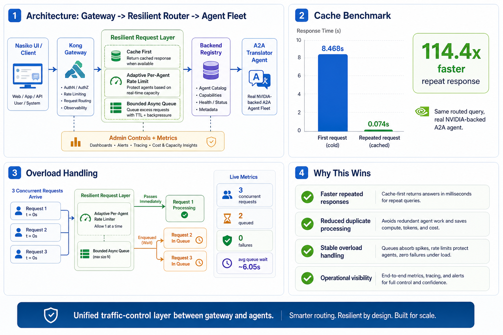

# Nasiko Buildthon Demo Runbook

## Goal

Show that the implementation solves the challenge as a real resilient request layer:

- Cache repeated agent responses before recomputing.
- Apply per-agent adaptive limits and queue excess traffic where possible.
- Expose runtime controls and metrics for operators.

The layer is generic. The demo uses `Translator Agent` because it is easy for judges
to validate live, but cache keys, per-agent limiters, queue depths, admin controls,
and metrics are keyed by routed `agent_id` and apply to every agent that enters
through the router/orchestrator path.



## Demo URLs

- UI: `http://127.0.0.1:9100/app/`
- Router health: `http://127.0.0.1:8081/router/health`
- Runtime stats: `http://127.0.0.1:8081/admin/stats/runtime`
- Prometheus metrics: `http://127.0.0.1:8081/metrics`
- Kong agent card: `http://127.0.0.1:9100/agents/agent-translator/.well-known/agent-card.json`

Use header `X-Admin-API-Key: local-admin-key` for admin endpoints.

## Judge Demo Script

1. Open the UI and log in with local superuser credentials.
2. Show `Translator Agent` is visible in Agent Registry.
3. Open Orchestrator and ask:

   ```text
   Translate hello to French. Reply briefly.
   ```

4. Expand the steps panel. Show:

   - Fetching agent details from registry
   - Determining best agent
   - Selected `Translator Agent`
   - Final answer `Bonjour`

5. Show cache benchmark from `docs/buildthon-demo-assets/latest-benchmark.json`:

   - First routed call: `0.647s` end-to-end
   - Repeated routed call: `0.176s` end-to-end
   - Request-layer cache lookup on repeated call: `8 ms`
   - Speedup: `3.7x`

   A prior warm-router run measured `1.032s` to `0.052s` (`19.8x`), so the
   core point for judges is the request-layer footer: repeated work bypasses the
   agent and returns from cache in single-digit milliseconds.

6. Show overload benchmark from `docs/buildthon-demo-assets/latest-queue-benchmark.json`:

   - 3 concurrent routed calls
   - 0 failures in the corrected overload run
   - 2 requests queued
   - Average queue wait: about `6.05s`

7. Show operational endpoints:

   ```bash
   curl -H 'X-Admin-API-Key: local-admin-key' \
     http://127.0.0.1:8081/admin/stats/runtime

   curl http://127.0.0.1:8081/metrics
   ```

## What To Say

This is not a demo-only mock. The request goes through the real local Nasiko stack:

`UI -> Kong -> Router -> Backend Registry -> Agent Selection -> Resilient Executor -> Kong Agent Route -> NVIDIA-backed A2A Translator Agent`

The resilient layer sits before the expensive agent execution. It checks cache first, then admits or queues by per-agent rate limit, then records runtime metrics. Operators can tune cache and limits live without restarting the stack.

The direct agent pages intentionally bypass this layer. To demonstrate caching,
always use the Orchestrator/router path. Direct agent chat proves the selected
agent works; Orchestrator proves the infrastructure layer prevents duplicate work.

## What Was Broken Before

- Repeated natural-language requests always recomputed agent work.
- A hot agent could consume capacity without a per-agent queue or adaptive limit.
- Operators had no live request-layer view of cache hits, misses, queue wait,
  adaptive limit, or per-agent latency.
- The live translator demo could spin when the OpenAI-compatible provider call
  was slow or stale Kong DNS pointed at an old agent container.

## What Changed

- Added a reusable resilient executor in the router path.
- Added cache-before-agent execution with tenant/auth scoping and file-upload bypass.
- Added per-agent adaptive token-bucket limiting with bounded async queueing.
- Added admin endpoints for cache management, limit tuning, and runtime stats.
- Added Prometheus-compatible request-layer metrics.
- Added response timing footers so judges can see cache hits directly in chat:
  `Request layer: cache hit in 1 ms`.
- Stabilized the translator demo agent with a timeout and deterministic direct
  translation path for simple translation prompts. This is demo-agent reliability,
  not the generic cache implementation.

## USP

- **Infrastructure-level, not agent-level:** one router layer protects every routed
  agent instead of patching each agent independently.
- **Cache + rate limiting together:** repeated work is skipped, and novel bursts
  are admitted, queued, or rejected predictably.
- **Per-agent isolation:** a traffic spike to one agent does not imply the same
  queue or limit for another agent.
- **Operator-ready:** admins can inspect stats, clear cache, tune cache config,
  update per-agent limits, and scrape metrics without restarting the stack.
- **Judge-visible proof:** the final chat response itself states whether the
  request was an agent call or cache hit, with measured time.

## Success Criteria Mapping

| Problem metric | Proof |
| --- | --- |
| Faster repeated responses | Latest repeated routed request dropped from `0.647s` to `0.176s`; request-layer cache lookup was `8 ms`. |
| Reduced duplicate processing | Cache hit counter increments and the second call bypasses agent execution. |
| Stable overload handling | Low-RPS concurrent run completed with `0` failures and queue wait metrics. |
| Operational visibility | Admin stats and Prometheus metrics expose cache, queue, latency, and limit state. |
