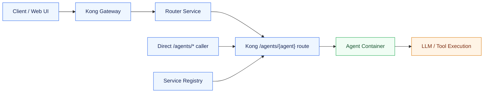
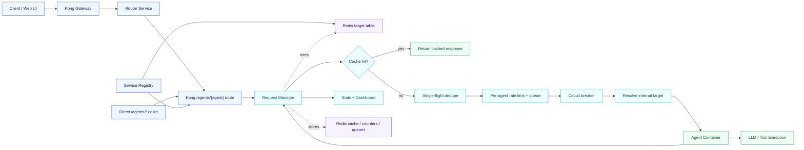

# Nasiko Buildthon Demo: Resilient Agent Request Layer

## One-Line Pitch

We built a unified traffic-control layer for Nasiko agents that makes repeated requests fast, prevents overloaded agents from destabilizing the platform, and gives operators live visibility and controls without changing the existing client contract.

## Judging Criteria Map

| Judging criterion | What to emphasize |
| --- | --- |
| How well I understood the problem statement | This is not only a caching task and not only a rate-limiting task. It is a traffic-control problem for multi-agent systems: avoid duplicate compute, isolate overloaded agents, preserve predictable behavior, and expose operational controls. |
| Understanding of Nasiko | The solution fits Nasiko's current architecture: Kong remains the gateway, the registry remains the source of agent discovery, the router keeps its existing contract, agents still speak A2A JSON-RPC `message/send`, and Redis is reused as the shared coordination layer. |
| MVP quality | The MVP is conservative and correct: cache only safe text-only A2A requests, cache hits bypass agent work, cache misses use single-flight dedupe, per-agent concurrency/RPS limits, bounded queues, circuit breaker, runtime controls, and a dashboard. |
| Project completion | The layer is implemented, wired into Docker Compose, routes `/agents/*` through Request Manager, exposes `/health`, `/control/stats`, `/control/limits`, `/control/cache`, and includes runnable demo scripts for each KPI. |

## 60-Second Opening

Modern AI platforms like Nasiko can run many specialized agents at the same time. The risk is that the platform wastes compute by processing the same request repeatedly, and a traffic spike to one agent can cascade into failures for the whole system.

The requirement asks for a unified request management layer between the gateway and the agent fleet. I interpreted that as an infrastructure traffic-control layer, not as a router-only optimization.

Our solution adds a Request Manager after Kong and before the agent fleet. Kong still handles public routing and middleware. The router still selects the best agent. Once a request targets a specific agent, Request Manager controls execution through caching, single-flight dedupe, per-agent limits, bounded queueing, circuit breaking, and live operational endpoints.

## Problem Understanding

The core problem has two failure modes:

- Redundant compute: repeated identical requests cause repeated LLM/tool execution even though the answer could be reused.
- Cascading overload: one slow or overloaded agent consumes resources and makes the platform less stable.

The success criteria map naturally to four capabilities:

- Faster repeated responses: response cache before agent execution.
- Reduced duplicate processing: cache hits plus single-flight dedupe for concurrent identical misses.
- Stable overload handling: per-agent concurrency/RPS limits plus bounded FIFO queues and circuit breaker.
- Operational visibility: live stats, limit controls, cache controls, and dashboard.

The key design choice is placement. Caching before routing is risky because we do not know which agent owns the answer. Putting it only inside the router misses direct `/agents/*` traffic. Putting it after Kong and before agents captures both router-driven calls and direct agent calls.

## Understanding Of Nasiko

Nasiko already has the right seams:

- Kong is the public gateway on `9100`.
- Dynamic agent routes use `/agents/{agent}`.
- `agent-gateway/registry/registry.py` discovers agent containers and registers Kong routes.
- The router chooses an agent, then calls the selected agent through Kong.
- Agents use A2A JSON-RPC, especially `message/send`.
- Redis already exists in the local stack and is suitable for shared state.

So the MVP avoids disturbing the client or router contract. We reuse the registry for discovery and extend it to publish internal agent targets to Redis. Kong `/agents/*` routes point to Request Manager. Request Manager resolves the real internal target and proxies to the agent directly, avoiding a proxy loop.

## Architecture

### Before: Direct Gateway-To-Agent Execution

Before this change, Kong was already the public entry point and the registry discovered agent containers. The missing piece was an execution-control layer between Kong and the agents. Once traffic reached an agent route, the request went directly to the agent container.



What this meant:

- Repeated identical requests could repeatedly hit the same expensive agent computation.
- There was no shared per-agent queue or concurrency gate after Kong.
- Router-selected traffic and direct `/agents/*` traffic did not share one protection layer.
- Operational visibility for cache hits, queue waits, and per-agent overload state was missing.

### After: Request Manager As The Agent Execution-Control Layer

Now Kong still owns public routing and middleware, and the router still owns agent selection. The change is that every dynamic `/agents/{agent}` route goes to Request Manager first. Request Manager checks cache, dedupes identical misses, applies per-agent limits, queues when possible, and then proxies to the internal agent target.



What changed:

- Kong dynamic agent routes now point to Request Manager, not directly to agent containers.
- Registry still owns discovery, but it also publishes internal agent targets to Redis.
- Request Manager calls internal container URLs, so it avoids looping back through Kong.
- Cache hits return before rate limit, queue, or agent execution.
- Cache misses are protected by single-flight, per-agent concurrency, token-bucket RPS, bounded queueing, and circuit breaker.

### Final Runtime Paths

For routed requests:

```text
Client -> Kong -> Router -> Kong /agents/{agent} -> Request Manager -> Agent
```

For direct agent requests:

```text
Client -> Kong /agents/{agent} -> Request Manager -> Agent
```

Why this is the right MVP placement:

- Kong stays the public front door for auth, CORS, and route matching.
- Router does not need a contract change.
- Direct `/agents/*` traffic is also protected.
- Cache keys include selected `agent_id`, user scope, method, normalized text, and agent target revision.
- Request Manager never calls public Kong `/agents/*`; it calls the internal container target from Redis.

## Request Flow

1. Extract `agent_id` from `/agents/{agent}`.
2. Resolve the internal upstream target from Redis.
3. Decide if the request is cacheable.
4. Check Redis response cache.
5. If miss, single-flight dedupes identical concurrent misses.
6. Acquire per-agent capacity using concurrency and token-bucket RPS limits.
7. Wait in bounded FIFO queue if capacity is temporarily unavailable.
8. Proxy request to the internal agent.
9. Cache safe successful JSON responses.
10. Record metrics and return response headers for observability.

Important headers:

- `X-Request-Layer-Agent`
- `X-Request-Layer-Cache: HIT | MISS | BYPASS`
- `X-Request-Layer-Queue-Wait-Ms`
- `X-Request-Layer-Limit-State`

## MVP Quality

Implemented MVP capabilities:

- Safe response caching for text-only A2A `message/send`.
- Cache bypass on `Cache-Control: no-cache`.
- Cache keys scoped by agent, user, normalized text, method, and target revision.
- Single-flight dedupe to prevent cache stampedes.
- Per-agent concurrency limit.
- Per-agent token-bucket sustained RPS and burst handling.
- Bounded FIFO queue with max depth and max wait.
- Per-agent circuit breaker for failing agents.
- Redis-backed coordination for multi-replica readiness.
- Degraded local limiter if Redis is temporarily unavailable.
- Runtime operational endpoints.
- Simple dashboard.
- Demo scripts for cache latency, duplicate processing, and overload behavior.

Conservative choices:

- No semantic cache in MVP because correctness matters more than a slightly higher hit rate.
- No streaming response caching in MVP.
- No side-effect agent caching by default.
- No router/client API change.

## Operational Endpoints

Request Manager runs on `8090`.

```text
GET    /health
GET    /
GET    /control/stats
GET    /control/agents/{agent_id}/stats
GET    /control/limits
PUT    /control/limits/{agent_id}
DELETE /control/cache
```

Dashboard:

```text
http://localhost:8090/
```

## Demo Setup

Use the request-layer worktree:

```bash
cd /Users/himanshu.sin/Personal/goals/nashiko-hackathon/.worktrees/request-layer
```

Start the Request Manager and registry against the existing local stack:

```bash
docker --context rancher-desktop compose \
  -p nashiko-hackathon \
  -f docker-compose.local.yml \
  --env-file /Users/himanshu.sin/Personal/goals/nashiko-hackathon/.nasiko-local.env \
  up -d --build nasiko-request-manager kong-service-registry
```

For a deterministic demo agent, use the included mock A2A agent:

```bash
docker --context rancher-desktop run -d \
  --name agent-demo-request-layer \
  --network agents-net \
  -v "$PWD/scripts/request-layer/mock_agent.py:/mock_agent.py:ro" \
  python:3.11-slim python /mock_agent.py
```

If the mock container already exists, keep using the running one.

Force registry discovery:

```bash
docker --context rancher-desktop exec kong-service-registry \
  curl -sS -X POST http://localhost:8080/sync
```

## Live Demo Script

### Demo 0: Real AI Agent Through Nasiko UI

This is the strongest product demo because it uses a real OpenAI-backed Nasiko A2A translator agent from the web UI, while Request Manager protects the `/agents/*` execution path behind the scenes.

Start the real translator container:

```bash
docker --context rancher-desktop build \
  -t nasiko-real-a2a-translator ./agents/a2a-translator

docker --context rancher-desktop run -d \
  --name agent-a2a-translator \
  --network agents-net \
  --env-file /Users/himanshu.sin/Personal/goals/nashiko-hackathon/.nasiko-local.env \
  nasiko-real-a2a-translator

docker --context rancher-desktop exec kong-service-registry \
  curl -sS -X POST http://localhost:8080/sync
```

To make this manually started local agent visible in the Nasiko UI, add matching local registry metadata and owner permission for the superuser:

```bash
docker --context rancher-desktop exec mongodb mongosh --quiet \
  -u admin -p password --authenticationDatabase admin --eval '
const db=db.getSiblingDB("nasiko");
const user=db.users.findOne({is_super_user:true});
const now=new Date();
db.registry.updateOne(
  { id: "agent-a2a-translator" },
  { $set: {
    protocolVersion: "0.2.9",
    id: "agent-a2a-translator",
    name: "Real A2A Translator",
    description: "OpenAI-backed A2A translator agent used to demonstrate Request Manager caching, queueing, and runtime stats on a real AI response.",
    url: "http://localhost:9100/agents/agent-a2a-translator/",
    preferredTransport: "JSONRPC",
    version: "1.0.0",
    capabilities: { streaming: true, pushNotifications: false, stateTransitionHistory: false, chat_agent: false },
    securitySchemes: {},
    security: [],
    defaultInputModes: ["application/json", "text/plain"],
    defaultOutputModes: ["application/json", "text/plain"],
    skills: [{ id: "translator_agent", name: "Translator Agent", description: "Translate text and web content between different languages", tags: ["translation", "language", "text"], examples: ["Translate Hello world to Spanish"] }],
    tags: ["translation", "language", "text"],
    owner_id: user._id,
    updated_at: now,
    created_at: now,
    version_history: [{ version: "1.0.0", status: "active", created_at: now, notes: "Manual local demo registration" }]
  } },
  { upsert: true }
);
print(user._id);
'
```

Then create the permission using the printed superuser id:

```bash
curl -sS -X POST \
  "http://localhost:8082/auth/agents/agent-a2a-translator/permissions?owner_id=<SUPERUSER_ID>"
```

UI flow:

1. Open `http://localhost:9100/app/home`.
2. Sign in using `orchestrator/superuser_credentials.json`.
3. Confirm the `Real A2A Translator` card is visible.
4. Click `Start session`.
5. Ask: `Translate 'Request Manager makes repeated agent calls fast' to Spanish`.
6. Ask the same query again.
7. Open `http://localhost:8090/` or inspect `/control/agents/agent-a2a-translator/stats`.

What to say:

The first UI request goes through the full real path: Nasiko Web UI -> Kong -> Request Manager -> real A2A translator -> OpenAI. The repeated UI request is served by Request Manager cache. In my validation, `cache_hits` increased while `upstream_requests` stayed flat on the repeated request.

KPI proved:

- Real product usage, not only a synthetic script.
- Faster repeated responses on a real AI-backed agent.
- Reduced duplicate agent execution.
- Operational visibility from Request Manager stats.

### Demo 1: Faster Repeated Responses

Run:

```bash
python3 scripts/request-layer/demo_cache_latency.py
```

What to say:

The first request is a cold miss and reaches the agent. The repeated request is served from Request Manager cache before the agent is called. In my smoke check through Kong, the first call was approximately `1274ms` and the repeated call was approximately `3.9ms`.

KPI proved:

- Faster repeated responses.
- Reduced agent work for repeated queries.

### Demo 2: Reduced Duplicate Processing

Run:

```bash
python3 scripts/request-layer/demo_singleflight.py
```

What to say:

This fires concurrent identical requests. Without single-flight, every request could hit the agent at the same time. With single-flight, one request computes and the others wait for the same cache result.

KPI proved:

- Reduced duplicate processing.
- Cache stampede protection.

### Demo 3: Stable Overload Handling

Run:

```bash
python3 scripts/request-layer/demo_overload.py
```

What to say:

This lowers the demo agent limit and sends a burst. Request Manager queues excess traffic instead of immediately failing everything. The output shows successes/failures, queue wait times, and limit state.

KPI proved:

- Stable overload handling.
- Predictable queue behavior.
- Per-agent isolation.

### Demo 4: Operational Visibility

Open:

```text
http://localhost:8090/
```

Or inspect JSON:

```bash
curl http://localhost:8090/control/stats
```

What to say:

Operators can see cache hits/misses, upstream requests, queue waits, circuit state, and per-agent limits. They can also update limits at runtime and clear cache without restarting services.

KPI proved:

- Operational visibility.
- Runtime control.

## Exact KPI Mapping

| KPI | How we prove it |
| --- | --- |
| Faster repeated responses | `demo_cache_latency.py` shows cold miss latency versus cache hit latency. Verified example: `MISS ~1274ms`, `HIT ~3.9ms` through Kong. |
| Reduced duplicate processing | `demo_singleflight.py` fires concurrent identical requests; Request Manager collapses identical misses and records cache/single-flight metrics. |
| Stable overload handling | `demo_overload.py` lowers capacity and sends a burst; excess requests wait in bounded queue with visible queue wait metadata. |
| Operational visibility | Dashboard plus `/control/stats`, `/control/limits`, `/control/cache`, and per-agent stats endpoints. |

## What Is Complete

Code committed on branch:

```text
feature/resilient-agent-request-layer
774ba92 feat: wire request manager runtime and demo
```

Completed implementation areas:

- New Request Manager FastAPI service.
- Docker Compose service wiring.
- Registry discovery publishing to Redis.
- Kong dynamic agent routes through Request Manager.
- Internal target resolution.
- Cache policy and Redis response cache.
- Single-flight duplicate suppression.
- Per-agent limiter and queue.
- Circuit breaker.
- Runtime stats and control endpoints.
- Dashboard.
- Demo scripts and mock agent.

## What I Would Improve Next

If this were production, the next steps would be:

- Add auth protection for control endpoints.
- Add Prometheus/OpenTelemetry/Phoenix metrics export.
- Add async job mode for very long-running queued workflows.
- Add per-tenant fairness and priority queues.
- Add agent-card-driven cacheability hints.
- Add semantic cache only for explicitly safe read-only agents.
- Refactor and expand tests around concurrency and failure cases.

## Likely Judge Questions

### Why not put this inside the router?

Because router-only logic misses direct `/agents/*` calls. The problem asks for a layer between gateway and agent fleet. Request Manager after Kong protects both router-selected traffic and direct agent traffic.

### Why not put this before Kong?

Before Kong, we would duplicate gateway responsibilities like route matching, auth, CORS, and existing middleware. Kong should stay the public gateway. Request Manager should control agent execution after Kong has identified an agent route.

### Why cache after routing?

The selected agent is part of correctness. The same query can produce different answers from different agents. Cache after routing lets the cache key include `agent_id` and agent revision.

### How do you avoid caching unsafe actions?

MVP cache policy is conservative: only text-only A2A `message/send`, successful JSON responses, user-scoped keys, no uploads, no streams, no errors, no side-effect agents by default, and honor `Cache-Control: no-cache`.

### What happens under overload?

Each agent has its own concurrency cap, token-bucket RPS limit, and bounded FIFO queue. One overloaded agent does not consume another agent's capacity. If the queue is full or wait timeout expires, Request Manager returns a controlled response with `Retry-After`.

### What happens if Redis is unavailable?

Cache is bypassed, shared distributed coordination degrades, and Request Manager uses conservative local in-process limits. Health/status exposes degraded behavior instead of silently pretending everything is normal.

### Why use a mock agent in demo?

The mock agent is only for deterministic judging. It speaks the same basic A2A JSON shape and runs behind the same Kong -> Request Manager -> internal agent path. Real deployed agents use the same registry and routing flow.

## Closing Statement

This MVP demonstrates the core infrastructure pattern Nasiko needs: Kong remains the gateway, Router remains the intelligence layer, and Request Manager becomes the resilient execution-control layer for agents. It directly addresses redundant compute, overload isolation, queueing, and operator visibility while preserving the existing client contract.
