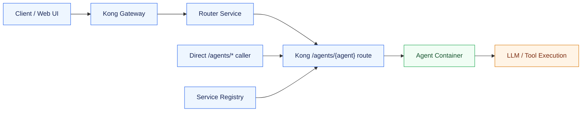
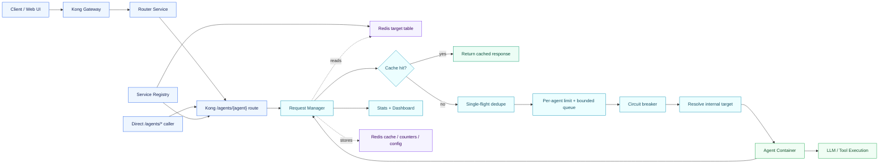

# Nasiko Buildthon Demo: Resilient Agent Request Layer

## Problem Statement

Modern AI platforms orchestrate many specialized agents concurrently. Without traffic controls, two failure modes appear quickly:

- Repeated requests trigger duplicate agent computation even when the same answer could be reused.
- Traffic spikes to one agent can overload that agent and cascade instability across the platform.

The requirement is to build a unified request management layer between the gateway and the agent fleet. The layer must combine caching, adaptive traffic protection, queueing, and operational controls.

The solution target is not "just cache responses" or "just add rate limits." It is an agent traffic-control plane for Nasiko:

- Serve safe repeated requests faster from cache.
- Reduce duplicate processing using cache hits and single-flight dedupe.
- Keep overloaded agents stable using per-agent limits and bounded queues.
- Give operators live visibility and runtime controls.

## Existing Design

Nasiko already had a clean gateway-driven architecture. Kong is the public entry point, the registry discovers agent containers, and the router can select an agent for a user request. Once traffic reached a dynamic `/agents/{agent}` route, however, it went directly from Kong to the target agent container.



### Existing Design Gaps

- Repeated identical calls could still execute the same expensive agent workflow again.
- There was no common per-agent queue after the gateway.
- Router-driven calls and direct `/agents/*` calls did not share one protection layer.
- Operators could not see cache hit rate, queue wait, per-agent limit state, or circuit state in one place.
- If one agent became slow, request pressure could pile up without predictable backpressure.

## Proposed Design

The proposed design adds a new service: Request Manager. Kong remains the public gateway. The router keeps selecting agents exactly as before. The registry still discovers agents. The key change is that dynamic `/agents/{agent}` routes now go to Request Manager first.

Request Manager then becomes the execution-control layer for each selected agent. It checks cache, dedupes identical misses, applies per-agent concurrency and RPS limits, queues briefly when possible, opens a circuit breaker when an agent is unhealthy, and proxies to the real internal agent target.



### Runtime Paths

Routed request path:

```text
Client -> Kong -> Router -> Kong /agents/{agent} -> Request Manager -> Agent
```

Direct agent request path:

```text
Client -> Kong /agents/{agent} -> Request Manager -> Agent
```

Internal proxy path:

```text
Request Manager -> Redis target table -> internal agent container URL
```

Request Manager does not call public Kong `/agents/*` URLs. That avoids a proxy loop and keeps the extra control layer focused on the final agent execution step.

### Request Lifecycle

1. Extract `agent_id` from `/agents/{agent}`.
2. Resolve the real internal agent target published by the registry into Redis.
3. Decide whether the A2A JSON-RPC request is safe to cache.
4. Check Redis response cache before touching the agent.
5. Use single-flight so concurrent identical misses share one upstream execution.
6. Acquire per-agent capacity using concurrency and token-bucket RPS limits.
7. Wait in a bounded FIFO queue when capacity is temporarily unavailable.
8. Fail with controlled backpressure if the queue is full or the wait is too long.
9. Proxy to the internal agent target.
10. Cache safe successful JSON responses and emit runtime metrics.

### Proposed Solution Components In Detail

#### 1. Kong Gateway

Kong remains Nasiko's public entry point. The Web UI, router, and external callers still use the same public gateway URL and the same dynamic agent paths such as `/agents/agent-a2a-translator`.

What changed is the upstream behind dynamic agent routes. Before this MVP, each dynamic route pointed directly to the discovered agent container. Now the registry points those dynamic routes to the shared Request Manager service.

```text
Before:
/agents/agent-a2a-translator -> agent-a2a-translator:5000

After:
/agents/agent-a2a-translator -> nasiko-request-manager:8090
```

Kong is still responsible for gateway concerns: public route matching, preserving Nasiko's external contract, and forwarding requests. Request Manager is responsible for execution control after the request has already been mapped to a specific agent path.

Why this matters: the solution does not replace Kong or move gateway logic into application code. It uses Kong exactly where Kong is strong, then adds a focused control plane behind it.

#### 2. Router Service

The router keeps its original responsibility: choose the best agent for a user request. The router does not need a new client contract and does not need to know the internals of caching, queueing, or circuit breaking.

For routed traffic, the router still calls the selected agent path:

```text
Router -> Kong /agents/{selected_agent}
```

Because Kong now forwards dynamic agent paths to Request Manager, routed requests automatically receive the same protection as direct agent calls.

Why this matters: both traffic types are protected by one layer:

- Web UI request that goes through router selection.
- Direct API caller that already knows the target agent and calls `/agents/{agent}`.

#### 3. Service Registry

The registry still discovers agent services from Kubernetes or Docker. In this MVP it has two responsibilities:

- Register dynamic Kong routes for each agent.
- Publish the real internal agent target into Redis for Request Manager.

Kong route registration points every dynamic agent route to Request Manager:

```text
Kong service: agent-request-manager
Kong service URL: http://nasiko-request-manager:8090
Kong route: /agents/{agent_id}
```

Redis target publishing writes the actual upstream target:

```text
Redis set:
request-manager:targets
  members: agent-a2a-translator, agent-demo-request-layer, ...

Redis hash:
request-manager:targets:{agent_id}
  agent_id: agent-a2a-translator
  public_path: /agents/agent-a2a-translator
  upstream_url: http://agent-a2a-translator:5000
  target_revision: <k8s resource_version or docker container id>
  source: kubernetes | docker
  namespace: nasiko-agents | docker-agents
  updated_at: <unix timestamp>
```

There is no TTL on target records. The registry periodically refreshes the target table and removes stale targets when an agent disappears. This is deliberate: target records represent current discovery state, not short-lived request state.

Why this matters: Request Manager can proxy to the real internal container without calling public Kong again. That avoids a loop like `Kong -> Request Manager -> Kong -> Request Manager`.

#### 4. Request Manager Service

Request Manager is a FastAPI service running on port `8090`. On startup it creates:

- Redis client with a short Redis timeout.
- HTTP client for upstream agent calls.
- Target resolver.
- Limit resolver.
- Redis response cache.
- Cache policy.
- Single-flight coordinator.
- Request limiter.
- Circuit breaker.
- Metrics recorder.

It exposes two kinds of routes:

- Control routes: `/health`, `/control/stats`, `/control/limits`, `/control/cache`, dashboard `/`.
- Proxy route: `/agents/{path:path}` for all dynamic agent traffic.

Its central job is to take an incoming request and decide:

- Can this be served from cache?
- If not cached, is another identical request already doing the work?
- Is this agent allowed to take more traffic now?
- Should the request wait in queue?
- Is the agent circuit open?
- Which internal upstream should receive the call?
- Which metrics and response headers should be emitted?

#### 5. Target Resolver

The target resolver reads the real upstream location from Redis:

```text
request-manager:targets:{agent_id}
```

Example:

```text
agent_id: agent-a2a-translator
upstream_url: http://agent-a2a-translator:5000
target_revision: 8f8e...
```

Request Manager then builds the final upstream URL:

```text
Incoming: /agents/agent-a2a-translator/
Resolved upstream: http://agent-a2a-translator:5000/
```

If Redis is temporarily unavailable, the resolver can use its in-memory copy of the last valid target. If no target exists, Request Manager returns:

```json
{"error":"agent_target_not_found","agent_id":"agent-a2a-translator"}
```

Why this matters: target resolution is separated from routing. Kong only knows "send dynamic agent traffic to Request Manager"; Request Manager knows the actual current container target.

#### 6. Limit Resolver And Runtime Configuration

Request Manager starts with environment-backed defaults:

```text
cache_ttl_seconds: 600
max_concurrency_per_agent: 2
sustained_rps_per_agent: 5.0
burst_capacity_per_agent: 10
max_queue_depth_per_agent: 20
max_queue_wait_ms: 10000
upstream_timeout_seconds: 45
global_active_cap: 50
circuit_window_size: 20
circuit_min_failures: 5
circuit_failure_ratio: 0.5
circuit_open_seconds: 30
singleflight_wait_ms: 10000
redis_timeout_seconds: 1
```

Per-agent runtime overrides are stored in Redis:

```text
Redis hash:
request-manager:limits:{agent_id}
  cache_ttl_seconds: 600
  max_concurrency: 2
  sustained_rps: 5.0
  burst_capacity: 10
  max_queue_depth: 20
  max_queue_wait_ms: 10000
  cache_enabled: true
```

There is no TTL on limits. Limits are operational configuration, so they remain until changed again.

Runtime update example:

```bash
curl -s -X PUT http://localhost:8090/control/limits/agent-demo-request-layer \
  -H 'Content-Type: application/json' \
  -d '{
    "cache_enabled": true,
    "cache_ttl_seconds": 600,
    "max_concurrency": 1,
    "sustained_rps": 1,
    "burst_capacity": 1,
    "max_queue_depth": 2,
    "max_queue_wait_ms": 2000
  }' | jq
```

Why this matters: judges can see that operators can tune an individual agent without restarting the stack.

#### 7. Cache Policy

The cache policy decides whether a request is safe to cache. The MVP intentionally caches only conservative read-like requests.

A request is cacheable only when:

- Agent-level `cache_enabled` is true.
- Request does not include `Cache-Control: no-cache` or `Cache-Control: no-store`.
- Body is JSON-RPC `2.0`.
- Method is A2A `message/send`.
- Request has a user scope from `X-Subject-ID` or an auth-token fingerprint.
- Message shape is valid.
- All message parts are text parts.

A request is bypassed when:

- It has non-text parts.
- It uses an unsupported method.
- It has missing user/auth scope.
- The caller explicitly sends `Cache-Control: no-cache` or `no-store`.
- Cache is disabled for that agent.

Example cacheable request fingerprint:

```json
{
  "agent_id": "agent-a2a-translator",
  "method": "message/send",
  "scope": "auth:7bbfd6e1c10a2f09",
  "target_revision": "container-123",
  "texts": ["translate request manager makes repeated calls fast to spanish"]
}
```

The fingerprint is serialized in stable JSON order and hashed with SHA-256. The final cache key is:

```text
request-manager:cache:{sha256_fingerprint}
```

Why this matters: a query-only cache would be unsafe. The same text might produce different answers for different users, agents, or agent versions. This cache key protects against those collisions.

#### 8. Response Cache Storage And TTL

Cached responses are stored in Redis as JSON payloads:

```text
Redis string:
request-manager:cache:{cache_key}
  {
    "status_code": 200,
    "media_type": "application/json",
    "headers": {...},
    "body_b64": "<base64 encoded response body>"
  }
```

The TTL comes from the resolved per-agent limit:

```text
ttl_seconds = limits.cache_ttl_seconds
default = 600 seconds
```

So by default, a cached response lives for 10 minutes.

Cache write happens only when:

- The request was cacheable.
- The upstream agent returned `2xx`.
- The upstream response content type is JSON.

Cache read happens before single-flight, limiter, queue, circuit breaker, and upstream proxying. That means cache hits do not consume agent concurrency and do not wait in queue.

Cache clear endpoint:

```bash
curl -s -X DELETE http://localhost:8090/control/cache | jq
```

Current MVP behavior: global cache clear is implemented. Agent-specific cache clear is intentionally not relied on in the demo because cache keys are hashed and not indexed per agent yet.

#### 9. Single-Flight Coordinator

Single-flight prevents cache stampedes. It is used only for requests that are cacheable and missed the cache.

Redis keys:

```text
request-manager:singleflight:{cache_key}
request-manager:singleflight:ready:{cache_key}
```

Flow:

1. First cache-miss request tries to create `request-manager:singleflight:{cache_key}` with `NX`.
2. If it succeeds, that request becomes the owner and calls the agent.
3. If another identical request arrives, it cannot acquire the lock.
4. The waiter polls `request-manager:singleflight:ready:{cache_key}` every 50ms.
5. When the owner finishes, it sets the ready key and deletes the lock.
6. Waiters read the newly cached response and return it.

TTL behavior:

```text
singleflight lock TTL: max(singleflight_wait_ms, 1000ms)
default lock TTL: 10000ms
ready marker TTL: 1000ms
waiter polling interval: 50ms
```

If the owner crashes, the lock expires. If waiters do not see readiness before the wait deadline, they receive:

```json
{"error":"singleflight_timeout","agent_id":"..."}
```

Why this matters: cache alone helps repeated requests after the first result is stored. Single-flight helps the burst case where many identical requests arrive before the first result is ready.

#### 10. Per-Agent Limiter

The limiter protects agents using two controls together:

- Concurrency cap: how many active in-flight requests this agent may run at once.
- Token bucket: how many new requests per second this agent may start, with burst capacity.

Redis keys:

```text
request-manager:active:{agent_id}
request-manager:active:global
request-manager:active:{agent_id}:requests
request-manager:bucket:{agent_id}
```

Example:

```text
max_concurrency: 2
sustained_rps: 5
burst_capacity: 10
global_active_cap: 50
```

Processing:

1. Check active requests for the agent.
2. Check global active request count.
3. Refill token bucket based on elapsed time.
4. If there is at least one token and capacity is available, consume one token.
5. Increment `request-manager:active:{agent_id}`.
6. Increment `request-manager:active:global`.
7. Add request ID to `request-manager:active:{agent_id}:requests`.
8. Allow the request to proxy to the agent.
9. On completion, remove request ID and decrement active counters.

Token bucket storage:

```text
Redis hash:
request-manager:bucket:{agent_id}
  tokens: <current token count>
  updated_at: <unix timestamp>
```

Token bucket TTL:

```text
request-manager:bucket:{agent_id}: 3600 seconds
```

Why this matters: concurrency prevents too many simultaneous slow calls. Token bucket prevents a sustained flood of new calls even if each one is quick.

#### 11. Bounded FIFO Queue

The queue appears only when immediate limiter acquisition fails. That can happen when:

- Agent concurrency is already full.
- Global active request cap is full.
- Token bucket has no token available.

Redis key:

```text
request-manager:queue:{agent_id}
```

It is a Redis list:

```text
RPUSH request_id
LINDEX queue 0
LPOP queue
LREM queue request_id
```

Queue processing:

1. Request tries immediate capacity acquisition.
2. If capacity is unavailable, Request Manager checks `LLEN request-manager:queue:{agent_id}`.
3. If queue length is already `max_queue_depth`, it returns `429 queue-full`.
4. Otherwise it appends the request ID with `RPUSH`.
5. The request waits while holding the HTTP connection open.
6. Every 50ms, it checks whether it is at the head of the queue.
7. Only the head request is allowed to acquire capacity.
8. When capacity and token are available, the head request is popped with `LPOP`.
9. The request proxies to the agent.
10. If max wait is exceeded, it returns `429 queue-timeout`.
11. In cleanup, the request removes itself from the queue with `LREM` if needed.

Example with tight demo limits:

```text
max_concurrency: 1
sustained_rps: 1
burst_capacity: 1
max_queue_depth: 2
max_queue_wait_ms: 2000
```

Six simultaneous no-cache requests behave like this:

```text
Request 1: gets the active slot and calls the agent.
Request 2: waits in queue.
Request 3: waits in queue.
Request 4: queue is full -> 429 queue-full.
Request 5: may get capacity if timing allows, otherwise queues.
Request 6: queue is full -> 429 queue-full.
```

Observed demo output included:

```text
status=200
status=429 body={"error":"queue-timeout","agent_id":"agent-demo-request-layer"}
status=429 body={"error":"queue-full","agent_id":"agent-demo-request-layer"}
```

Why this matters: the requirement says excess traffic should be queued where possible instead of immediately rejected. This design queues short bursts, but still has a maximum queue depth and maximum wait so overload remains predictable.

#### 12. Circuit Breaker

The circuit breaker protects the platform from repeatedly calling an unhealthy agent.

Redis keys:

```text
request-manager:circuit:{agent_id}
request-manager:outcomes:{agent_id}
```

Circuit config defaults:

```text
circuit_window_size: 20
circuit_min_failures: 5
circuit_failure_ratio: 0.5
circuit_open_seconds: 30
```

Outcome storage:

```text
request-manager:outcomes:{agent_id}
  list of recent outcomes, "1" for success and "0" for failure
  trimmed to last 20 entries
```

Circuit hash:

```text
request-manager:circuit:{agent_id}
  state: closed | open | half-open
  open_until: <unix timestamp>
```

Processing:

1. Before proxying, Request Manager checks `request-manager:circuit:{agent_id}`.
2. If state is open and `open_until` is in the future, it returns `503 circuit_open`.
3. If open time has expired, the next request is allowed as `half-open`.
4. After each upstream call, Request Manager records success or failure.
5. If failures cross the configured threshold and ratio, the circuit opens for 30 seconds.
6. A successful half-open request closes the circuit again.

Why this matters: rate limits protect against volume. Circuit breaker protects against unhealthy behavior.

#### 13. Upstream Proxy

If a request passes cache, single-flight, circuit, and limiter checks, Request Manager proxies it to the resolved internal upstream.

It forwards:

- HTTP method.
- Body.
- Query parameters.
- Most request headers.

It strips hop-by-hop headers such as:

```text
connection
keep-alive
transfer-encoding
upgrade
host
content-length
```

It uses the configured upstream timeout:

```text
upstream_timeout_seconds: 45
```

Response behavior:

- `2xx` JSON responses may be cached.
- `2xx`, `3xx`, and `4xx` count as upstream success for circuit purposes.
- `5xx`, timeout, and HTTP transport errors count as failures.
- Timeout returns `504 upstream_timeout`.
- HTTP transport error returns `502 upstream_error`.

Request Manager adds observability headers:

```text
X-Request-Layer-Agent: {agent_id}
X-Request-Layer-Cache: HIT | MISS | BYPASS
X-Request-Layer-Queue-Wait-Ms: {wait_ms}
X-Request-Layer-Limit-State: normal | degraded | circuit-open
```

#### 14. Metrics Recorder

Metrics are stored in Redis so the dashboard and control endpoints can show runtime behavior.

Redis keys:

```text
request-manager:metrics:global
request-manager:metrics:{agent_id}
request-manager:latency:{agent_id}
request-manager:queue-wait:{agent_id}
```

Counter fields:

```text
cache_hits
cache_misses
cache_bypasses
singleflight_waiters
upstream_requests
upstream_errors
queue_timeouts
```

Sample lists:

```text
request-manager:latency:{agent_id}: last 200 latency samples
request-manager:queue-wait:{agent_id}: last 200 queue wait samples
```

The stats endpoint calculates:

- Active requests.
- Queued requests.
- Cache hits/misses/bypasses.
- Upstream requests/errors.
- Queue timeouts.
- Circuit state.
- P50 latency.
- P95 latency.
- P95 queue wait.
- Current limits.

Why this matters: the problem statement explicitly asks for operational visibility. This gives a live view of whether caching and overload controls are working.

#### 15. Dashboard And Observability Graph Guide

The dashboard is available at:

```text
http://localhost:8090/
```

It refreshes every two seconds from:

```text
GET /control/stats
```

The dashboard has two parts:

- Top summary cards for whole-platform health.
- Per-agent table for agent-level traffic behavior.

##### Top Summary Cards

| Dashboard section | What it means | Source data | How to explain it in demo |
| --- | --- | --- | --- |
| `Status` | Overall Request Manager status: `healthy` when Redis is reachable, `degraded` when Redis is unavailable. | `redis.ping()` through `/control/stats` | "This tells judges whether the shared coordination layer is currently available." |
| `Cache Hit Rate` | Percentage of cacheable requests served from cache instead of recomputing. | `cache_hits / (cache_hits + cache_misses)` from `request-manager:metrics:global` | "When I repeat the same request, this increases, proving repeated calls are faster and duplicate compute is reduced." |
| `Active Requests` | Total in-flight requests currently allowed through the limiter. | `request-manager:active:global` | "This shows how many requests are currently consuming agent execution capacity." |
| `Upstream Errors` | Count of upstream agent transport errors and timeouts observed by Request Manager. | `upstream_errors` in `request-manager:metrics:global` | "This shows whether agents are failing or timing out behind the request layer." |
| `Queue Timeouts` | Count of requests that waited in queue but exceeded `max_queue_wait_ms`. | `queue_timeouts` in `request-manager:metrics:global` | "This proves the queue has a predictable max wait instead of letting requests hang forever." |

Example story while presenting:

```text
First I run a cold request. Cache hit rate is low because Request Manager had to call the agent.
Then I repeat the same request. Cache hit rate rises because Request Manager serves it from Redis.
Then I run overload. Active requests and queued requests move, but failures remain controlled.
```

##### Per-Agent Table

Each row is one discovered agent from `request-manager:targets`.

| Column | What it means | Source data | What good looks like |
| --- | --- | --- | --- |
| `Agent` | Agent ID discovered by the registry. | `request-manager:targets` | The real translator and demo agent should both appear. |
| `Active` | Current in-flight requests for that agent. | `request-manager:active:{agent_id}` | Should stay at or below `max_concurrency`. |
| `Queued` | Requests currently waiting in that agent's FIFO queue. | `LLEN request-manager:queue:{agent_id}` | Should rise during a burst and return to `0` after the burst drains. |
| `Hit Rate` | Agent-specific cache hit rate. | `cache_hits / (cache_hits + cache_misses)` from `request-manager:metrics:{agent_id}` | Should rise when repeated requests are sent to the same agent. |
| `P95 Latency` | 95th percentile request latency for recent samples. | Last 200 samples in `request-manager:latency:{agent_id}` | Cache-heavy traffic should lower this; overload can raise it predictably. |
| `P95 Queue` | 95th percentile queue wait for recent samples. | Last 200 samples in `request-manager:queue-wait:{agent_id}` | Should be near `0` normally and increase during overload demos. |
| `Circuit` | Current circuit breaker state: `closed`, `open`, `half-open`, or `degraded`. | `request-manager:circuit:{agent_id}` | Healthy agents should be `closed`; failing agents can move to `open`. |

##### How Each Dashboard Section Maps To The Problem Statement

| Problem statement need | Dashboard proof |
| --- | --- |
| Faster repeated responses | Cache Hit Rate rises, P95 Latency drops after repeated calls. |
| Reduced duplicate processing | Cache Hit Rate rises while Upstream Requests grow more slowly than total requests. |
| Stable overload handling | Active stays bounded, Queued rises during burst, Queue Timeouts show controlled backpressure. |
| Operational visibility | Operators can see status, per-agent health, cache behavior, queue behavior, and circuit state live. |

##### Demo Walkthrough For The Dashboard

Use this sequence while the dashboard is open:

1. Run the real UI translator request once.
2. Point to `Cache Hit Rate` and explain that the first request is a miss.
3. Run the exact same translator request again.
4. Point to `Cache Hit Rate` and the agent row `Hit Rate`; both should improve.
5. Run the overload script.
6. Point to `Active` and `Queued`; the agent is not receiving unlimited traffic.
7. Run the queue-depth demo.
8. Point to `Queue Timeouts`; this shows controlled backpressure when the queue policy is exceeded.
9. Point to `Circuit`; healthy agents remain `closed`, and unhealthy agents would move to `open`.

##### Important Clarification

The current dashboard is intentionally lightweight for the MVP. It is not a full Prometheus or Phoenix dashboard yet. The purpose is to show the live signals required by the problem statement directly inside the Request Manager:

- Cache behavior.
- Queue behavior.
- Rate-limit pressure.
- Agent health.
- Runtime stats.

In production, the same metrics should be exported to Prometheus and added to Phoenix/OpenTelemetry spans.

#### 16. Redis State Summary

| Redis key | Type | Example contents | TTL |
| --- | --- | --- | --- |
| `request-manager:targets` | Set | Agent IDs known to Request Manager | No TTL; registry refreshes/removes |
| `request-manager:targets:{agent}` | Hash | `upstream_url`, `target_revision`, `source`, `updated_at` | No TTL; registry refreshes/removes |
| `request-manager:limits:{agent}` | Hash | Per-agent runtime limits | No TTL; changed by control API |
| `request-manager:cache:{hash}` | String JSON | Cached response body, headers, status | `cache_ttl_seconds`, default 600s |
| `request-manager:singleflight:{hash}` | String | Owner token for in-progress miss | Default 10000ms |
| `request-manager:singleflight:ready:{hash}` | String | Ready marker for waiters | 1000ms |
| `request-manager:active:{agent}` | String int | Active in-flight count for agent | No TTL |
| `request-manager:active:global` | String int | Active in-flight count globally | No TTL |
| `request-manager:active:{agent}:requests` | Set | Active request IDs | No TTL |
| `request-manager:bucket:{agent}` | Hash | Token bucket `tokens`, `updated_at` | 3600s |
| `request-manager:queue:{agent}` | List | FIFO queued request IDs | No TTL; cleaned on acquire/timeout |
| `request-manager:circuit:{agent}` | Hash | Circuit `state`, `open_until` | No TTL |
| `request-manager:outcomes:{agent}` | List | Last success/failure outcomes | Trimmed to last 20 |
| `request-manager:metrics:global` | Hash | Global counters | No TTL |
| `request-manager:metrics:{agent}` | Hash | Per-agent counters | No TTL |
| `request-manager:latency:{agent}` | List | Last 200 latency samples | Trimmed to last 200 |
| `request-manager:queue-wait:{agent}` | List | Last 200 queue-wait samples | Trimmed to last 200 |

#### 17. Redis Failure Behavior

The MVP uses Redis as the shared coordination layer, but it does not make every Redis failure fatal.

- Cache read/write failures are treated as cache misses or no-op writes.
- Target resolver can fall back to the last valid in-memory target.
- Limiter can fall back to local semaphores with `X-Request-Layer-Limit-State: degraded`.
- Circuit checks allow traffic in degraded mode if Redis is unavailable.
- Metrics failures are ignored so they do not break request serving.

Why this matters: the platform should prefer availability during a Redis blip, while clearly reporting degraded behavior.

### How The Solution Handles Existing Problems

#### Example 1: Repeated Translation Request

Existing behavior:

```text
User asks: "Translate this sentence to Spanish"
Kong -> Router -> Agent
Agent performs LLM/tool work

User asks the same request again
Kong -> Router -> Agent
Agent performs the same LLM/tool work again
```

Problem in existing design: repeated requests still consume agent compute and return with cold-call latency.

New behavior:

```text
First request
Kong -> Router -> Request Manager
Request Manager cache miss -> agent call -> cache response

Second identical request
Kong -> Router -> Request Manager
Request Manager cache hit -> return cached response in milliseconds
```

How this solves it: the repeated request never reaches the agent. In the demo, cold latency was about `1272.7ms`, while warm cache latency averaged about `4.9ms`.

#### Example 2: Eight Users Ask The Same Question At The Same Time

Existing behavior:

```text
8 concurrent identical requests -> 8 agent calls -> 8 duplicate computations
```

Problem in existing design: even if a cache is added, all eight requests can miss at the same time before the first result is stored. This creates a cache stampede.

New behavior:

```text
8 concurrent identical requests -> Request Manager single-flight
1 request calls the agent
7 requests wait for the shared result
All 8 receive the response
```

How this solves it: duplicate processing is avoided even during bursts. In the demo, eight concurrent requests produced one miss and seven cache hits.

#### Example 3: One Agent Receives A Traffic Spike

Existing behavior:

```text
Traffic spike -> Kong forwards many requests -> agent receives all pressure
```

Problem in existing design: a slow or overloaded agent can accumulate too much work, leading to unpredictable latency and failure.

New behavior:

```text
Traffic spike -> Request Manager checks per-agent capacity
Available capacity -> request goes to agent
Temporary overflow -> request waits in bounded queue
Queue full or wait too long -> controlled 429 backpressure
```

How this solves it: the agent only receives traffic within its configured limits. Short spikes are queued, but unbounded overload is prevented.

#### Example 4: One Agent Becomes Unhealthy

Existing behavior:

```text
Agent starts failing -> gateway/router can keep sending traffic -> failures continue
```

Problem in existing design: repeated failures waste capacity and make the platform look unstable.

New behavior:

```text
Agent starts failing -> Request Manager records failures
Failure threshold reached -> circuit opens
New requests fail fast until cooldown completes
```

How this solves it: the platform protects itself and avoids repeatedly calling an unhealthy dependency.

## MVP: What Is Done

### Request Manager Service

Implemented a new Request Manager service under `agent-gateway/request-manager`. It exposes the control layer for `/agents/{agent}` traffic and keeps the existing client and router contracts unchanged.

### Kong And Registry Wiring

The service registry now points dynamic Kong agent routes to Request Manager. The registry also publishes the real internal agent container target into Redis so Request Manager can proxy to the agent directly.

### Safe Response Cache

The cache is intentionally conservative. It caches text-only A2A JSON-RPC `message/send` responses, only for successful JSON responses, and only with a user/auth scope. It bypasses cache for `Cache-Control: no-cache`, non-text payloads, unsafe methods, uploads, and streams.

Cache keys include the agent, method, normalized text payload, subject/auth scope, and target revision. This keeps correctness higher than a query-only cache while still giving a strong repeated-request win.

### Single-Flight Dedupe

Concurrent identical cache misses are deduped. One request performs the upstream agent call, and the other matching requests wait for the result and receive the same cached response. This prevents cache stampedes during bursts.

### Per-Agent Rate Limit And Queue

Each agent has its own concurrency cap, token-bucket sustained RPS, burst capacity, max queue depth, and max queue wait. This isolates agents from each other and gives predictable overload behavior.

### Circuit Breaker

Repeated upstream failures open a per-agent circuit breaker. While open, Request Manager fails fast instead of continuing to overload an unhealthy agent.

### Operational Controls

Request Manager exposes runtime stats, cache controls, per-agent limit updates, and a small dashboard.

```text
GET    http://localhost:8090/
GET    http://localhost:8090/health
GET    http://localhost:8090/control/stats
GET    http://localhost:8090/control/limits
PUT    http://localhost:8090/control/limits/{agent_id}
DELETE http://localhost:8090/control/cache
```

### Demo Support

The repo includes scripts to prove the important scenarios:

```text
scripts/request-layer/demo_cache_latency.py
scripts/request-layer/demo_singleflight.py
scripts/request-layer/demo_overload.py
scripts/request-layer/mock_agent.py
```

## Live Demo Scenarios

Use the request-layer worktree:

```bash
cd /Users/himanshu.sin/Personal/goals/nashiko-hackathon/.worktrees/request-layer
```

### 1. Real Nasiko UI With A Real AI Agent

Open the Nasiko app:

```text
http://localhost:9100/app/home
```

Use the real `Real A2A Translator` agent and ask:

```text
Translate 'Request Manager makes repeated agent calls fast' to Spanish
```

Then ask the exact same thing again. The second request should be served through Request Manager cache while preserving the normal Nasiko UI flow.

Show stats:

```bash
curl -s http://localhost:8090/control/stats | jq
```

What this proves: the solution works through the actual Nasiko app path, not only through a mock script.

### 2. Faster Repeated Responses

Run:

```bash
python3 scripts/request-layer/demo_cache_latency.py --runs 4
```

Observed sample:

```text
Cache latency KPI
run=1 status=200 cache=miss latency_ms=1272.7
run=2 status=200 cache=hit latency_ms=7.9
run=3 status=200 cache=hit latency_ms=3.7
run=4 status=200 cache=hit latency_ms=3.2
cold_ms=1272.7
warm_avg_ms=4.9
latency_reduction=99.6%
cache_hit_rate=75.0%
```

What this proves: repeated requests avoid agent recomputation and return in milliseconds.

### 3. Reduced Duplicate Processing With Single-Flight

Clear cache and fire concurrent identical requests:

```bash
curl -s -X DELETE http://localhost:8090/control/cache | jq
python3 scripts/request-layer/demo_singleflight.py \
  --concurrency 8 \
  --text "Translate single-flight real protection demo to French"
```

Observed sample:

```text
Single-flight KPI
requests=8 cache_hits=7 cache_misses=1
duplicate_processing_avoided~=7
```

What this proves: eight simultaneous identical misses produce one real upstream agent execution, not eight.

### 4. Stable Overload Handling With Queueing

Run:

```bash
python3 scripts/request-layer/demo_overload.py --requests 8 --concurrency 1
```

Observed sample:

```text
Overload stability KPI
requests=8 successes=8 failures=0 failure_rate=0.0%
queue_wait_max_ms=8519
```

What this proves: when an agent is limited, Request Manager queues instead of immediately rejecting traffic.

### 5. Queue Depth, Queue Timeout, And Backpressure

For the queue-boundary demo, temporarily set a very small queue:

```bash
curl -s -X PUT http://localhost:8090/control/limits/agent-demo-request-layer \
  -H 'Content-Type: application/json' \
  -d '{
    "cache_enabled": true,
    "cache_ttl_seconds": 600,
    "max_concurrency": 1,
    "sustained_rps": 1,
    "burst_capacity": 1,
    "max_queue_depth": 2,
    "max_queue_wait_ms": 2000
  }' | jq
```

Fire six distinct no-cache requests concurrently. Observed sample:

```text
Queue overflow / bounded backpressure demo
request=1 status=200 elapsed_ms=2430.4
request=2 status=429 body={"error":"queue-timeout","agent_id":"agent-demo-request-layer"}
request=3 status=429 body={"error":"queue-full","agent_id":"agent-demo-request-layer"}
request=4 status=429 body={"error":"queue-full","agent_id":"agent-demo-request-layer"}
request=5 status=200 elapsed_ms=1214.9
request=6 status=429 body={"error":"queue-full","agent_id":"agent-demo-request-layer"}
```

Reset normal demo limits:

```bash
curl -s -X PUT http://localhost:8090/control/limits/agent-demo-request-layer \
  -H 'Content-Type: application/json' \
  -d '{
    "cache_enabled": true,
    "cache_ttl_seconds": 600,
    "max_concurrency": 2,
    "sustained_rps": 5,
    "burst_capacity": 10,
    "max_queue_depth": 20,
    "max_queue_wait_ms": 10000
  }' | jq
```

What this proves: the layer buffers where possible, but still applies predictable backpressure when the queue is full or the wait exceeds policy.

### 6. Operational Visibility

Open:

```text
http://localhost:8090/
```

Also show:

```bash
curl -s http://localhost:8090/control/stats | jq
curl -s http://localhost:8090/control/limits | jq
```

What this proves: operators can inspect runtime behavior and change per-agent policy without restarting the stack.

## What I Would Improve Next

### Production-Grade Control Security

Add admin authentication, authorization, and audit logs for `/control/*` endpoints. The MVP is optimized for local demo speed; production controls should be protected.

### Prometheus And Phoenix Integration

Expose Prometheus metrics and add Phoenix/OpenTelemetry span attributes such as `cache_hit`, `queue_wait_ms`, `limit_state`, and `circuit_state`. The MVP already tracks the data; the next step is deeper platform observability.

### Async Job Mode

The MVP uses a bounded synchronous queue and keeps the HTTP request open while waiting. That is simple and good for the demo. For long-running corporate workloads, I would add an async job mode: return a job ID, let the client poll or subscribe, and dispatch from Redis Streams or a durable broker.

### Stronger Multi-Tenant Fairness

The MVP supports user/auth scoped cache keys and per-agent limits. Next I would add per-tenant and per-user fairness controls so one tenant cannot consume the full queue of a shared agent.

### AgentCard-Based Policies

Move more cacheability and limit hints into AgentCard metadata, with ops overrides in Redis. That lets agent authors declare whether their agent is safe to cache while platform operators retain final control.

### Semantic Cache As A Safe Optional Layer

Exact cache is safer and was the right MVP choice. Later, semantic cache could be introduced only for explicitly safe read-only agents, with a high similarity threshold and clear observability.

### Broader Load And Failure Testing

Add sustained load tests, chaos tests for Redis/agent outages, and regression tests for queue limits, circuit behavior, and cache key safety.

## Expected Judge Questions And Answers

### Why place Request Manager after Kong instead of before Kong?

Kong should remain the public gateway for routing, CORS, auth middleware, and gateway concerns. Request Manager is not replacing Kong. It controls the final agent execution step after the target agent is known.

### Why not put this only inside the router?

Router-only caching would miss direct `/agents/*` traffic. The problem statement asks for a layer between the gateway and the agent fleet, so the correct boundary is after Kong and before agents.

### Why not cache before routing?

Before routing, we do not yet know which agent owns the answer. The same user text could be answered differently by different agents. Caching after routing lets the key include `agent_id`, which protects correctness.

### Why does the router still call Kong instead of calling Request Manager directly?

The MVP preserves Nasiko's existing contract: the router already calls the selected agent through the public `/agents/{agent}` route. Kong forwards that route to Request Manager. A later optimization could let the router call Request Manager directly on the internal network, but that is not required for correctness.

### How do you avoid unsafe caching?

The MVP caches only conservative cases: text-only A2A `message/send`, successful JSON responses, and scoped user/auth requests. It bypasses cache for `Cache-Control: no-cache`, unsafe methods, streams, uploads, and missing user/auth scope.

### How does this reduce duplicate processing?

There are two layers. Cache hits skip the agent entirely. Single-flight dedupe handles the harder case where many identical requests arrive before the first one finishes, allowing only one upstream execution.

### How does queueing prevent overload?

Each agent has independent concurrency, RPS, queue depth, and queue wait limits. A hot agent can queue or reject its own excess traffic without consuming capacity for other agents.

### What happens when the queue is full?

Request Manager returns controlled backpressure such as `queue-full` or `queue-timeout`. This is better than unbounded waiting because callers get predictable behavior and the agent is protected.

### What happens if Redis is unavailable?

The MVP degrades to local limiter behavior where possible and bypasses shared cache/state. The production improvement would define stricter fail-open/fail-closed policies per environment.

### Is this only a hackathon design, or would it work in a company?

The architecture works in a corporate environment because it keeps clear boundaries: Kong for gateway, router for selection, Request Manager for execution control, Redis for shared coordination, agents for business capability. Production would add stronger auth, audit logs, durable queues, Prometheus/Phoenix, and multi-tenant fairness.

### Why use exact cache instead of semantic cache?

Exact cache is safer for an MVP because it avoids returning a response for a request that is only "similar." Semantic cache can be a later opt-in feature for read-only agents.

### What about streaming responses?

The cached object here is the upstream agent HTTP response handled by Request Manager, not the user-facing UI stream produced by the router. Streaming cache is intentionally deferred because buffering and replaying streams adds complexity and correctness risk.

### What is the strongest proof that the MVP is complete?

The same layer works for direct agent calls and the real Nasiko UI path. The demo shows cache latency reduction, single-flight duplicate avoidance, stable queueing under overload, bounded backpressure when queues are full, runtime limit changes, and live operational stats.
