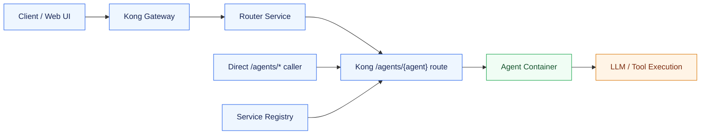
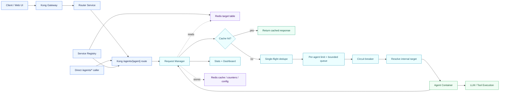

# Nasiko Buildthon Demo: Resilient Agent Request Layer

## Problem Statement

Modern AI platforms orchestrate many specialized agents concurrently. Without traffic controls, two failure modes appear quickly:

- Repeated requests trigger duplicate agent computation even when the same answer could be reused.
- Traffic spikes to one agent can overload that agent and cascade instability across the platform.

The requirement is to build a unified request management layer between the gateway and the agent fleet. The layer must combine caching, adaptive traffic protection, queueing, and operational controls.

The solution target is not "just cache responses" or "just add rate limits." It is an agent traffic-control plane for Nasiko:

- Serve safe repeated requests faster from cache.
- Reduce duplicate processing using cache hits and single-flight dedupe.
- Keep overloaded agents stable using per-agent limits and bounded queues.
- Give operators live visibility and runtime controls.

## Existing Design

Nasiko already had a clean gateway-driven architecture. Kong is the public entry point, the registry discovers agent containers, and the router can select an agent for a user request. Once traffic reached a dynamic `/agents/{agent}` route, however, it went directly from Kong to the target agent container.



### Existing Design Gaps

- Repeated identical calls could still execute the same expensive agent workflow again.
- There was no common per-agent queue after the gateway.
- Router-driven calls and direct `/agents/*` calls did not share one protection layer.
- Operators could not see cache hit rate, queue wait, per-agent limit state, or circuit state in one place.
- If one agent became slow, request pressure could pile up without predictable backpressure.

## Proposed Design

The proposed design adds a new service: Request Manager. Kong remains the public gateway. The router keeps selecting agents exactly as before. The registry still discovers agents. The key change is that dynamic `/agents/{agent}` routes now go to Request Manager first.

Request Manager then becomes the execution-control layer for each selected agent. It checks cache, dedupes identical misses, applies per-agent concurrency and RPS limits, queues briefly when possible, opens a circuit breaker when an agent is unhealthy, and proxies to the real internal agent target.



### Runtime Paths

Routed request path:

```text
Client -> Kong -> Router -> Kong /agents/{agent} -> Request Manager -> Agent
```

Direct agent request path:

```text
Client -> Kong /agents/{agent} -> Request Manager -> Agent
```

Internal proxy path:

```text
Request Manager -> Redis target table -> internal agent container URL
```

Request Manager does not call public Kong `/agents/*` URLs. That avoids a proxy loop and keeps the extra control layer focused on the final agent execution step.

### Request Lifecycle

1. Extract `agent_id` from `/agents/{agent}`.
2. Resolve the real internal agent target published by the registry into Redis.
3. Decide whether the A2A JSON-RPC request is safe to cache.
4. Check Redis response cache before touching the agent.
5. Use single-flight so concurrent identical misses share one upstream execution.
6. Acquire per-agent capacity using concurrency and token-bucket RPS limits.
7. Wait in a bounded FIFO queue when capacity is temporarily unavailable.
8. Fail with controlled backpressure if the queue is full or the wait is too long.
9. Proxy to the internal agent target.
10. Cache safe successful JSON responses and emit runtime metrics.

## MVP: What Is Done

### Request Manager Service

Implemented a new Request Manager service under `agent-gateway/request-manager`. It exposes the control layer for `/agents/{agent}` traffic and keeps the existing client and router contracts unchanged.

### Kong And Registry Wiring

The service registry now points dynamic Kong agent routes to Request Manager. The registry also publishes the real internal agent container target into Redis so Request Manager can proxy to the agent directly.

### Safe Response Cache

The cache is intentionally conservative. It caches text-only A2A JSON-RPC `message/send` responses, only for successful JSON responses, and only with a user/auth scope. It bypasses cache for `Cache-Control: no-cache`, non-text payloads, unsafe methods, uploads, and streams.

Cache keys include the agent, method, normalized text payload, subject/auth scope, and target revision. This keeps correctness higher than a query-only cache while still giving a strong repeated-request win.

### Single-Flight Dedupe

Concurrent identical cache misses are deduped. One request performs the upstream agent call, and the other matching requests wait for the result and receive the same cached response. This prevents cache stampedes during bursts.

### Per-Agent Rate Limit And Queue

Each agent has its own concurrency cap, token-bucket sustained RPS, burst capacity, max queue depth, and max queue wait. This isolates agents from each other and gives predictable overload behavior.

### Circuit Breaker

Repeated upstream failures open a per-agent circuit breaker. While open, Request Manager fails fast instead of continuing to overload an unhealthy agent.

### Operational Controls

Request Manager exposes runtime stats, cache controls, per-agent limit updates, and a small dashboard.

```text
GET    http://localhost:8090/
GET    http://localhost:8090/health
GET    http://localhost:8090/control/stats
GET    http://localhost:8090/control/limits
PUT    http://localhost:8090/control/limits/{agent_id}
DELETE http://localhost:8090/control/cache
```

### Demo Support

The repo includes scripts to prove the important scenarios:

```text
scripts/request-layer/demo_cache_latency.py
scripts/request-layer/demo_singleflight.py
scripts/request-layer/demo_overload.py
scripts/request-layer/mock_agent.py
```

## Live Demo Scenarios

Use the request-layer worktree:

```bash
cd /Users/himanshu.sin/Personal/goals/nashiko-hackathon/.worktrees/request-layer
```

### 1. Real Nasiko UI With A Real AI Agent

Open the Nasiko app:

```text
http://localhost:9100/app/home
```

Use the real `Real A2A Translator` agent and ask:

```text
Translate 'Request Manager makes repeated agent calls fast' to Spanish
```

Then ask the exact same thing again. The second request should be served through Request Manager cache while preserving the normal Nasiko UI flow.

Show stats:

```bash
curl -s http://localhost:8090/control/stats | jq
```

What this proves: the solution works through the actual Nasiko app path, not only through a mock script.

### 2. Faster Repeated Responses

Run:

```bash
python3 scripts/request-layer/demo_cache_latency.py --runs 4
```

Observed sample:

```text
Cache latency KPI
run=1 status=200 cache=miss latency_ms=1272.7
run=2 status=200 cache=hit latency_ms=7.9
run=3 status=200 cache=hit latency_ms=3.7
run=4 status=200 cache=hit latency_ms=3.2
cold_ms=1272.7
warm_avg_ms=4.9
latency_reduction=99.6%
cache_hit_rate=75.0%
```

What this proves: repeated requests avoid agent recomputation and return in milliseconds.

### 3. Reduced Duplicate Processing With Single-Flight

Clear cache and fire concurrent identical requests:

```bash
curl -s -X DELETE http://localhost:8090/control/cache | jq
python3 scripts/request-layer/demo_singleflight.py \
  --concurrency 8 \
  --text "Translate single-flight real protection demo to French"
```

Observed sample:

```text
Single-flight KPI
requests=8 cache_hits=7 cache_misses=1
duplicate_processing_avoided~=7
```

What this proves: eight simultaneous identical misses produce one real upstream agent execution, not eight.

### 4. Stable Overload Handling With Queueing

Run:

```bash
python3 scripts/request-layer/demo_overload.py --requests 8 --concurrency 1
```

Observed sample:

```text
Overload stability KPI
requests=8 successes=8 failures=0 failure_rate=0.0%
queue_wait_max_ms=8519
```

What this proves: when an agent is limited, Request Manager queues instead of immediately rejecting traffic.

### 5. Queue Depth, Queue Timeout, And Backpressure

For the queue-boundary demo, temporarily set a very small queue:

```bash
curl -s -X PUT http://localhost:8090/control/limits/agent-demo-request-layer \
  -H 'Content-Type: application/json' \
  -d '{
    "cache_enabled": true,
    "cache_ttl_seconds": 600,
    "max_concurrency": 1,
    "sustained_rps": 1,
    "burst_capacity": 1,
    "max_queue_depth": 2,
    "max_queue_wait_ms": 2000
  }' | jq
```

Fire six distinct no-cache requests concurrently. Observed sample:

```text
Queue overflow / bounded backpressure demo
request=1 status=200 elapsed_ms=2430.4
request=2 status=429 body={"error":"queue-timeout","agent_id":"agent-demo-request-layer"}
request=3 status=429 body={"error":"queue-full","agent_id":"agent-demo-request-layer"}
request=4 status=429 body={"error":"queue-full","agent_id":"agent-demo-request-layer"}
request=5 status=200 elapsed_ms=1214.9
request=6 status=429 body={"error":"queue-full","agent_id":"agent-demo-request-layer"}
```

Reset normal demo limits:

```bash
curl -s -X PUT http://localhost:8090/control/limits/agent-demo-request-layer \
  -H 'Content-Type: application/json' \
  -d '{
    "cache_enabled": true,
    "cache_ttl_seconds": 600,
    "max_concurrency": 2,
    "sustained_rps": 5,
    "burst_capacity": 10,
    "max_queue_depth": 20,
    "max_queue_wait_ms": 10000
  }' | jq
```

What this proves: the layer buffers where possible, but still applies predictable backpressure when the queue is full or the wait exceeds policy.

### 6. Operational Visibility

Open:

```text
http://localhost:8090/
```

Also show:

```bash
curl -s http://localhost:8090/control/stats | jq
curl -s http://localhost:8090/control/limits | jq
```

What this proves: operators can inspect runtime behavior and change per-agent policy without restarting the stack.

## What I Would Improve Next

### Production-Grade Control Security

Add admin authentication, authorization, and audit logs for `/control/*` endpoints. The MVP is optimized for local demo speed; production controls should be protected.

### Prometheus And Phoenix Integration

Expose Prometheus metrics and add Phoenix/OpenTelemetry span attributes such as `cache_hit`, `queue_wait_ms`, `limit_state`, and `circuit_state`. The MVP already tracks the data; the next step is deeper platform observability.

### Async Job Mode

The MVP uses a bounded synchronous queue and keeps the HTTP request open while waiting. That is simple and good for the demo. For long-running corporate workloads, I would add an async job mode: return a job ID, let the client poll or subscribe, and dispatch from Redis Streams or a durable broker.

### Stronger Multi-Tenant Fairness

The MVP supports user/auth scoped cache keys and per-agent limits. Next I would add per-tenant and per-user fairness controls so one tenant cannot consume the full queue of a shared agent.

### AgentCard-Based Policies

Move more cacheability and limit hints into AgentCard metadata, with ops overrides in Redis. That lets agent authors declare whether their agent is safe to cache while platform operators retain final control.

### Semantic Cache As A Safe Optional Layer

Exact cache is safer and was the right MVP choice. Later, semantic cache could be introduced only for explicitly safe read-only agents, with a high similarity threshold and clear observability.

### Broader Load And Failure Testing

Add sustained load tests, chaos tests for Redis/agent outages, and regression tests for queue limits, circuit behavior, and cache key safety.

## Expected Judge Questions And Answers

### Why place Request Manager after Kong instead of before Kong?

Kong should remain the public gateway for routing, CORS, auth middleware, and gateway concerns. Request Manager is not replacing Kong. It controls the final agent execution step after the target agent is known.

### Why not put this only inside the router?

Router-only caching would miss direct `/agents/*` traffic. The problem statement asks for a layer between the gateway and the agent fleet, so the correct boundary is after Kong and before agents.

### Why not cache before routing?

Before routing, we do not yet know which agent owns the answer. The same user text could be answered differently by different agents. Caching after routing lets the key include `agent_id`, which protects correctness.

### Why does the router still call Kong instead of calling Request Manager directly?

The MVP preserves Nasiko's existing contract: the router already calls the selected agent through the public `/agents/{agent}` route. Kong forwards that route to Request Manager. A later optimization could let the router call Request Manager directly on the internal network, but that is not required for correctness.

### How do you avoid unsafe caching?

The MVP caches only conservative cases: text-only A2A `message/send`, successful JSON responses, and scoped user/auth requests. It bypasses cache for `Cache-Control: no-cache`, unsafe methods, streams, uploads, and missing user/auth scope.

### How does this reduce duplicate processing?

There are two layers. Cache hits skip the agent entirely. Single-flight dedupe handles the harder case where many identical requests arrive before the first one finishes, allowing only one upstream execution.

### How does queueing prevent overload?

Each agent has independent concurrency, RPS, queue depth, and queue wait limits. A hot agent can queue or reject its own excess traffic without consuming capacity for other agents.

### What happens when the queue is full?

Request Manager returns controlled backpressure such as `queue-full` or `queue-timeout`. This is better than unbounded waiting because callers get predictable behavior and the agent is protected.

### What happens if Redis is unavailable?

The MVP degrades to local limiter behavior where possible and bypasses shared cache/state. The production improvement would define stricter fail-open/fail-closed policies per environment.

### Is this only a hackathon design, or would it work in a company?

The architecture works in a corporate environment because it keeps clear boundaries: Kong for gateway, router for selection, Request Manager for execution control, Redis for shared coordination, agents for business capability. Production would add stronger auth, audit logs, durable queues, Prometheus/Phoenix, and multi-tenant fairness.

### Why use exact cache instead of semantic cache?

Exact cache is safer for an MVP because it avoids returning a response for a request that is only "similar." Semantic cache can be a later opt-in feature for read-only agents.

### What about streaming responses?

The cached object here is the upstream agent HTTP response handled by Request Manager, not the user-facing UI stream produced by the router. Streaming cache is intentionally deferred because buffering and replaying streams adds complexity and correctness risk.

### What is the strongest proof that the MVP is complete?

The same layer works for direct agent calls and the real Nasiko UI path. The demo shows cache latency reduction, single-flight duplicate avoidance, stable queueing under overload, bounded backpressure when queues are full, runtime limit changes, and live operational stats.
