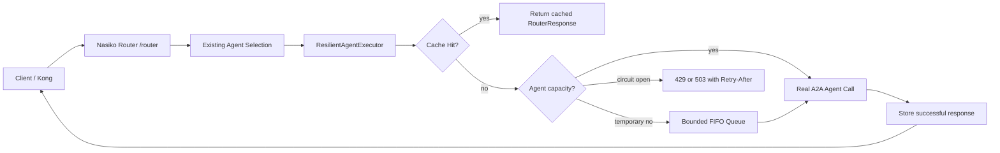

# Resilient Agent Request Layer Design

Date: 2026-05-09
Target: Nasiko Buildthon problem statement, implemented in the real Nasiko router.

## Goal

Build a production-shaped request management layer inside Nasiko that reduces duplicate agent execution, protects individual agents from overload, queues excess work where possible, and exposes runtime controls and metrics. This is not a demo-only mock service. The implementation lands in `agent-gateway/router`, which already sits between the user-facing gateway path and the selected A2A agent fleet.

## Existing Integration Point

Nasiko's `agent-gateway/router` FastAPI service accepts `/router` requests, chooses an agent using registry data and router logic, then calls `AgentClient.send_request()` to send an A2A `message/send` JSON-RPC request to the selected agent.

The resilient request layer wraps the selected-agent execution step. The route selection flow stays intact. After an agent is selected and before the agent call is made, the layer:

1. Computes a cache-safe request identity.
2. Checks the cache.
3. Applies per-agent admission control.
4. Queues the request if capacity is temporarily unavailable.
5. Executes the real A2A call when admitted.
6. Stores successful cacheable responses.
7. Updates stats and metrics.

## Non-Goals

- Do not build a separate mock gateway.
- Do not replace Nasiko's existing router selection flow.
- Do not cache file-upload requests in the first implementation, because uploaded file content changes the answer and raises safety concerns.
- Do not share cached results across authorization scopes.
- Do not require an external embedding API for the gateway cache path.

## Architecture

New package: `agent-gateway/router/src/resilience/`

Core components:

- `ResilientAgentExecutor`: orchestration facade used by `RouterOrchestrator`.
- `SemanticResponseCache`: Redis-backed cache with exact normalized lookup and optional vector similarity lookup.
- `AdaptiveRateLimiter`: per-agent token bucket whose effective limit adapts to observed latency, queue depth, and error rate.
- `AgentRequestQueue`: bounded per-agent asynchronous FIFO queue for short overload periods.
- `RuntimeStats`: in-memory and Redis-backed counters for cache, latency, queue, and limiter state.
- `admin_routes`: operational controls under `/admin`.
- `metrics`: Prometheus-compatible metrics exposed from the router.

Data flow:

## Semantic Caching

The cache must win obvious repeated-query latency while remaining safe for real deployments.

Cacheable requests:

- No uploaded files.
- Method is the router's normal A2A `message/send` flow.
- A selected agent URL/name is known.
- The agent response was successful.
- The request is not marked dynamic through configuration.

Cache isolation fields:

- selected agent identity;
- normalized query text;
- authorization scope fingerprint;
- optional route;
- cache namespace/version.

The first implementation uses deterministic exact normalized caching as the always-on path. Optional semantic matching is implemented behind a feature flag so deployments can enable RedisVL or a local embedding backend without affecting the safe baseline. The exact cache gives reliable, measurable Buildthon wins for repeated requests. The semantic extension provides the path to paraphrase hits without forcing heavyweight model dependencies into every local run.

Cache storage:

- Redis when available.
- Local in-memory fallback for tests and degraded development mode.
- TTL defaults to 3600 seconds.

Admin controls:

- Clear all cache entries.
- Clear entries by agent.
- Update TTL.
- Enable or disable semantic matching.
- Update semantic threshold when the semantic backend is enabled.

## Adaptive Rate Limiting

Each selected agent gets an independent limiter. The limiter protects the agent, not the whole router.

Inputs:

- base maximum requests per second;
- minimum requests per second;
- recent agent latency;
- recent error rate;
- current queue depth.

The first production implementation uses an adaptive token bucket with a load factor rather than a full PID controller. It is easier to verify, safer under hackathon time pressure, and still satisfies the requirement: limits tighten when latency, errors, or queue depth rise, then relax when the agent recovers.

The effective rate is:

`effective_rate = max(min_rps, base_rps * (1 - load_factor))`

Where `load_factor` is derived from normalized latency pressure, error pressure, and queue pressure. This keeps the implementation understandable and testable while preserving a future extension point for PID tuning.

## Queueing

When an agent is temporarily above its effective limit, the request layer queues the request rather than immediately returning HTTP 429.

Queue rules:

- Queue is per-agent.
- FIFO order.
- Bounded max depth.
- Bounded max wait.
- If queue is full or wait budget is exhausted, return 429 or 503 with `Retry-After`.
- Queued requests execute the real `AgentClient.send_request()` call when admitted.

In-process async queues provide deterministic behavior in the router service. Redis-backed queue state can be added for multi-replica fairness, but the first implementation uses Redis for config/stats/cache and keeps queue execution in-process to avoid duplicate delivery and response-correlation complexity.

## Operational API

Admin routes are mounted into the router FastAPI app.

Endpoints:

- `GET /admin/stats/runtime`: cache hit/miss counts, hit ratio, queue depths, current limits, average latency, error counts.
- `POST /admin/cache/clear`: clear cache globally or for a selected agent.
- `PUT /admin/cache/config`: update TTL and semantic settings.
- `PUT /admin/limits/{agent_id}`: update per-agent base limit, minimum limit, burst, queue size, and max wait.

Admin auth:

- If `RESILIENCE_ADMIN_API_KEY` is configured, require `X-Admin-API-Key`.
- If not configured, routes remain available in local development but log a warning on startup.

## Metrics

Expose Prometheus text metrics from `/metrics`.

Required metrics:

- `gateway_cache_hits_total`
- `gateway_cache_misses_total`
- `gateway_cache_hit_ratio`
- `gateway_agent_latency_seconds_count`
- `gateway_agent_latency_seconds_sum`
- `gateway_queue_depth`
- `gateway_queue_wait_seconds_count`
- `gateway_queue_wait_seconds_sum`
- `gateway_rate_limit_rejections_total`
- `gateway_agent_errors_total`

These metrics allow a Grafana dashboard to show the Buildthon KPIs:

- repeated response latency reduction;
- cache hit rate;
- queue depth and predictable wait;
- lower overload failure rate;
- per-agent current effective limits.

## Error Handling

- Cache backend failure does not block agent execution. It records an error and continues as a miss.
- Cache store failure does not fail the client response.
- Limiter failure falls back to conservative per-agent limits.
- Queue timeout returns 503 with `Retry-After`.
- Queue full returns 429 with `Retry-After`.
- Agent 4xx/5xx errors are not cached.

## Testing Strategy

Tests should prove the success criteria through behavior:

- A repeated request returns the cached response and does not call the agent twice.
- Cache entries are isolated by authorization scope and agent identity.
- File-upload requests bypass cache.
- Per-agent rate limits are independent.
- Excess requests queue and drain when capacity becomes available.
- Full queues or exceeded wait budgets return bounded failures.
- Admin endpoints mutate cache and limit configuration.
- Runtime stats and metrics reflect hits, misses, queue depth, wait time, and rejections.

## Implementation Order

1. Add focused tests for caching, isolation, rate limiting, queueing, and admin stats.
2. Add resilience package with local fallback stores.
3. Wire `ResilientAgentExecutor` into `RouterOrchestrator._send_agent_request()`.
4. Add admin routes and `/metrics`.
5. Add Redis and configuration settings to router service and local compose.
6. Run router test suite and focused resilience tests.

