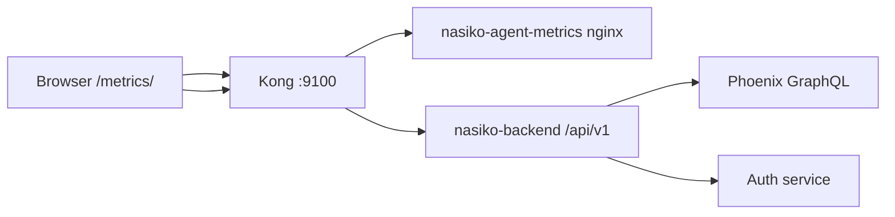

# Challenge 2 — Agent Performance Metrics Page

## Goal

Build a metrics page showing **per-agent stats** for the last 24 hours:

- Average response time
- Success / error counts
- Uptime percentage
- Simple charts (requests and latency over time)

## Constraints

- Main Nasiko UI is a compiled Flutter bundle (`nasiko-web` image) without React source in this repo.
- Solution: a **standalone React/TypeScript app** served at `http://localhost:9100/metrics/` via Kong, using existing backend + Phoenix observability data.

## Architecture



## Data sources

| Metric | Source |
|--------|--------|
| Agent list + names | `GET /api/v1/registry/user/agents` |
| Trace volume, latency, OK/ERROR | Phoenix via new `GET /api/v1/observability/agents/metrics` |
| Deployment state (Active/Failed) | Upload status records merged in metrics handler |

## API design

### `GET /api/v1/observability/agents/metrics?hours=24`

**Auth:** Bearer token (same as main app).

**Response:**

```json
{
  "data": {
    "period_hours": 24,
    "start_time": "2026-05-15T12:00:00.000Z",
    "agents": [
      {
        "agent_id": "translator",
        "name": "Translator",
        "deployment_status": "Active",
        "avg_response_time_ms": 842.5,
        "success_count": 18,
        "error_count": 2,
        "total_requests": 20,
        "uptime_percent": 87.5,
        "hourly": [
          {
            "hour": "2026-05-16T08:00:00.000Z",
            "requests": 5,
            "errors": 0,
            "avg_latency_ms": 720.0
          }
        ]
      }
    ]
  }
}
```

**Uptime:** share of hourly buckets (in the window) with at least one trace; `0%` if deployment status is `Failed`.

## Frontend (`web/agent-metrics/`)

- **Stack:** Vite, React 18, TypeScript, Recharts
- **Pages:** single dashboard with agent selector, summary cards, 24h line/bar charts
- **Auth:** sign-in with access key/secret → `POST /auth/users/login` → store JWT in `sessionStorage`
- **Base URL:** relative (`/api/v1`, `/auth`) so Kong proxy works

## Access

1. Complete [Quickstart](README.md) and deploy the translator agent.
2. Open **http://localhost:9100/metrics/**
3. Sign in with credentials from `orchestrator/superuser_credentials.json`.
4. Run agent sessions to populate Phoenix traces; refresh metrics.

## Implementation checklist

- [x] `feature.md` (this file)
- [x] Backend aggregation endpoint
- [x] React dashboard + Docker image
- [x] `docker-compose.local.yml` service + Kong static route `/metrics`

## PR notes

Fork → branch `challenge/agent-metrics` → commit → PR to `Nasiko-Labs/nasiko` with screenshots of the metrics page.
