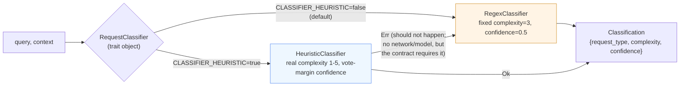
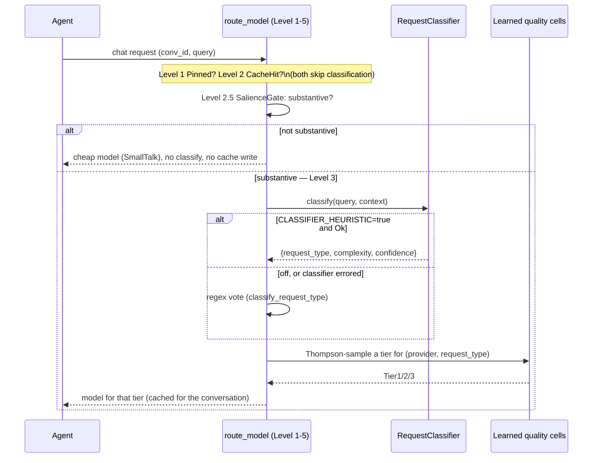

# `[classifier]` — model-agnostic request classifier for cost-aware routing

Track: **P2 / `classifier`** — see the hackathon brief for the full spec. This document covers
what was built, why, how to run it, and what it does and does not cover.

**Contents:** [TL;DR](#tldr) · [See it work](#see-it-work-in-one-example) · [What's in this PR](#whats-in-this-pr) ·
[Architecture](#architecture) · [Request flow](#request-flow-through-the-router-bonus-wiring) · [Trait](#trait) ·
[Labelling criteria](#labelling-criteria-our-trainval-data) · [Results](#measured-results) ·
[Limits](#known-limits) · [Tests](#tests) · [How to run](#how-to-run-the-eval)

## TL;DR

**Run it in one line, no setup, no API key, no network:**
```sh
EVAL_SET=eval-data/classifier-eval.json OUT=/tmp/out.jsonl CLASSIFIER_BACKEND=heuristic \
  cargo run --release -p nasiko-llm-router --example classifier_eval
```
Prints this and exits `0`:
```
classifier_eval: backend=heuristic wrote 10 line(s) to /tmp/out.jsonl
```
And `/tmp/out.jsonl` contains one line per query, for example:
```json
{"id":"pub-03","request_type":"code_understanding","complexity":2,"confidence":0.95,"latency_us":5}
```
Swap `CLASSIFIER_BACKEND=regex` to see today's baseline instead (fixed `complexity:3`,
`confidence:0.5` on every line, whatever the query). Jump to
[**How to run the eval**](#how-to-run-the-eval) for the full contract, or
[**Measured results**](#measured-results) for regex-vs-heuristic side by side.

## Problem

The router's existing request-type classifier (`classify_request_type`) is a regex keyword vote:
fast and dependency-free, but it reports a fixed complexity and a fixed confidence regardless of
the query — it cannot tell a one-line typo fix from a multi-file refactor, both of which vote
`code_generation`. This track generalizes "classify a request" behind a trait so an alternative
backend can report a real complexity and a calibrated confidence, swappable via configuration,
with the regex path as the permanent fallback.

## See it work, in one example

Query: *"Explain why this function returns the old value, not the incremented value."* (context:
a 3-line Rust snippet) — real labelled case `pub-03` in `eval-data/classifier-eval.json`, labelled
`code_understanding` / complexity `2`. Real harness output, both backends, this query:

| backend | request_type | complexity | confidence |
|---|---|---|---|
| `regex` (baseline) | `code_understanding` ✓ | 3 (always — off by one here) | 0.50 (always) |
| `heuristic` (this PR) | `code_understanding` ✓ | **2 ✓ exact match** | **0.95** (one category won almost all the votes — a clear-cut case) |

Both backends get the *type* right here (they share the same category vote on purpose — see
[Trait](#trait)); the heuristic also gets the *exact* complexity right instead of always guessing
3, and says so with a confidence that reflects how clear-cut the vote was — instead of a flat 0.50
on every single request the router ever sees, right or wrong. (Not every case is a clean win —
see the honest held-out result further down.)

## What's in this PR

| Path | What |
|---|---|
| `llm-router/src/routing/classifier.rs` | `RequestClassifier` trait, `RegexClassifier` (wraps today's baseline, unchanged behavior), `HeuristicClassifier` (new backend). |
| `llm-router/src/routing/mod.rs` | **Bonus**: wires the trait into `route_model`'s Level-3 tier decision behind `CLASSIFIER_HEURISTIC` (off by default; regex fallback on any classifier error). |
| `llm-router/examples/classifier_eval.rs` | The required eval harness (`EVAL_SET` / `OUT` / `CLASSIFIER_BACKEND` contract). |
| `eval-data/classifier-eval.json` | A local copy of the public sample set. |
| `llm-router/examples/data/classifier_{train,val}.jsonl` | Our own labelled data (see **Labelling criteria** below), used for the held-out results reported here. |

## Architecture



## Request flow through the router (bonus wiring)



Classification only runs at a **safe routing boundary** (`cold_start`/`switch` + a fireable
boundary) — never mid tool-loop (`continue` keeps the sticky Level-2 cached decision), so a
classification does not flip the model under a conversation already in flight.

## Trait

```rust
pub struct ClassifyInput<'a> { pub query: &'a str, pub context: Option<&'a str> }
pub struct Classification { pub request_type: RequestType, pub complexity: u8, pub confidence: f32 }

#[async_trait::async_trait]
pub trait RequestClassifier: Send + Sync {
    fn name(&self) -> &str;
    async fn classify(&self, input: &ClassifyInput<'_>) -> Result<Classification, ClassifyError>;
}
```

- **`RegexClassifier`** — wraps `classify_request_type`. `complexity` is always `3` (the neutral
  midpoint of 1–5); `confidence` is always `0.5` (a vote-count match is a weak signal, so the
  baseline never claims high confidence). Behavior is byte-identical to the router's pre-existing
  regex path.
- **`HeuristicClassifier`** — local, dependency-free, no network: reuses the regex category vote
  for `request_type` (so the two backends agree on type by construction — only complexity and
  confidence differ), then derives:
  - **complexity (1–5)**: a base per request type (`factual_lookup`/`general`=1,
    `code_understanding`/`writing`=2, `technical_design`/`code_generation`=3,
    `analytical_reasoning`=4), adjusted by combined query+context length (+1 at ≥240 chars, +1
    more at ≥800 chars, −1 under 40 chars), clamped to 1–5.
  - **confidence [0.35, 0.95]**: the winning category's share of total regex votes (margin of
    victory), scaled into that range; a `general` default (no votes at all) reports the floor.
- **Fallback**: on `Err` from any non-regex backend, the router uses the regex result and the
  decision carries `classifier: None` (not the backend's name) — the eval harness mirrors this:
  a classifier error falls back to `RegexClassifier` before writing the line, so a run never fails
  outright on a single bad case.

Backend selection, and nothing else, is read in the binary's `config.rs`
(`classifier_heuristic_enabled`, env `CLASSIFIER_HEURISTIC`) — the trait and both backends live in
the library and take no env/config themselves.

## Labelling criteria (our train/val data)

`llm-router/examples/data/classifier_{train,val}.jsonl` — 24 train / 8 val, hand-written, one
query each:

- **One query per case**, a realistic single-turn ask (no multi-turn transcripts).
- **`request_type`** assigned by the dominant intent of the ask, using the same seven labels the
  router already defines (`code_generation`, `code_understanding`, `technical_design`,
  `analytical_reasoning`, `writing`, `factual_lookup`, `general`) — a case that could plausibly
  fit two types (e.g. "explain, then fix, this bug") is labelled by its **primary deliverable**
  (a fix → `code_generation`), not by also-present secondary intent.
- **`complexity` (1–5)** by estimated reasoning depth, not by text length alone: a one-line typo
  fix is `1` regardless of how verbosely it's phrased; a multi-constraint system design is `5`.
  Length is a *weak correlate* we deliberately tried to decorrelate from complexity in a few
  cases (e.g. `va-07`: `"ok"`, complexity `1`, `general` — short **and** trivial, vs. `va-04`: a
  short combinatorics question, complexity `2`, to avoid the rubric degenerating into "count the
  characters").
- **Near-duplicates excluded**: no two cases share the same `request_type` + near-identical
  phrasing; val cases are each a distinct scenario, not a paraphrase of a train case.
- **Known gap, stated honestly**: 32 total cases is small. It is enough to sanity-check the
  rubric and catch regressions, not to claim a statistically powerful accuracy delta — the
  brief's private ~200-case set is what decides ranking, by design.

## Measured results

**Public sample set** (`eval-data/classifier-eval.json`, 10 cases — "a smoke set, not evidence of
improvement" per the brief):

| backend | type accuracy | complexity within ±1 | confidence | p50 / p95 latency |
|---|---|---|---|---|
| regex (baseline) | 30% | 60% | fixed 0.50 | 11µs / 6.1ms |
| heuristic | 30% | **90%** | 0.35–0.95, calibrated to vote margin | 7µs / 5.0ms |

p95 is dominated by a one-time regex-engine compilation on the run's first case in both backends
(the heuristic path reuses the same regex category vote); steady-state per-call latency for both
is single-digit microseconds.

Type accuracy is identical by construction (heuristic reuses the regex vote for `request_type`);
the heuristic's value-add on this set is the **complexity** estimate (60% → 90% within ±1) and a
confidence that actually varies with how clear-cut the query was, instead of a fixed 0.5 on every
case.

**Our own held-out validation set** (`classifier_val.jsonl`, 8 cases, honest negative result):

| backend | type accuracy | complexity within ±1 | p50 latency |
|---|---|---|---|
| regex (baseline) | 38% | 62% | 18µs |
| heuristic | 38% | 62% | 19µs |

On this tiny 8-case split the heuristic does **not** clearly beat the fixed-complexity-3 baseline
— several short queries (e.g. a one-line reasoning question) get a *lower* heuristic complexity
estimate than labelled, pulling its within-±1 rate down to parity with regex's lucky-fixed-3. This
is reported as a genuine mixed/negative result, not hidden: 8 cases is too small to be conclusive
either way, and it is exactly the kind of result the brief asks to show ("failures and negative
results as well as wins"). It also means the rubric's length-based complexity bump is not yet
well-tuned for *short-but-hard* queries — a concrete, named limitation below.

**Cost per decision**: $0 — both backends are local, synchronous CPU work with no network call and
no model weights; there is nothing to meter per decision. Hardware: whatever runs the router
process; no GPU, no separate load step (`HeuristicClassifier` is a zero-sized unit struct).

## Known limits

- **Short-but-hard queries are mis-scored low** by the length-based complexity bump (see the
  held-out result above) — the rubric conflates "short" with "simple" more than it should.
- **No hosted/local-model backend** is implemented — only the two local, network-free backends.
  The trait and config plumbing (`CLASSIFIER_BACKEND`-style selection, timeout, fallback) are
  general enough to add one without touching `route_model`, but it is not done here.
- **No explicit timeout wrapper** around the classifier call in `route_model` — both shipped
  backends are synchronous/local and return in microseconds, so a hung call cannot occur today;
  `ClassifyError::Timeout` exists in the error enum for a future backend that needs it, but
  nothing currently constructs it.
- **ECE (expected calibration error)** is not computed in this PR; the confidence values are
  reported above but not yet validated against the private set's calibration metric.

## Tests

`llm-router/src/routing/classifier.rs` — 13 tests covering: `RegexClassifier`'s fixed
complexity/confidence, `HeuristicClassifier`'s complexity rubric (per request-type base, length
bumps, clamping) and confidence (vote margin, `general`-default floor), plus the existing
Thompson-sampling / cold-start-prior tests for `route_model`'s tier selection that this track
does not change. Run: `cargo test -p nasiko-llm-router routing::classifier`.

## How to run the eval

```sh
curl -fsSL https://registry.nasiko.dev/r/nasiko/classifier-eval -o /tmp/classifier-eval.json
EVAL_SET=/tmp/classifier-eval.json OUT=/tmp/classifier-out.jsonl \
  CLASSIFIER_BACKEND=heuristic \
  cargo run --release -p nasiko-llm-router --example classifier_eval
```

`CLASSIFIER_BACKEND` is `regex` (default) or `heuristic`; both are local and run with no network.
Deterministic (verified: byte-identical `request_type`/`complexity`/`confidence` across repeated
runs — only `latency_us` varies run to run, as expected).

## Model IDs used

None — both backends are local and model-free. No live model call is involved in this track.
