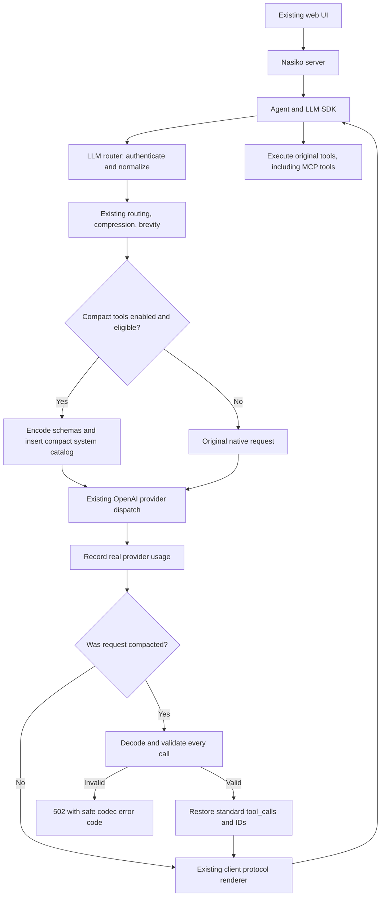

# P1 compact tools architecture

Status: implemented locally. The pure library, evaluation example, and opt-in
non-streaming router adapter are built and tested. The running local server still
uses its earlier binary; compaction is disabled by default. See
[measured results](COMPACT_TOOLS_RESULTS.md) for limitations and live evidence.

## How it connects to Nasiko



The compact library does not execute tools. The agent owns execution and later
conversation turns. The original schemas remain in request-scoped memory for
validation; they are not duplicated into the compact model prompt.

The adapter runs after existing payload compression and brevity, before dispatch
and final request-size accounting. It inserts the compact catalog after leading
system/developer messages and before the first user message. It removes native
tools and auto tool_choice from the outbound copy only after all eligibility
checks pass. On a bypass the request is untouched by this adapter.

## Files and responsibilities

| File | Responsibility |
| --- | --- |
| tool-compact/src/lib.rs | Pure public types, API, limits, instructions |
| tool-compact/src/schema.rs | Supported-schema checks and argument validation |
| tool-compact/src/codec.rs | Reversible ct1 schema encoding and decoding |
| tool-compact/src/decode.rs | Batch/incremental call parsing and preserved text |
| llm-router/src/compact_tools.rs | Request eligibility and standard response restoration |
| llm-router/src/config.rs | COMPACT_TOOLS_ENABLED, default false |
| llm-router/src/handlers/chat.rs | Provider-path insertion, usage, error handling |
| llm-router/examples/compact_tools_eval.rs | Dataset I/O, offline/live runs, token measurement |
| llm-router/examples/compact_tools_demo.rs | Hosted model request and validated real CPU tool execution |

The nasiko-tool-compact crate has no environment, file, network, provider, or
router dependency. tiktoken-rs is pinned to 0.6.0 as a router dev dependency for
evaluation only. No database migration, new service, or frontend change is needed.

## What travels over the provider connection

Stored definitions start with ct1. CompactTools::catalog strips that version
line from the model prompt to avoid a fake tool named ct1. The prompt contains
Tools:, these signatures, then the call instructions:

```text
calendar(title:str#"Event title",start:str/date-time,visibility?:str=["public","private"])! - "Create an event."
```

Names, descriptions, enum values, nesting, supported constraints, and the distinction
between absent and explicit schema fields round-trip without a hidden sidecar.
The exact grammar and supported schema subset are documented in
[the library README](../tool-compact/README.md).

A model response can contain these explicit forms:

```text
<<calendar {"title":"Review","start":"2026-10-05T15:00:00+05:30"}>>
<<call calendar {"title":"Review","start":"2026-10-05T15:00:00+05:30"}>>
[TOOL_CALLS]calendar{"title":"Review","start":"2026-10-05T15:00:00+05:30"}
[TOOL_CALLS]calendar({"title":"Review","start":"2026-10-05T15:00:00+05:30"})
```

The decoder accepts multiple calls and preserves surrounding ordinary text. JSON
nesting and escaping distinguish delimiters inside strings from call boundaries.
Unknown tools, duplicate keys, missing required fields, invalid values, malformed
JSON, truncation, and exceeded resource limits reject the entire response. It does
not coerce types, insert defaults, guess missing values, or repair JSON. A valid
schema alone cannot prove that the model chose the right action or arguments.

Restoration assigns fresh standard call IDs, stringifies arguments, and sets
finish_reason to tool_calls. All choices are validated before response mutation. Missing/null final text,
unexpected typed native calls, and any finish reason other than stop are rejected
for compact responses.
Provider token usage is preserved and recorded even if decoding fails. There is
no hidden retry.

## Initial compatibility boundary

Only OpenAI Chat Completions inbound, OpenAI outbound, non-streaming initial text
requests with default/auto tool choice are eligible. These bypass compaction:

- Disabled flag, no tools, or no byte reduction.
- Unsupported schema keywords, tool kinds, strict or unknown function fields.
- Streaming, historical tool calls/results, multimodal messages.
- Extra request fields, structured response formats, special tool_choice.
- Configured provider fallback chains.

The core StreamDecoder handles arbitrary UTF-8 chunk boundaries and withholds calls
until finish. Router SSE integration and history rewriting are not implemented.
The existing local assistant has no tool catalog, so its ordinary chat does not
demonstrate this optimization. The direct compact_tools_demo example executes real CPU tools through the same
adapter against a hosted model. A tool-enabled agent is still needed for a UI demo.
Custom-provider Bedrock dispatch remains outside the router compatibility boundary.

## Evaluation and next work

The required EVAL_SET/OUT example produces deterministic offline JSONL and shares
the adapter and codec used by the router. Decoder chunks from the organizer sample
are fed unchanged. Live mode uses temperature 0 and the fixed date 2026-10-02,
Asia/Kolkata; expected calls never enter live requests. A native baseline mode uses
the same model, user messages, and reference date.

Completed: pure library, reversible schemas, batch and streaming decoder, property
tests, offline runner, real provider evaluation, and disabled-by-default router
integration. Remaining work: improve live action fidelity and token savings,
evaluate broader unseen cases, then demonstrate a tool-enabled agent before
considering activation. Streaming and other provider protocols are later extensions.
Thirty percent savings remains a target; the organizers score the private set.
