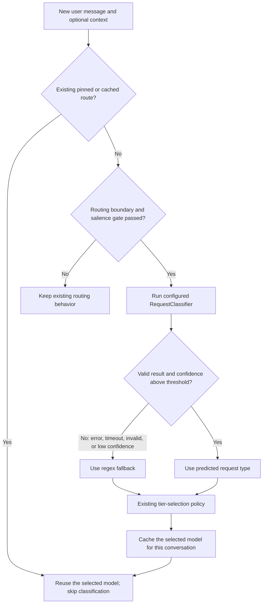

# Request Classifier — Work Summary

## What I built

I added a configurable request-classification layer to Nasiko’s LLM router. It predicts what kind of work a user is asking for, estimates complexity, and reports confidence. The existing regex classifier remains the default, so enabling a new model is an explicit configuration choice.

The classifier returns:

- **Request type:** one of `code_generation`, `code_understanding`, `technical_design`, `analytical_reasoning`, `writing`, `factual_lookup`, or `general`.
- **Complexity:** an estimate from 1 (simple) to 5 (very involved).
- **Confidence:** a score from 0 to 1 indicating how confident the classifier is in its request-type prediction.

## End-to-end routing flow

Classification runs when Nasiko needs a new routing decision, such as at a conversation start or switch. A cache hit, pinned route, or tool-loop continuation keeps its existing model. This preserves sticky routing. The classifier’s complexity value is reported, but it does **not** currently affect tier selection; the router’s existing tier-selection policy remains in place.

## How the local model works

The local backend uses **TF-IDF features with Logistic Regression** for request-type prediction:

1. **Tokenize the text.** The model processes the request and optional context separately.
2. **Create text features.** It uses word unigrams and bigrams, plus character n-grams. These capture both words and smaller spelling patterns.
3. **Weight the features with TF-IDF.** Term frequency represents how often a feature occurs in this input. Inverse document frequency gives more weight to features that are more useful for distinguishing examples in the training data.
4. **Score the request types.** A trained multiclass Logistic Regression model calculates a score for each category. The highest-scoring category is the prediction.
5. **Estimate confidence.** The scores are converted into probabilities with a softmax. A temperature fitted during training calibrates these probabilities; they are estimates, not guarantees.
6. **Estimate complexity separately.** A ridge-regression model predicts a value that is rounded and limited to the 1–5 scale. Complexity is currently informational and does not choose the tier.

The model is a 549 KiB JSON file bundled with the Rust crate. It runs offline and needs no separate model server. The implementation sorts feature indices before its floating-point calculations to keep predictions deterministic for the same input.

## Configurable backends

| Backend | How it works | Notes |
|---|---|---|
| `regex` | Existing keyword/rule-based classifier | Default; preserves the original behavior. |
| `local` | Bundled TF-IDF model, Logistic Regression for type, ridge regression for complexity | Offline, no classifier network call. |
| `http` | HTTP service using `bge-small-en-v1.5` embeddings with Logistic Regression | Reference service uses FastAPI and CPU inference. |
| `llm` | OpenAI-compatible chat-completions API | Uses a hosted model; adds network latency and service cost. |

Configuration is through environment variables: `REQUEST_CLASSIFIER_BACKEND`, `REQUEST_CLASSIFIER_ENDPOINT`, `REQUEST_CLASSIFIER_MODEL`, `REQUEST_CLASSIFIER_MODEL_PATH`, `REQUEST_CLASSIFIER_TIMEOUT_MS`, `REQUEST_CLASSIFIER_MIN_CONFIDENCE`, and optional `REQUEST_CLASSIFIER_API_KEY`. API keys are supplied through the environment; none belongs in source code.

If configuration is incomplete or a local model cannot load, Nasiko warns and selects regex. After an opt-in backend has been created, a call error, timeout, invalid result, or confidence below the configured threshold triggers the regex fallback; these runtime fallbacks are counted and logged.

## Evaluation results

The recorded comparison used about 220 hand-labeled seed queries. The labels are single-author, and the set is small, so these results are useful for comparing these implementations on this dataset—not a guarantee of performance on other users’ requests.

| Backend | Request-type accuracy | p50 latency | p95 latency | Public 10-case sample |
|---|---:|---:|---:|---:|
| Regex | 36.4% | ~0 ms | ~0 ms | 3/10 |
| Local | 60.9% | 0.03 ms | 0.06 ms | 6/10 |
| HTTP embeddings | 68.2% | 7.9 ms | 13.2 ms | 8/10 |
| Hosted LLM | 81.4% | 779 ms | 2,134 ms | 8/10 |

These are the measurements recorded in [`README.md`](README.md). Run the evaluation again before presenting them as current results. The hosted classifier’s reported confidence was poorly calibrated in that evaluation, and hosted usage cost was not measured.

## What is complete and what remains

**Implemented:** pluggable classifier interface, regex default, local/HTTP/LLM backends, validation and regex fallback, environment-based configuration, shared evaluation interface, scoring and training tools, and tests for fallback and deterministic classifier output.

**Limitations:** the training set is small and single-author; confidence can still be wrong; complexity does not influence routing; and the evaluation measures classification rather than answer quality, model-tier quality, or cost savings. Existing tier selection remains unchanged and may be stochastic.

## Short demo narration

> “I added an opt-in request classifier to Nasiko. Regex remains the default. The local model turns word and character patterns into TF-IDF features, then Logistic Regression predicts the request type. It also estimates complexity separately. If an optional classifier fails, returns an invalid result, or has low confidence, Nasiko uses the regex fallback. Classification happens only when a new route is needed; follow-ups and tool calls keep the conversation’s existing route. On my labeled dataset, the local model improved request-type accuracy over regex, but I have not measured whether that improves answer quality or reduces cost.”

## Useful files

- [`README.md`](README.md) — configuration, commands, and detailed evaluation notes.
- [`DATA.md`](DATA.md) — labeling rubric, data split, and dataset limitations.
- [`../src/routing/request_classifier.rs`](../src/routing/request_classifier.rs) — interface, backends, configuration selection, and fallback.
- [`../src/routing/local_classifier.rs`](../src/routing/local_classifier.rs) — bundled local model inference.
- [`../examples/classifier_eval.rs`](../examples/classifier_eval.rs) — runs the configured classifier over an evaluation set.
