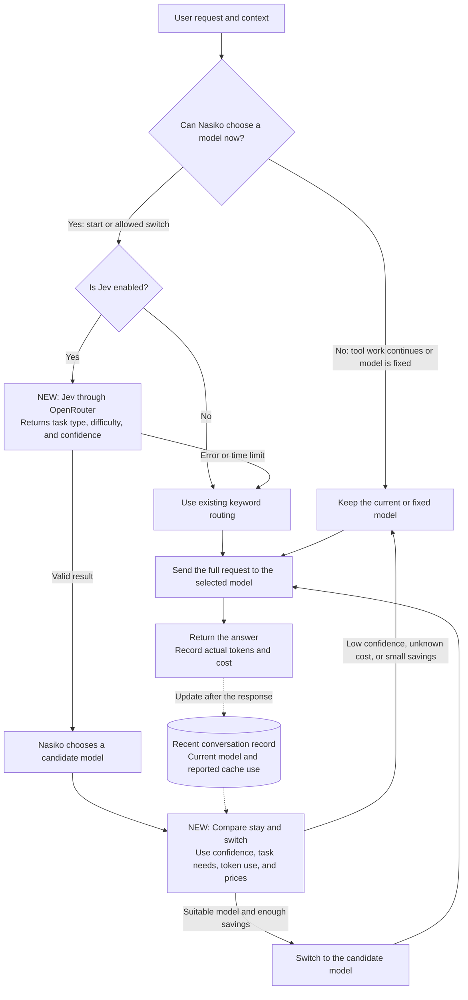

# Explain the proposed Jev routing solution

JEV classification and cache-based switching are implemented. The cache demo uses synthetic usage and prices.

Nasiko already routes requests and records token use. We propose to add Jev classification and a cost check before a model change.

The diagram uses short labels and direct sentences based on ASD-STE100 principles. It is not a certified ASD-STE100 document.

## Follow the request through the router

The dotted arrows carry saved information. They do not make another model call.

The recent conversation record is a proposed addition. The provider supplies the reported cache use. Nasiko cannot guarantee the next cache hit.

## Explain each part in plain English

1. The user sends a request. Context includes relevant instructions, previous messages, and supplied information.
2. Nasiko checks whether a new model choice is allowed. During tool work, the selected model stays unchanged.
3. If Jev is off, the existing keyword routing works as before.
4. If Jev is on, Jev reads the request and relevant context. It reports the task type, difficulty, and confidence.
5. Nasiko chooses a candidate from the existing provider-specific model tiers.
6. The new cost check compares the candidate with the current model. Low confidence prevents a price-driven switch.
7. Nasiko keeps the current model when switching has little benefit or the cost information is unknown.
8. Nasiko switches when the candidate meets the task needs and the expected savings pass the configured margin.
9. The current policy has no quality override for an otherwise rejected switch.
10. The selected model receives the full request it needs. Nasiko records the actual token use and calculated cost after the response.

If Jev fails, Nasiko uses the keyword classifier. If the conversation record is unavailable, the cost check uses the configured model as its safe starting choice.

## Explain the cost check with one example

Cached tokens are parts of a prompt that the provider can reuse at a lower price. A different model may need to process those parts again.

These numbers are examples for a test. They are not measured results.

| Choice | Expected cost | Decision |
| --- | --- | --- |
| Keep Model A and reuse cached input | $0.012 | Keep Model A. |
| Switch to Model B and process the prompt again | $0.015 | Do not switch. |
| Switch to suitable Model C with enough savings | $0.006 | Switch if the savings margins pass. |

For staying, include fresh input, likely cached input, expected output, and any cache creation.

For switching, assume no cached reuse on the candidate. Include the full input, expected output, and any required cache creation. Do not count the same input tokens twice.

The implementation uses a configurable 20 percent savings margin. It has no absolute-dollar threshold. This is our rule, not a hackathon requirement.

If reuse is uncertain, compare the candidate against the cheapest plausible staying cost. Keep the current model if the candidate does not pass that comparison.

Jev has already run before this comparison. Its cost belongs to both options. Include Jev in the total cost report.

## Use this short demo script

"Our proposal adds two checks to Nasiko's existing router.

First, Jev reads the request and context. It identifies the task type, difficulty, and confidence.

Second, Nasiko checks whether a model change is worthwhile. A cheaper model price does not always mean a cheaper request. The current model may reuse cached input.

We compare staying cost with switching cost. We keep the current model when savings are small, confidence is low, or information is missing.

We never change models during continuing tool work. We retain keyword classification as the default and backup.

After each response, we record actual tokens and cost. We compare those results with our estimates to test whether the rule helped."

## Show evidence during the demo

Show these cases and label their evidence clearly.

- A valid Jev classification using both request and context.
- A forced Jev failure that uses the keyword backup.
- A fixed-input test that keeps the current model because cache savings make staying cheaper.
- A fixed-input test that permits a beneficial switch.
- A tool continuation that makes no new Jev call and no model change.
- A real conversation comparison with recorded token use, cost, and answer quality, if completed.

A fixed-input test proves the decision rule. It does not prove live provider savings.

Actual cached-token use depends on provider reports, prompt structure, cache lifetime, and the serving route. Recent usage is evidence for an estimate, not a guarantee.

For a real savings claim, compare matched conversations with and without the new rule. Include Jev's cost and check answer quality.

## Read the implementation details

The [implementation plan](/home/chaitanya/projects/nasiko/nasiko_hackthon/llm-router/docs/classifier-implementation-plan.md:186) specifies conversation records, cost comparisons, safe defaults, and tests.

The [hackathon brief](/home/chaitanya/projects/nasiko/hackathon-problems.md:219) requires safe routing points and an unchanged model during tool continuation.

The [evaluation rules](/home/chaitanya/projects/nasiko/hackathon-problems.md:233) require actual routing and answer-quality measurements before claiming savings.
