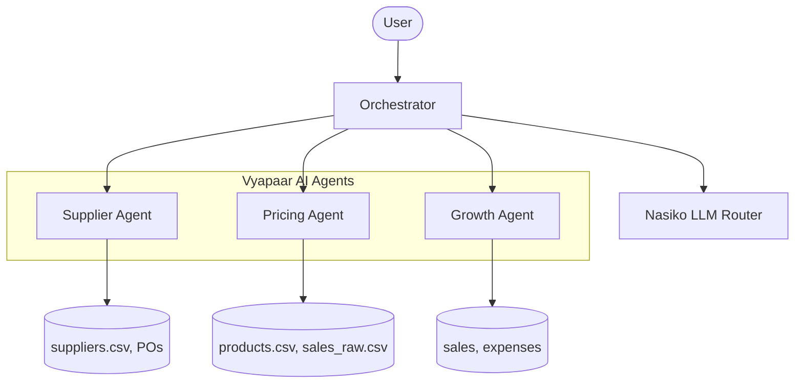

# Vyapaar AI

Vyapaar AI is an intelligent SME (Small and Medium Enterprise) Growth Advisor platform built on the Nasiko framework. It uses autonomous AI agents combined with Python-based data analytics to provide actionable business intelligence directly from raw CSV data.

## Architecture



## The Agents

### 1. Supplier Agent
Analyzes suppliers and purchase orders to calculate supplier reliability, find price variances for identical products, and identify potential volume discount savings by shifting spend to cheaper suppliers.
**Tools**: `get_supplier_metrics`

### 2. Pricing Agent
Analyzes sales volume, margins, and product costs to determine product performance and recommend optimal pricing strategies (e.g., increasing prices on low-margin products, dropping prices to drive volume on high-margin products).
**Tools**: `get_pricing_strategy`

### 3. Growth Agent
Acts as a financial simulator. Users can ask "what-if" questions about price elasticity, revenue, and COGS changes, and the agent uses a Python data pipeline to accurately project future revenues, costs, and profits based on current baselines.
**Tools**: `simulate_scenario`

---

## Deployment Commands

> **Important**: You must run the Nasiko server (via `docker compose up -d`) and set up your `.env` file first.

Use the following commands from the project root to deploy the agents to your local Nasiko cluster. *Ensure you replace the placeholders with your actual keys.*

```powershell
# Set your keys as environment variables
$env:OPENAI_API_KEY = "sk-..."
$env:OPENAI_BASE_URL = "https://api.openai.com/v1"
$env:MODEL = "gpt-4o-mini"

# Deploy Supplier Agent
cd sme-project\supplier-agent
nasiko deploy . --port 10003 -y
cd ..\..

# Deploy Pricing Agent
cd sme-project\pricing-agent
nasiko deploy . --port 10003 -y
cd ..\..

# Deploy Growth Agent
cd sme-project\growth-agent
nasiko deploy . --port 10003 -y
cd ..\..
```

## Demo Questions to try in the Orchestrator

1. **"Which supplier could save us the most money?"** (Triggers Supplier Agent)
2. **"Should I raise the price of my best-selling product?"** (Triggers Pricing Agent)
3. **"What happens to profit if I raise prices by 5%?"** (Triggers Growth Agent)
