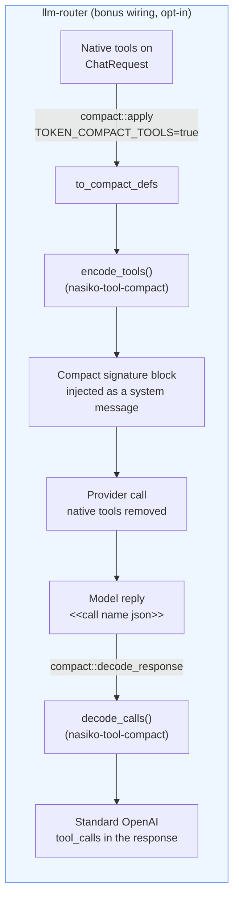
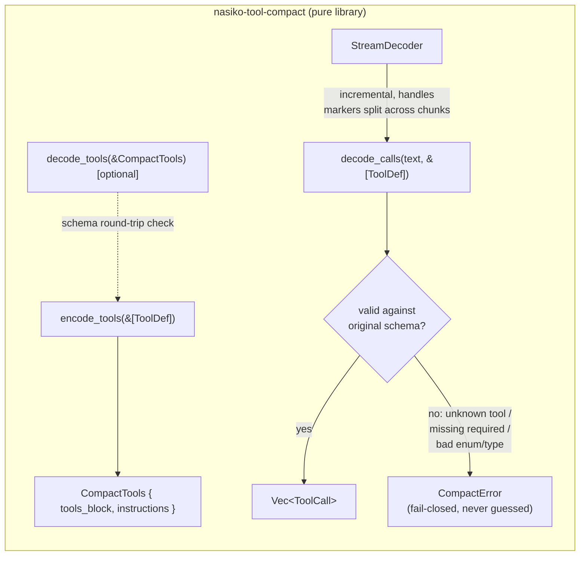

# `[compact-tools]` — compact tool schemas without breaking tool calls

Track: **P1 / `compact-tools`** — see the hackathon brief for the full spec. This document covers
what was built, why, how to run it, and what it does and does not cover.

**Contents:** [TL;DR](#tldr) · [See it work](#see-it-work-in-one-example) · [What's in this PR](#whats-in-this-pr) ·
[Architecture](#architecture) · [Grammar](#grammar-explicit-versioned) · [Fail-closed](#fail-closed-by-design) ·
[Use cases](#use-cases-this-solves) · [Limits](#known-limits--unsupported-cases) · [Tests](#tests) ·
[How to run](#how-to-run-the-eval) · [Results](#measured-results-this-prs-local-sample-set--the-private-set-decides-ranking)

## TL;DR

**Run it in one line, no setup, no API key:**
```sh
EVAL_SET=eval-data/compact-tools-eval.json OUT=/tmp/out.jsonl \
  cargo run --release -p nasiko-llm-router --example compact_tools_eval
```
Prints this and exits `0`:
```
compact_tools_eval: wrote 8 line(s) to /tmp/out.jsonl (offline)
compact_tools_eval: token reduction 31.9% (baseline 668 -> compact 455, o200k_base)
```
That's the whole thing working: it reads the eval set, renders every tool call in the compact
format, decodes it back, and tells you how many tokens that saved. Jump to
[**How to run the eval**](#how-to-run-the-eval) for the full contract, or
[**Measured results**](#measured-results-this-prs-local-sample-set--the-private-set-decides-ranking)
for the numbers.

## Problem

Every chat request that offers an agent tools re-sends the full JSON Schema for each one —
`{"type":"function","function":{"name":...,"parameters":{"type":"object","properties":{...}}}}` —
on **every turn**. That is prompt tokens spent on structure (braces, repeated key names, JSON
Schema boilerplate) the model does not need spelled out in full. This track replaces that with a
compact, one-line-per-tool signature plus a tiny call grammar, and decodes the model's reply back
into standard OpenAI-shaped tool calls — so the client never sees the compact format.

## See it work, in one example

Input — one of this track's two tools, as the client would normally send it:
```json
{"type": "function", "function": {"name": "create_calendar_event",
  "description": "Create an event in the user's calendar.",
  "parameters": {"type": "object", "properties": {
    "title": {"type": "string"}, "start": {"type": "string", "format": "date-time"},
    "attendees": {"type": "array", "items": {"type": "string"}}
  }, "required": ["title", "start"]}}}
```
What this crate renders instead (one line, injected as a system message):
```
create_calendar_event(attendees?:[str], duration_min?:int, start:datetime, title:str,
visibility?:public|private) - Create an event in the user's calendar.
```
The user asks: *"Book a design review Monday 3pm IST with riya@example.com"* — the model replies
in the compact grammar:
```
<<call create_calendar_event {"attendees":["riya@example.com"],"start":"2026-10-05T15:00:00+05:30","title":"Design review"}>>
```
...and this crate decodes that back into the exact same shape the client always expected:
```json
{"name": "create_calendar_event",
 "arguments": {"attendees": ["riya@example.com"], "start": "2026-10-05T15:00:00+05:30", "title": "Design review"}}
```
*(This is the real output of `compact_tools_eval` for case `ct-001` in `eval-data/compact-tools-eval.json` — not a hand-written illustration.)*

**Fail-closed, with real examples from this PR's decoder test cases:**
| what the model wrote | what came back |
|---|---|
| a call to a tool that doesn't exist | `{"error": "unknown_tool"}` |
| a call missing a required argument | `{"error": "invalid_arguments"}` |
| `>>` appearing *inside* a string argument (`"subject":"a >> b"`) | decoded correctly — the closing marker is only recognised once the JSON object is balanced, not at the first `>>` seen |
| the `<<call ...>>` marker itself split across two separate stream chunks | decoded correctly once reassembled |
| a request with `tool_choice: "required"` or a forced specific tool | compaction is **bypassed** (native tools kept) — found via a real agent integration test where the upstream provider rejected `"required"` with no `tools` left to force a call against |

## What's in this PR

| Path | What |
|---|---|
| `tool-compact/` (new crate, `nasiko-tool-compact`) | Pure library: encode tool schemas to the compact form, decode model output back into tool calls. No IO, no env, no provider code, no dependency on the router. |
| `llm-router/src/compact.rs` | **Bonus**: opt-in router wiring — replaces native `tools` with the compact form at the egress seam, decodes the reply back, off by default (`TOKEN_COMPACT_TOOLS`). |
| `llm-router/examples/compact_tools_eval.rs` | The required eval harness (`EVAL_SET` / `OUT` contract). |
| `eval-data/compact-tools-eval.json` | A local copy of the public sample set, for convenience running the harness without network. |

## Architecture





## Grammar (explicit, versioned)

A compact **tool definition** is one line:

```text
name(arg:type, opt?:type, choice?:a|b) - description
```

- `?` after an argument name marks it **optional**; no `?` means **required**.
- `type` is one of `str`, `int`, `float`, `bool`, `datetime`, `[elem]` (array), `obj` (nested
  object), or an inline enum `a|b|c`.
- The trailing ` - description` is present only when the tool has a description.

A tool **call** is a marker the model emits inline, anywhere in its reply:

```text
<<call name {"arg":"value"}>>
```

The payload between the braces is a normal JSON object. Multiple markers = multiple calls. Text
before, between, or after markers is ignored. `>>` inside a JSON string argument is safe — the
decoder matches the JSON object by brace depth with full string/escape awareness, so the closing
`>>` is only recognised once the object is balanced.

## Fail-closed by design

Decoding **validates every call against the original schema**. An unknown tool, a missing
required argument, a wrong type, or a value outside an `enum` returns a `CompactError`
(`unknown_tool` / `invalid_arguments` on the wire) — never a guessed or silently-altered call.

## Use cases this solves

1. **Multi-tool agents** (e.g. a GitHub or calendar assistant) that re-send 5–10 tool schemas on
   every turn of a conversation — the dominant fixed cost shrinks every single call.
2. **High tool-count catalogs** (MCP gateways with dozens of tools) where the native JSON Schema
   payload can be the majority of the prompt.
3. **Streaming responses**, where the compact marker can arrive split across chunk boundaries —
   `StreamDecoder` buffers and resolves this incrementally rather than requiring the whole text
   up front.

## Known limits / unsupported cases

- **Deeply nested schemas** beyond one level of `obj`/`[elem]` are rendered as `obj`/`[obj]`
  without expanding inner properties; compaction is bypassed (native schema kept) when a tool's
  shape cannot be losslessly summarized in the one-line grammar — see `encode::type_str` and its
  tests for the exact cutover.
- **Anthropic / streaming-through-router decode** is not wired; the response-side decode only
  runs on the non-streaming OpenAI-shaped path (`llm-router/src/compact.rs` doc comment explains
  why: streamed tool calls must stay native so they reassemble correctly client-side).
- **Conversation history replay** (previous compact calls/results re-entering context) is not
  exercised — out of required scope, listed as stretch in the brief.

## Tests

- `tool-compact/tests/behaviour.rs` — 15 tests: unit coverage per edge case named in the brief
  (unknown tool, missing required field, enum violation, marker split across stream chunks, `>>`
  inside a string argument, nested object/array rendering) plus a property test over randomized
  tool schemas (encode → decode round-trips without dropping required/optional/enum meaning).
- `llm-router/src/compact.rs` — 6 tests: flag-off is a byte-identical no-op, flag-on removes
  native tools and injects the compact block, response-side decode reconstructs standard
  `tool_calls`, and a `demo_router_compacts_a_real_request` test that prints a measured
  before/after byte count for a real tool set (`cargo test -p nasiko-llm-router demo_router -- --nocapture`).

Run everything: `cargo test -p nasiko-tool-compact -p nasiko-llm-router`.

## How to run the eval

```sh
curl -fsSL https://registry.nasiko.dev/r/nasiko/compact-tools-eval -o /tmp/compact-tools-eval.json
EVAL_SET=/tmp/compact-tools-eval.json OUT=/tmp/out.jsonl \
  cargo run --release -p nasiko-llm-router --example compact_tools_eval
```

Offline by default — no network, no API key, deterministic (byte-identical `OUT` across repeated
runs; verified: see Testing above).

**Live mode** (format adherence, optional): set `PROVIDER_BASE_URL` and `MODEL` (and
`PROVIDER_API_KEY` if your endpoint needs one) to send each `compact_request` to a real
OpenAI-compatible endpoint at temperature 0; the line gains `raw_output` and `live_calls`.

## Measured results (this PR's local sample set; private set numbers decide ranking)

- Token reduction: **−31.9%** (baseline 668 → compact 455 tokens, `o200k_base`, summed over the
  sample set's cases) — printed by the harness itself on every run.
- Round-trip: 3/3 sample `cases` decode back to the expected tool call(s) exactly (name +
  arguments; free-text fields checked for presence/type only, per the brief's match rules).
- Decoder cases: 5/5 sample `decoder_cases` resolve to the expected calls or the expected error
  (`unknown_tool` / `invalid_arguments`), including the marker-split-across-chunks case.
- Opt-in router wiring (bonus): a real 5-tool GitHub-agent request measured **408 → 329 input
  tokens (−19.4%)** end to end through the gateway with a live model; a 2-tool request measured
  **1008 → 495 schema bytes (−51%)**. These vary with tool-set size and are **not** the official
  scoring number — the harness's `o200k_base` count over the sample set (above) is.

## Model IDs used (optional, live mode only)

Live/router verification was run against `openai.gpt-oss-20b` and `mistral.devstral-2-123b` via an
OpenAI-compatible proxy; the offline harness (what's scored) uses no model at all.
