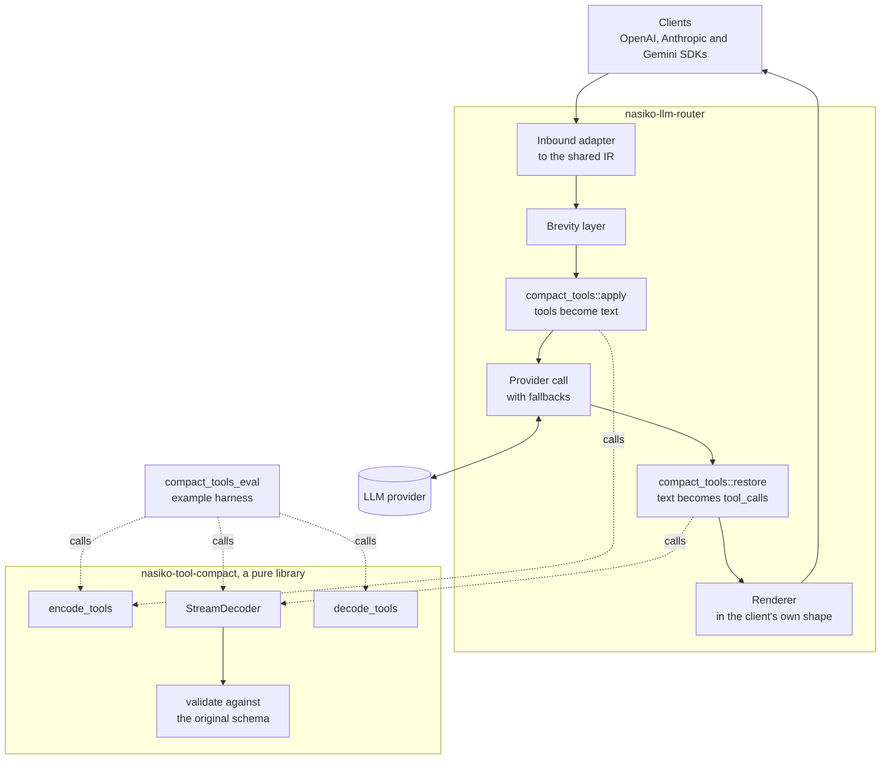
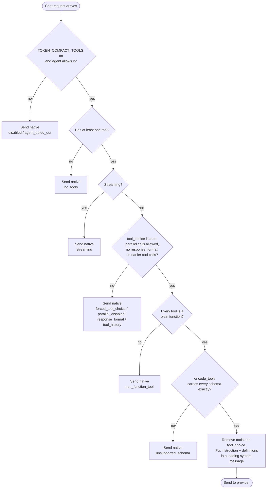
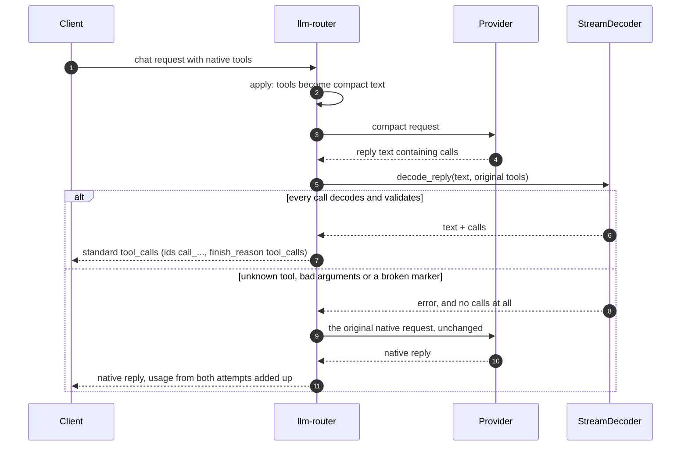
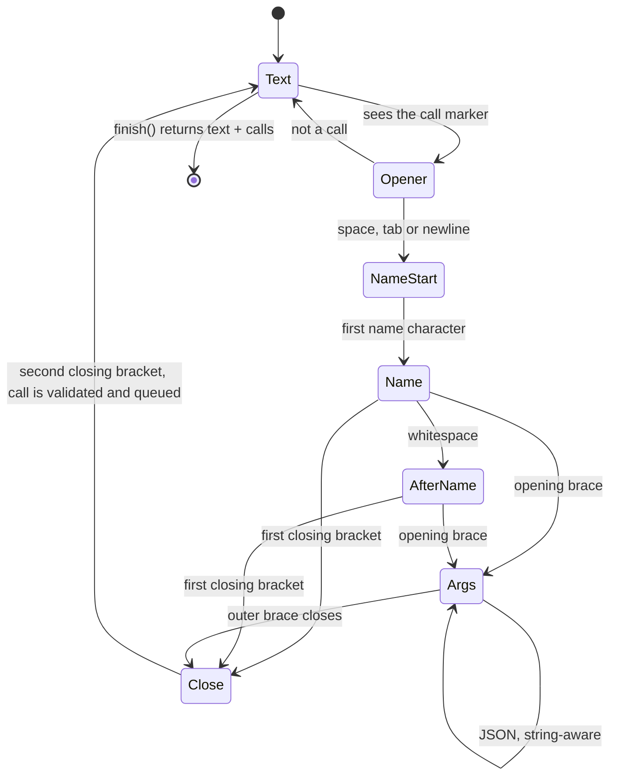
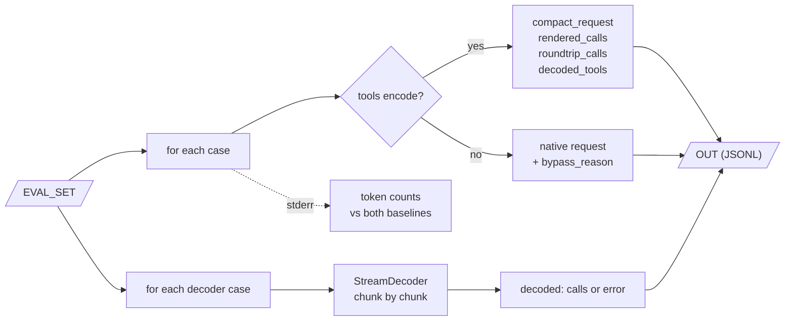

# nasiko-tool-compact

Every chat request that offers tools pays for their JSON Schema again, on every turn. This crate
writes the same tools as a few short lines of text, and turns the model's answer back into normal
tool calls. When something doesn't fit, it says no instead of guessing.

There are two halves:

- **Encode.** `encode_tools` turns OpenAI-style tool definitions into compact text that goes in a
  system message. If a schema uses something the text can't carry exactly, you get
  `CompactError::Unsupported` and send the native tools as before. Nothing is dropped quietly.
- **Decode.** The model replies with `<<call NAME {json}>>`. `StreamDecoder` (or the one-shot
  `decode_reply` / `decode_calls`) finds those calls, checks each one against the original schema,
  and hands back standard `ToolCall`s. One bad call voids the whole reply.

The crate is a plain library. It does no I/O, reads no environment variables, and has no clock,
no randomness and no provider code. `nasiko-llm-router` depends on it; it never depends on the
router.

## Before and after

The `create_calendar_event` tool from the public eval set, as the provider sees it today
(minified, **122 tokens** in `o200k_base`):

```json
{"type":"function","function":{"name":"create_calendar_event","description":"Create an event in the user's calendar.","parameters":{"type":"object","properties":{"title":{"type":"string","description":"Event title"},"start":{"type":"string","format":"date-time","description":"Start time, ISO 8601"},"duration_min":{"type":"integer","description":"Duration in minutes"},"attendees":{"type":"array","items":{"type":"string"},"description":"Attendee emails"},"visibility":{"type":"string","enum":["public","private"]}},"required":["title","start"]}}}
```

The same tool after `encode_tools` (**54 tokens**):

```text
create_calendar_event: Create an event in the user's calendar.
 title: string # Event title
 start: datetime # Start time, ISO 8601
 attendees?: string[] # Attendee emails
 duration_min?: integer # Duration in minutes
 visibility?: public|private
```

The request also carries one fixed instruction line (23 tokens), whatever the number of tools:

```text
Call tools with <<call NAME {"key": value}>> (strict JSON, quoted keys), one per line.
```

The model answers like this, and the client gets an ordinary `tool_calls` entry back:

```text
<<call create_calendar_event {"title": "Design review", "start": "2026-10-05T15:00:00+05:30", "attendees": ["riya@example.com"]}>>
```

Nothing is lost on the way. `decode_tools` parses the compact text back into JSON Schema and gets
the original schema, so the round trip is checked by code rather than by eye.

## Results

| What | Result |
|---|---|
| Public sample, official command | 3/3 round trips and 5/5 decoder cases match. Two runs give byte-identical output |
| Prompt tokens saved on the public sample | 33.9% with the reference-date line in the baseline, 25.8% without it. These cases have only one or two small tools, so the fixed instruction line weighs heavily; the saving per tool definition is about 55% |
| Live, `gemini-3.5-flash-lite` (free tier) | Compact got 41/50 calls right against 37/50 for native tool calling on our dev set, and 18/20 against 16/20 on held-out cases. Every compact reply decoded |
| Live, `qwen/qwen3.8-27b:free` | Compact 13/15, native 15/15. Both misses were `<call …>` with one bracket, which reads as plain text: a missed call, never a wrong one |

The live sets are our own (no-call turns, optional arguments, enums, nested objects, hostile
strings, relative dates, parallel calls, ten distractor tools). With 15 to 50 cases, one case is
worth 2 to 7 points, so read small gaps as noise.

## Where it sits in Nasiko



The router owns everything that touches the network, config or tracing. The crate owns the format
and the checks. The eval harness (`llm-router/examples/compact_tools_eval.rs`) also uses the
crate directly, so the scorer exercises the same encoder and decoder the router does.

## What happens to a request

Compaction is opt-in. It runs only when `TOKEN_COMPACT_TOOLS` is on and the agent's own
token-optimization switch allows it. After that, the request has to clear a few checks. Each "no"
sends the request exactly as the client wrote it, with a stable reason label in the trace.



The definitions go in a *leading* system message, so they sit in the stable prefix that
providers cache. Messages the client wrote are left byte-for-byte as they were.

## What happens to the reply



The client never sees the compact format and never gets a call that was repaired or guessed. If
the compact attempt fails, the router falls back to what it would have sent without this feature,
once, and bills both attempts honestly. The trace records `nasiko.compact_tools.native_retry`.

## Inside the decoder

`StreamDecoder` reads one character at a time, so it doesn't matter where a network chunk ends.
Plain text is released as soon as it can't be the start of a marker. Calls are only released by
`finish()`, so a good call is never handed out before a later bad one voids the reply.



Inside `Args` the decoder tracks brace depth outside strings and honours escapes, so `}`, `>>` or
even `<<call` inside a JSON string is just content. Any problem (an unknown name, broken JSON, a
missing `>>`, a reply that ends mid-call, more than 1 MiB in one call) poisons the decoder and
`finish()` returns the error.

## Code map

| File | What it does |
|---|---|
| `src/models.rs` | `ToolDef`, `ToolCall`, `CompactTools`, `Decoded`. `ToolDef` reads and writes the OpenAI `{"type":"function",…}` wrapper |
| `src/schema.rs` | Reads JSON Schema into a typed tree and records anything that blocks a lossless render. Bounded: 64 levels deep, 10,000 nodes, so a `$ref` diamond can't blow up |
| `src/encode.rs` | `encode_tools`, `render_calls` and the `INSTRUCTION` line |
| `src/decode_tools.rs` | Parses compact text back into JSON Schema |
| `src/stream.rs` | `StreamDecoder`, the character-level state machine above |
| `src/validate.rs` | Checks arguments against the schema, including keywords the encoder never renders |
| `src/json.rs` | Strict JSON: duplicate keys and integers that can't be stored exactly are errors |
| `src/grammar.rs` | Reserved words, bare-word rules, description escaping |
| `src/error.rs` | `CompactError` and its typed fault enums, each with a stable `code()` / label |

## Usage

```rust
use nasiko_tool_compact::{decode_calls, encode_tools, ToolDef};

let tools: Vec<ToolDef> = serde_json::from_value(openai_tools_json)?;   // {"type":"function",…}
let compact = encode_tools(&tools)?;          // Err(Unsupported) means: send the native tools
let system_prompt = compact.system_prompt();  // instruction + definitions
let calls = decode_calls(&model_reply, &tools)?;   // Err means: no call is returned at all
```

Streaming works the same way, chunk by chunk:

```rust
let mut decoder = StreamDecoder::new(&tools)?;
for chunk in reply_chunks {
    print!("{}", decoder.push(chunk)?);   // text that can't be part of a call
}
let Decoded { text, calls } = decoder.finish()?;
```

## Running the eval

```sh
cargo fetch
curl -fsSL https://registry.nasiko.dev/r/nasiko/compact-tools-eval -o /tmp/compact-tools-eval.json
EVAL_SET=/tmp/compact-tools-eval.json OUT=/tmp/out.jsonl \
  cargo run --release -p nasiko-llm-router --example compact_tools_eval
```

By default it is offline and deterministic: no network, no keys, and two runs give the same bytes.
Token counts (`o200k_base`, through `tiktoken-rs`, pinned) go to stderr only. Set
`PROVIDER_BASE_URL` and `MODEL` (and `PROVIDER_API_KEY` if needed) to send each request to an
OpenAI-compatible endpoint at temperature 0; `LIVE_NATIVE=1` also sends the native request so you
can compare the two on the same cases.



## Grammar

### Definitions (what the model reads)

```ebnf
definitions = tool { LF tool } ;
tool        = name [ " (" annotations ")" ] ":" [ " " description ] { LF property } ;
property    = indent key [ "?" ] ": " type [ " = " json ] [ " #" [ " " description ] ]
              { LF property } ;                 (* deeper indent: fields of an object *)
indent      = " " { " " } ;                     (* one space per nesting level *)
type        = term { "|" term } ;
term        = atom [ " (" annotations ")" ] { "[]" [ " (" annotations ")" ] } ;
atom        = keyword [ "<" format ">" ] | "(" type ")" | word | json-literal ;
keyword     = "string" | "integer" | "number" | "boolean" | "null" | "object" | "array"
            | "any" | "datetime" | "date" | "time" ;
annotations = annotation { ", " annotation } ;
```

- **`?` marks an optional property.** Required properties come first, in the order of the
  schema's `required` array, so that order survives the round trip. Optional ones follow in key
  order.
- **`datetime`, `date` and `time`** are `string` with that `format`. Any other format is written
  `string<email>`, `integer<int64>` and so on.
  - Decoding checks `date-time`, `date` and `time` values for ISO 8601 / RFC 3339 shape, so
    "next Monday" is rejected. The offset is optional.
  - Every other format is an annotation, as JSON Schema says.
- **A type is either a union or an enum.**
  - If every alternative is a type keyword, it's a union: `string|null`, `string[]|null`.
  - Otherwise the alternatives are enum values. A plain word is written bare (`public|private`);
    anything else is JSON-quoted (`"New York"|"string"|3`).
  - `(type=…)` gives the declared type when it differs from what the values imply.
  - `(const)` marks a single value as a `const`.
  - Enum and const values used as array items are always grouped: `(a|b)[]`, `(a)[]`.
- **Annotations:**

  | Group | Annotations |
  |---|---|
  | Numbers | `min=`, `max=`, `xmin=`, `xmax=`, `step=` |
  | Strings | `minlen=`, `maxlen=`, `pattern="…"` |
  | Arrays | `minitems=`, `maxitems=`, `unique` |
  | Objects | `closed` / `open` (`additionalProperties` false/true), `any` (free-form, no `properties`), `noreq` (`required: []`) |
  | Tool header only | `strict` / `nonstrict` (`function.strict`), `noparams` (no `parameters` at all) |

- **Descriptions** stay verbatim on one line. `\`, line feed, carriage return and tab are written
  as `\\`, `\n`, `\r` and `\t`; other control characters as `\u00XX`.
- **Defaults** are written as JSON after ` = `. They're documentation for the model and are never
  filled into a call.

### Calls (what the model writes)

```ebnf
reply = { text | call } ;
call  = "<<call" ( ws | "{" | ">" ) { ws } name { ws } [ object ] { ws } ">>" ;
name  = any characters up to whitespace, "{" or ">" ;   (* looked up exactly *)
ws    = " " | TAB | CR | LF ;
```

- `<<call` followed by whitespace, `{` or `>` opens a call. `<<callback` and `<<CALL` are plain
  text.
- The arguments are one RFC 8259 JSON object. An omitted object means `{}`.
- Text before, between and after calls comes back as text, and calls keep their order.

## Fail-closed decoding

Each of these is an error, and the reply then yields no calls at all:

| Input | Code |
|---|---|
| A name that isn't one of the offered tools (no fuzzy matching; checked before the arguments are read) | `unknown_tool` |
| Missing required argument, wrong type, enum or `const` violation, broken bound, undeclared key on an object that declares `properties`, duplicate JSON key, malformed JSON, an integer too large to store exactly | `invalid_arguments` |
| `<<call>>` with no name, missing `>>`, a reply that ends inside a call, a call over 1 MiB | `invalid_arguments` |

- Nothing is repaired: no trailing-comma fixes, no quote fixes, no defaults filled in.
- An integer written as `30.0` is valid for `integer`, as JSON Schema defines it, and is passed
  through exactly as written.

## Supported schemas, and what bypasses

Compaction is **lossless or skipped**. `encode_tools` returns `CompactError::Unsupported`, with a
JSON-pointer `path` and a `feature` label, rather than drop anything.

| Rendered losslessly | Bypassed (send the native tools) |
|---|---|
| `type` (and type arrays of two or more types), `properties`, `required`, nested objects, `items`, arrays of arrays | `$ref`/`$defs`, `anyOf`/`oneOf`/`allOf`, `not`, `if`/`then`/`else` |
| `enum` (strings, numbers, booleans, `null`, mixed), `const` (scalars) | `patternProperties`, `prefixItems`, `dependent*`, `propertyNames`, `contains`, `unevaluated*` |
| `description` (tool and every property), `default`, `format` | `title`, `examples`, `$schema`, `$comment` and any unknown keyword |
| `minimum`, `maximum`, `exclusiveMinimum`, `exclusiveMaximum`, `multipleOf` | `additionalProperties` given as a schema; `minProperties`/`maxProperties` |
| `minLength`, `maxLength`, `pattern`, `minItems`, `maxItems`, `uniqueItems` | Tool or property names outside the grammar's character set |
| `additionalProperties: true/false`, `function.strict` | A description or default on `items`; `required` naming an undeclared property |

**Validation covers more than the renderer.** A tool that bypasses is still validated when it's
called:

- `anyOf`, `oneOf`, `allOf`, local non-recursive `$ref`, `not`, `if`/`then`/`else`,
  `dependentRequired`, `propertyNames` and `contains` are all enforced.
- A keyword that can't be enforced (`patternProperties`, `prefixItems`, `dependentSchemas`,
  `unevaluated*`) makes every call to that tool fail closed, rather than pass unchecked.

`decode_tools` gives back exactly the original schema for everything in the left column. The only
difference is that object keys come back in `serde_json`'s order.

## Guarantees and the tests behind them

| Guarantee | Tests |
|---|---|
| Tool and argument names never change | `encode`/`decode_tools` unit tests, `tests/properties.rs`, `tests/edge_cases.rs::many_tools_keep_every_name_and_order` |
| Required arguments are never invented; defaults are never injected | `tests/decoding.rs`, `tests/edge_cases.rs::defaults_are_never_injected_into_a_call` |
| Unknown tools, wrong types and enum violations fail closed | `tests/decoding.rs` (failure-first matrix), property tests |
| Unsupported features bypass | `schema`/`encode` unit tests, `tests/edge_cases.rs` |
| Chunk boundaries don't matter | `tests/streaming.rs` (every split point, every pair of split points, one character at a time), `tests/properties.rs` |
| `>>` inside strings, escapes, Unicode | `tests/decoding.rs`, `tests/properties.rs` |
| Malformed output never becomes a call | `tests/decoding.rs`, property `mutated_replies_…` |
| The schema round trip is exact | `decode_tools` fixtures, property `generated_schemas_roundtrip_exactly` |
| Same input, same bytes | `encoding_is_deterministic`; the eval run twice and compared |

## Known limits

- **`pattern` uses Rust `regex` syntax.** Patterns only ECMA-262 accepts (lookaround,
  backreferences) bypass, and calls to such tools fail closed. `\d` matches Unicode digits here,
  but only ASCII digits in JavaScript.
- **Numeric bounds** are compared as `f64`.
- **Pydantic-style schemas usually bypass,** because they put a `title` on every property.
- **History isn't handled here.** A conversation with earlier tool calls would need them
  re-rendered in the compact form; the router sends those requests natively for now.
- **Streaming through the router** isn't wired yet. The decoder supports it; the router still
  sends streaming requests natively.
