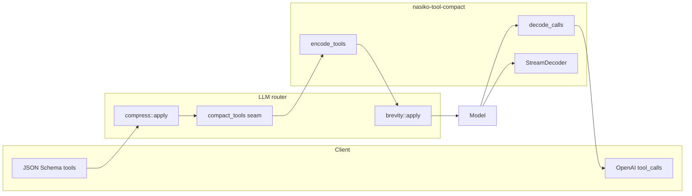
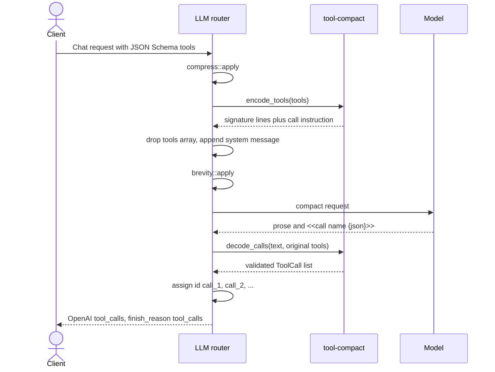
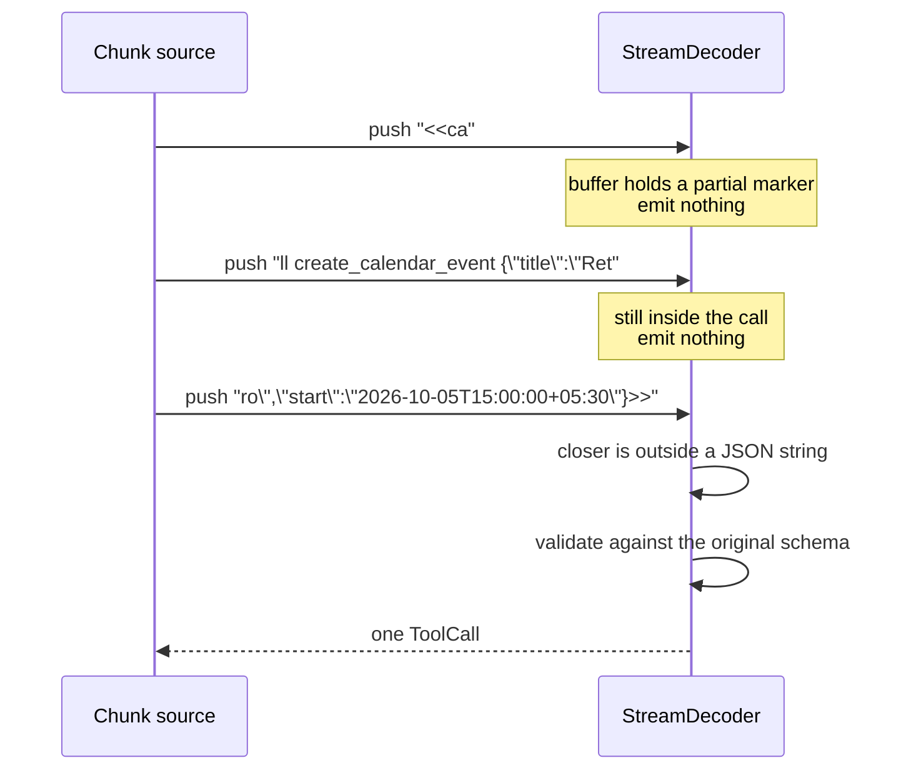
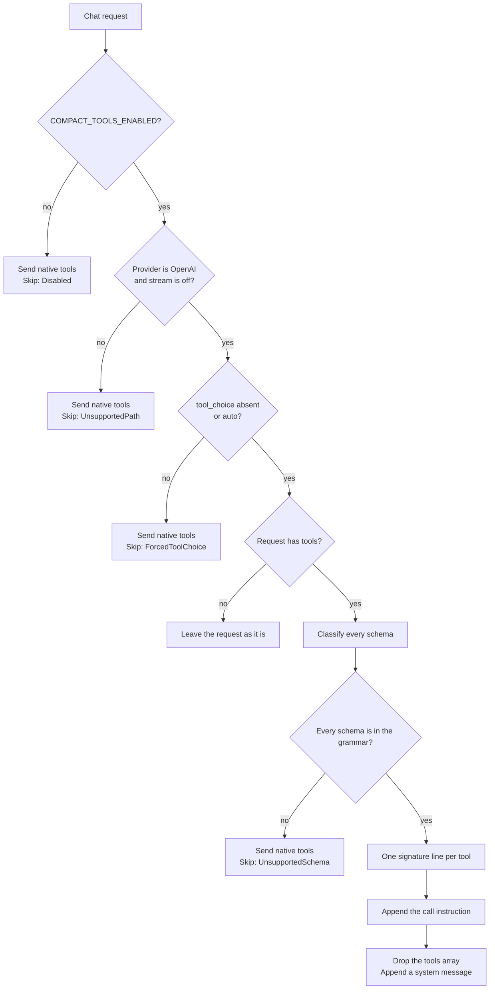
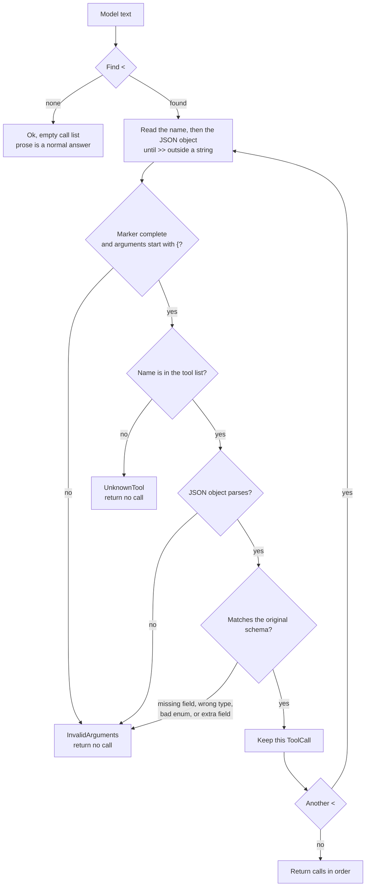
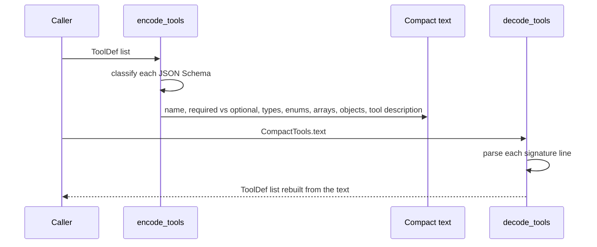

# Tool compact — solution

`nasiko-tool-compact` shrinks OpenAI function-tool definitions before they are sent to a model, then turns the model's reply back into ordinary tool calls. The client still sends JSON Schema tools and still receives OpenAI `tool_calls`. The compact form stays inside the router.

The library is pure: no filesystem, network, clock, or environment reads. The router owns the flag. With `COMPACT_TOOLS_ENABLED` unset, outbound request bytes stay as they are today.

## Problem

Every tool the client sends is a full JSON Schema: name, description, property types, formats, enums, required fields, nested objects, and arrays. That schema is copied into the prompt on every turn, including turns that use one tool out of a long list.

The model is expected to answer with an OpenAI tool call. The client needs `tool_calls[].function.name` and `arguments` as a JSON string. A shorter prompt only helps if the name and the arguments survive, and if a bad reply is refused rather than turned into a guessed call.

A calendar tool shows the size of the problem. The native definition is a nested JSON object. The compact form is one signature line plus a call instruction:

```text
create_calendar_event(title:str, start:datetime, duration_min?:int, attendees?:[str], visibility?:public|private) - Create an event in the user's calendar.
To call a tool, emit: <<call name {json args}>>
```

The model writes `<<call create_calendar_event {...}>>`. The router checks that object against the original schema and returns a normal tool call.

`compress/` shrinks payloads. `brevity` shortens answers. Neither rewrites tool definitions or parses a call grammar. This crate is that missing piece.

## Benefits

| Benefit | What it means |
| --- | --- |
| Fewer input tokens | Tool schemas become signature lines. On the vendored public sample, `o200k_base` measured `token_reduction=0.444` (about 44%), above the 30% target. A case that stays native adds nothing to the savings. |
| Client contract stays put | Callers still send and receive OpenAI-shaped tools and tool calls. Compaction is an internal transform. |
| Fail closed | An unknown tool, a missing required field, a wrong type, or an enum value outside the schema is an error. The decoder never invents a call, drops a field, or coerces a value. |
| Streaming-safe library | A marker may arrive split across chunks (`<<ca` then `ll create_...`). `>>` inside a JSON string stays inside the argument. |
| Deterministic | The same tools and the same text always produce the same result. The default eval mode makes no network call. |
| Safe to turn on | The flag defaults off. Off means today's bytes. One unsupported tool, a forced `tool_choice`, or a path this slice does not decode keeps the native `tools` array. |

### Who gains

| Who | What they get |
| --- | --- |
| Agent authors | Large tool lists (calendar, email, MCP) stop dominating the prompt. The code that sends `tools` does not change. |
| People paying for router traffic | Input tokens drop on every OpenAI non-streaming request whose schemas the grammar can carry. |
| End users of those agents | The same tool runs with the same arguments. They do not see a new call format. |
| Router maintainers | One opt-in seam, same pattern as payload compression. |

## Where it sits



Order on the live path: routing has already chosen the model, then `compress::apply`, then `compact_tools::apply`, then `brevity::apply`. Compaction cannot change which model is pinned. Brevity sees the bytes that will actually be sent.

## Sequence: one compacted turn

Covered live path: OpenAI, non-streaming, flag on, every schema supported, `tool_choice` absent or `"auto"`.



The originals stay on the seam result. They are what the decoder checks against. They are not put back on the outbound request.

A reply with no call marker is a normal answer. The router leaves the assistant text in place.

A reply that fails validation stays as provider text. The router logs the error and invents no call.

## Sequence: a marker split across chunks

`StreamDecoder` lives in this crate. The router does not call it yet. The eval example feeds published decoder chunks through it.



The same bytes pushed as one chunk match `decode_calls`. `finish` after a dangling `<<call ` returns `InvalidArguments` and no call.

## Flow: encode or keep native tools

The router decides whether to call the encoder. The encoder then accepts the batch or refuses it. One unsupported schema fails the whole batch, so the caller can send native tools rather than a simplified form.



## Flow: decode a model reply



`>>` inside a quoted argument is text. The title `meet >> review` decodes with that title intact. Characters after the real closer are not part of the arguments.

## Sequence: schema facts survive the text

`decode_tools` rebuilds tools from the signature text. It does not return the originals stored on `CompactTools`, so a renderer that drops a type fails a round trip.



What the signature carries:

| Fact | Compact form |
| --- | --- |
| Required field | `title:str` |
| Optional field | `duration_min?:int` |
| String, integer, number, boolean | `str`, `int`, `num`, `bool` |
| `format: date-time` | `datetime` |
| String enum | `public\|private` |
| Array | `[str]` |
| Nested object | `{room:str, floor?:int}` |
| Tool description | text after ` - ` |

Property-level descriptions inside the JSON Schema are not part of the signature. `decode_tools` rebuilds types and required-ness from the line. It does not restore those property descriptions.

## Grammar the library accepts

```text
signature  := name "(" params ")" " - " description
param      := name ":" type          required
            | name "?:" type         optional
type       := str | int | num | bool | datetime
            | enum alternatives separated by |
            | "[" type "]"
            | "{" params "}"
call       := "<<call " name " " json-object ">>"
```

A name is ASCII letters, digits, and `_`. Several calls in one reply stay in order. Prose may sit before or after a call.

These schema features return `UnsupportedSchema`. The walker stops at the first one. It does not drop the feature and continue:

- `$ref`, `oneOf`, `anyOf`, `allOf`, `not`, `prefixItems`
- `additionalProperties` set to a schema (a boolean is allowed)
- tuple `items` (an array of schemas)
- `enum` values that are not strings
- any `format` other than `date-time`
- a root type the grammar has no name for

## Modules

| Module | Job |
| --- | --- |
| `types.rs` | `ToolDef`, `ToolCall`, `CompactTools`, `CompactError` |
| `schema.rs` | Walk a JSON Schema. Check a value against the shape. |
| `encode.rs` | Signatures plus the call instruction. |
| `grammar.rs` | Scan `<<call name {json}>>`, including escapes. |
| `decode.rs` | Text to calls, and signature text back to schemas. |
| `stream.rs` | `StreamDecoder` for split chunks. |
| `lib.rs` | Public entry: `encode_tools`, `decode_calls`, `decode_tools`, `StreamDecoder`. |

The crate defines its own `ToolDef` and `ToolCall`. Router types stay in `llm-router`. The seam in `llm-router/src/compact_tools.rs` converts at the boundary. The router assigns call ids (`call_1`, `call_2`, …).

Errors are matched by variant:

| Variant | When |
| --- | --- |
| `UnknownTool` | The call names a tool that was not in the list. |
| `InvalidArguments` | Malformed marker, bad JSON, missing field, wrong type, or value outside an enum. `ArgumentFault` names which. |
| `UnsupportedSchema` | The grammar cannot carry a feature of the schema. |

## Limits of this slice

- Live wiring is OpenAI and non-streaming. Streaming through the router, Anthropic, and Gemini keep native tools.
- A forced `tool_choice` (anything other than absent or `"auto"`) keeps native tools. The compact instruction cannot express "you must call this function."
- A decode failure on the way back leaves the provider text. No tool call is invented.
- Prior tool-call turns in conversation history are unchanged.
- Token counting uses `tiktoken-rs` in the eval example only. This crate does not count tokens.

## See it locally

```sh
cargo test -p nasiko-tool-compact
```

Offline eval, no API key:

```sh
EVAL_SET=tool-compact/tests/fixtures/compact-tools-eval.json OUT=/tmp/out.jsonl \
  COUNT_TOKENS=1 \
  cargo run --release -p nasiko-llm-router --example compact_tools_eval
```

`COUNT_TOKENS=1` prints `token_reduction=` after `OUT` is written. Two runs of the same `EVAL_SET` write the same `OUT`.
